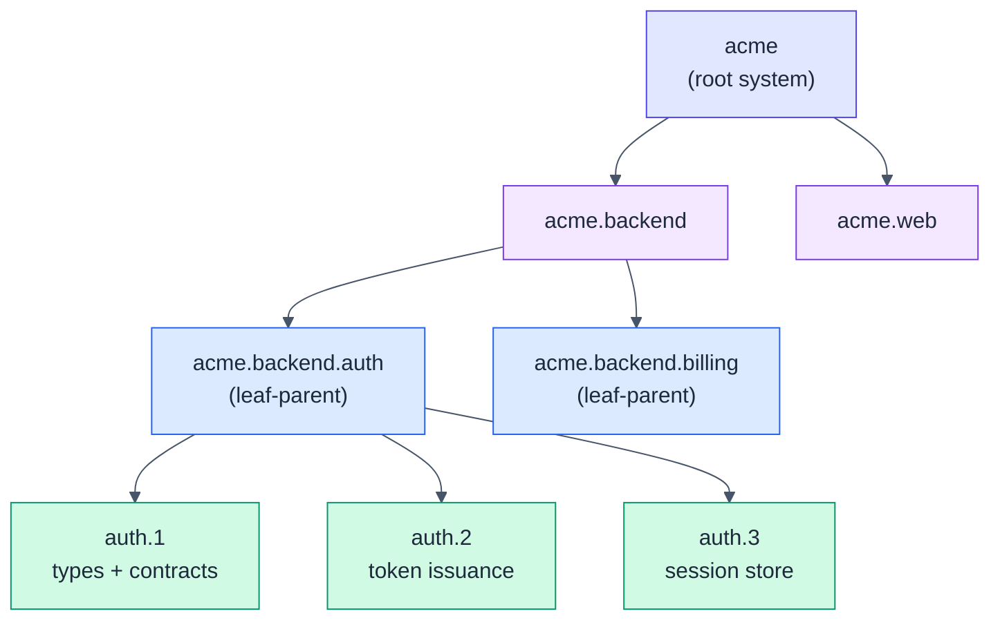

# HSDD: Hierarchical Spec-Driven Development

> Scale spec-driven development from a single spec to large, multi-team systems.
> Recursive decomposition, first-class contracts, and one human-reviewed phase at
> a time.

**The spec is the program.** You don't write a large program as one file; you
decompose it into loosely-coupled subsystems and modules that talk only through
interfaces. A large spec should be built the same way.

Single-spec workflows (like [OpenSpec](https://github.com/fission-ai/openspec)) work
well for small systems but not for large ones. As the system grows, the one spec
becomes too large, every session re-reads all of it, token usage climbs, and model
focus degrades.

HSDD applies that decomposition to the spec itself:

- A large spec breaks into independent, loosely-coupled sub-specs.
- Sub-specs are isolated. They connect only through **contracts**: an API endpoint,
  a schema, a shared data structure, or any other named interface.
- Decomposition recurses to as many levels as the system's complexity needs.
- At the lowest level, a spec is a **phase**: the smallest piece executable on its
  own.

HSDD keeps OpenSpec as the per-phase execution engine and makes the phase its
**unit of work**:

> The unit of spec-driven development is not the product. It is the smallest
> independently verifiable phase with explicit contracts.

We size that unit as one **Phase Equivalent (PE)**: roughly five hours of agentic
build plus human review and testing for one person, about one JIRA ticket.
Everything above a PE is decomposition; everything inside one is a single ordinary
OpenSpec (SDD) cycle.

The inputs are whatever you already have for the project: PRD, RFC, architecture
docs, designs, and any other available context.



Only the green leaf phases drive OpenSpec cycles. Each one consumes contract
interfaces by id, never another node's internals, so its session stays small.

## Why HSDD

HSDD applies established software engineering practice to the specification itself,
and to how an AI agent works against it.

- **Modularity and loose coupling in the spec.** Principles that are routine for
  code (single responsibility, information hiding, explicit interfaces) rarely reach
  the spec. HSDD structures the spec as a tree of nodes coupled only through named,
  versioned contracts, with a typed dependency graph in place of implicit
  whole-spec coupling.
- **Bounded context per session.** Each phase's session receives its own spec plus
  only the interfaces of the contracts it consumes. Context stays proportional to
  the phase, not the whole system, so token cost does not scale with total system
  size.
- **Less drift and hallucination.** The same bound limits what the model can
  conflate or invent. A session cannot wander into a sibling's concern or fabricate
  an interface it was never given, because neither is in context.
- **Human review by construction.** Every leaf phase ends at a human review gate,
  sized so review and manual verification fit one working window (one PE). Review
  depth scales to risk through tiers. The human owns correctness; the agent owns
  throughput.
- **A functional model underneath.** Each node is a function with typed inputs and
  outputs (its consumed and produced contracts), the dependency DAG is the
  composition, and internals are private. Nodes are built against contract values,
  not live implementations.

## Install

HSDD ships as agent skills, installable with the [`skills`](https://github.com/vercel-labs/skills)
CLI (works with Claude Code, Cursor, Codex, and 70+ agents):

```bash
# All six HSDD skills (replace with your repo path)
npx skills add mpurbo/hsdd

# Or a single skill
npx skills add mpurbo/hsdd --skill hsdd-spec
```

The optional slash commands and the registry generator are not installed by the
`skills` CLI. To use them, copy `commands/*.md` into your project's
`.claude/commands/` and run the generator bundled at
`skills/hsdd-contract/scripts/gen-registry.mjs`.

**Recommended companion:** Obra's [superpowers](https://github.com/obra/superpowers)
plugin. HSDD composes with its `brainstorming`, `test-driven-development`,
`verification-before-completion`, and code-review skills rather than
re-implementing them; `hsdd-config` wires them into each OpenSpec cycle.

## The skill set

| Skill | Use it to |
|-------|-----------|
| `hsdd-spec` | Turn a brain-dump into a high-level spec, or decompose any node into child nodes. Recursive: runs at the root and every internal level. |
| `hsdd-contract` | Define and version the first-class contracts between nodes. |
| `hsdd-adr` | Author and maintain cross-cutting Architecture Decision Records as first-class files, with registry-compatible frontmatter and a status lifecycle. |
| `hsdd-phase-plan` | Break a small-enough node into ordered, independently implementable phases, each sized for one OpenSpec change and one review window. |
| `hsdd-reconcile` | Drain the pending governance updates emitted by phase planning: finalize contract phase ids, resolve contract-gap requests with you, and regenerate the registries. Runs at the root, after parallel plan branches merge. |
| `hsdd-config` | Configure OpenSpec and switch the phase context so each cycle sees only the current phase plus its consumed contracts. |

## How it works

1. **Decompose** the system into a tree of nodes (`hsdd-spec`), recursing until a
   node is small enough to phase. Cross-cutting decisions become ADRs
   (`hsdd-adr`), first-class files the registry and phase context resolve by id.
2. **Contract** every boundary as a versioned file (`hsdd-contract`); a generated
   registry keeps the index honest.
3. **Phase-plan** each leaf node into ordered phases with gates and review tiers
   (`hsdd-phase-plan`).
4. **Reconcile** at the root after phase planning (`hsdd-reconcile`): drain the
   pending governance sections, finalize contract phase ids, and regenerate the
   registry. With parallel worktrees, merge the plan branches first; the merge
   is clean by construction because planning never edits shared files.
5. **Configure** the per-phase context (`hsdd-config`), then run one OpenSpec
   cycle per phase. Each `apply` produces a verification doc.
6. **Review** every phase: a human reads the diff and runs the verification, at a
   depth set by the phase's review tier. Then move to the next phase.

Run `openspec init` once, at the repo root (the directory that holds `docs/`,
`contracts/`, and `adr/`). One HSDD tree has one OpenSpec project; phases are
isolated by the per-phase context switch, not by separate projects.

Each phase is one PE (defined above), sized so the AI run plus the human review fit
one Claude Code rolling window. Phase sizing is the control knob for context,
tokens, time, and quality.

## Quickstart

```text
"Write a high-level spec for a merchant onboarding platform."   -> hsdd-spec (root)
"Break down @spec/acme.md into backend, mobile, and web."       -> hsdd-spec (internal node)
"Define the auth-token contract: auth produces, billing consumes." -> hsdd-contract
"Write the ADR for the auth provider decision."                 -> hsdd-adr
"acme.backend.auth is small enough. Write its phase plan."      -> hsdd-phase-plan
"Reconcile the worktrees."                                      -> hsdd-reconcile
"Set up OpenSpec config for this project."                      -> hsdd-config
"/hsdd-phase acme.backend.auth.2"   (switch context, then opsx:new)
```

## Learn more

- [Methodology specification](spec/hsdd-spec-v0_3.md): the full model, diagrams,
  and design decisions.
- [v0.4 delta](spec/hsdd-spec-v0_4.md): ADR authoring as a first-class skill and
  where to run `openspec init`. Read against v0.3.
- [v0.4.2 delta](spec/hsdd-spec-v0_4_2.md): the governance freeze protocol and
  `hsdd-reconcile` for parallel leaf-parent development. Read against v0.4.
- [User's guide](docs/users-guide.md): worked examples for a simple single-level
  project and a multi-level system.

## References

- This methodology supersedes the set of SDD-related skills in [pubo-skills](https://github.com/mpurbo/purbo-skills#spec-driven-development).