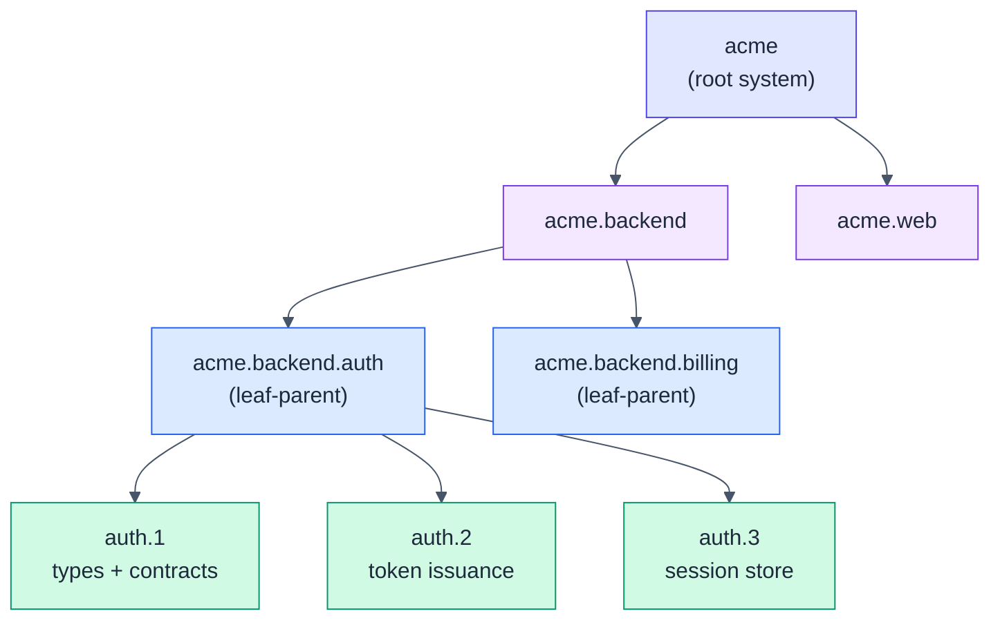

# HSDD: Hierarchical Spec-Driven Development

> Scale spec-driven development from a single spec to large, multi-team systems.
> Recursive decomposition, first-class contracts, and one human-reviewed phase at
> a time.

Single-spec workflows (like [OpenSpec](https://github.com/fission-ai/openspec)) are
excellent for small systems and fall apart on large ones: the spec becomes a
100-page monolith, every session re-reads everything, tokens explode, and the
model loses focus.

HSDD keeps OpenSpec as the execution engine and changes the **unit of work**:

> The unit of spec-driven development is not the product. It is the smallest
> independently verifiable phase with explicit contracts.

Everything above that unit is decomposition. Everything inside it is one ordinary
OpenSpec cycle. You get loose coupling, parallel development across teams, a small
focused context per session, and a human review gate on every phase.



Only the green leaf phases drive OpenSpec cycles. Each one consumes contract
interfaces by id, never another node's internals, so its session stays small.

## Install

HSDD ships as agent skills, installable with the [`skills`](https://github.com/vercel-labs/skills)
CLI (works with Claude Code, Cursor, Codex, and 70+ agents):

```bash
# All four HSDD skills (replace with your repo path)
npx skills add mpurbo/hsdd

# Or a single skill
npx skills add mpurbo/hsdd --skill hsdd-spec
```

The optional slash commands and the registry generator are not installed by the
`skills` CLI. To use them, copy `commands/*.md` into your project's
`.claude/commands/` and run the generator bundled at
`skills/hsdd-contract/scripts/gen-registry.mjs`.

**Recommended companion:** Obra's [superpowers](https://github.com/obra/superpowers)
plugin. HSDD composes with its `brainstorming`, `test-driven-development`,
`verification-before-completion`, and code-review skills rather than
re-implementing them; `hsdd-config` wires them into each OpenSpec cycle.

## The skill set

| Skill | Use it to |
|-------|-----------|
| `hsdd-spec` | Turn a brain-dump into a high-level spec, or decompose any node into child nodes. Recursive: runs at the root and every internal level. |
| `hsdd-contract` | Define and version the first-class contracts between nodes. |
| `hsdd-phase-plan` | Break a small-enough node into ordered, independently implementable phases, each sized for one OpenSpec change and one review window. |
| `hsdd-config` | Configure OpenSpec and switch the phase context so each cycle sees only the current phase plus its consumed contracts. |

## How it works

1. **Decompose** the system into a tree of nodes (`hsdd-spec`), recursing until a
   node is small enough to phase.
2. **Contract** every boundary as a versioned file (`hsdd-contract`); a generated
   registry keeps the index honest.
3. **Phase-plan** each leaf node into ordered phases with gates and review tiers
   (`hsdd-phase-plan`).
4. **Configure** the per-phase context (`hsdd-config`), then run one OpenSpec
   cycle per phase. Each `apply` produces a verification doc.
5. **Review** every phase: a human reads the diff and runs the verification, at a
   depth set by the phase's review tier. Then move to the next phase.

Each phase is sized so the AI run plus the human review fit one Claude Code
rolling window (target ~5h). Phase sizing is the control knob for context,
tokens, time, and quality.

## Quickstart

```text
"Write a high-level spec for a merchant onboarding platform."   -> hsdd-spec (root)
"Break down @spec/acme.md into backend, mobile, and web."       -> hsdd-spec (internal node)
"Define the auth-token contract: auth produces, billing consumes." -> hsdd-contract
"acme.backend.auth is small enough. Write its phase plan."      -> hsdd-phase-plan
"Set up OpenSpec config for this project."                      -> hsdd-config
"/hsdd-phase acme.backend.auth.2"   (switch context, then opsx:new)
```

## Learn more

- [Methodology specification](spec/hsdd-spec-v0_3.md): the full model, diagrams,
  and design decisions.
- [User's guide](docs/users-guide.md): worked examples for a simple single-level
  project and a multi-level system.
