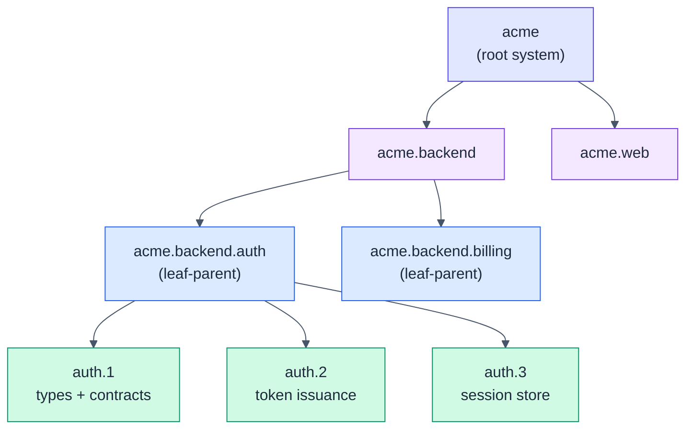

# HSDD: Hierarchical Spec-Driven Development

> Scale spec-driven development from a single spec to large, multi-team systems.
> Recursive decomposition, first-class contracts, and one human-reviewed phase at
> a time.

**The spec is the program.** You don't write a large program as one file; you
decompose it into loosely-coupled subsystems and modules that talk only through
interfaces. A large spec should be built the same way.

Single-spec workflows (like [OpenSpec](https://github.com/fission-ai/openspec)) work
well for small systems but not for large ones. As the system grows, the one spec
becomes too large, every session re-reads all of it, token usage climbs, and model
focus degrades.

HSDD applies that decomposition to the spec itself:

- A large spec breaks into independent, loosely-coupled sub-specs.
- Sub-specs are isolated. They connect only through **contracts**: an API endpoint,
  a schema, a shared data structure, or any other named interface.
- Decomposition recurses to as many levels as the system's complexity needs.
- At the lowest level, a spec is a **phase**: the smallest piece executable on its
  own.

HSDD keeps OpenSpec as the per-phase execution engine and makes the phase its
**unit of work**:

> The unit of spec-driven development is not the product. It is the smallest
> independently verifiable phase with explicit contracts.

We size that unit as one **Phase Equivalent (PE)**: the largest unit of change
one reviewer can genuinely review and manually verify in a single sitting, plus
the agent run that produces it (roughly <= 400 changed lines of non-generated
code, <= 8 OpenSpec tasks, about half a working day end to end). Everything
above a PE is decomposition; everything inside one is a single ordinary OpenSpec
(SDD) cycle.

The inputs are whatever you already have for the project: PRD, RFC, architecture
docs, designs, and any other available context.



Only the green leaf phases drive OpenSpec cycles. Each one consumes contract
interfaces by id, never another node's internals, so its session stays small.

## Why HSDD

HSDD applies established software engineering practice to the specification itself,
and to how an AI agent works against it.

- **Modularity and loose coupling in the spec.** Principles that are routine for
  code (single responsibility, information hiding, explicit interfaces) rarely reach
  the spec. HSDD structures the spec as a tree of nodes coupled only through named,
  versioned contracts, with a typed dependency graph in place of implicit
  whole-spec coupling.
- **Bounded context per session.** Each phase's session receives its own spec plus
  only the interfaces of the contracts it consumes. Per-session context is bounded
  by the phase, not the system. Total project tokens still scale with the number
  of phases, and decomposition itself costs tokens: below a handful of PEs, plain
  OpenSpec is cheaper. HSDD pays a planning overhead to buy bounded sessions,
  parallelism, and reviewability.
- **Attention shaped, drift discouraged.** Context injection shapes attention:
  the session is handed only its phase and its consumed interfaces, so it has no
  reason to load sibling internals. Where information hiding must be enforced,
  a phase declares `Touches` file globs and `hsdd check-scope` fails the gate on
  any out-of-scope diff.
- **Skills decide; tools do.** Every mechanical guarantee (registry projection,
  phase-context assembly, referential lint, derived status, tree renames, scope
  checks) lives in the deterministic `hsdd` CLI, not in prose an agent might
  drift from. Skills shrink to judgment: decomposition, contract design,
  decision capture, review.
- **Human review by construction.** Every leaf phase ends at a human review gate,
  sized so review and manual verification fit one working window (one PE). Review
  depth scales to risk through tiers. The human owns correctness; the agent owns
  throughput.
- **A functional model underneath.** Each node is a function with typed inputs and
  outputs (its consumed and produced contracts), the dependency DAG is the
  composition, and internals are private. Nodes are built against contract values,
  not live implementations.

## Install

HSDD is two pieces: agent skills (judgment) and the `hsdd` CLI (mechanics).

Skills install with the [`skills`](https://github.com/vercel-labs/skills) CLI
(works with Claude Code, Cursor, Codex, and 70+ agents):

```bash
# All seven HSDD skills (replace with your repo path)
npx skills add mpurbo/hsdd

# Or a single skill
npx skills add mpurbo/hsdd --skill hsdd-spec
```

The CLI installs per project as a dev dependency (zero-dependency Node >= 20
package, source under [`cli/`](cli/)):

```bash
npm i -D hsdd     # or run ad hoc: npx hsdd <command>
```

It owns every deterministic operation: `registry`, `context`, `lint`, `status`,
`rename`, `check-scope`. The optional slash commands are not installed by the
`skills` CLI; copy `commands/*.md` into your project's `.claude/commands/`.

**Recommended companion:** Obra's [superpowers](https://github.com/obra/superpowers)
plugin. HSDD composes with its `brainstorming`, `test-driven-development`,
`verification-before-completion`, and code-review skills rather than
re-implementing them; `hsdd-config` wires them into each OpenSpec cycle.

## The skill set

| Skill | Use it to |
|-------|-----------|
| `hsdd-spec` | Turn a brain-dump into a high-level spec, or decompose any node into child nodes. Recursive: runs at the root and every internal level. Adds integration nodes where siblings exchange contracts. |
| `hsdd-contract` | Define and version the first-class contracts between nodes. `stable` requires an executable schema or fixtures, and both producer and consumer gates run them. |
| `hsdd-adr` | Author and maintain cross-cutting Architecture Decision Records as first-class files, with registry-compatible frontmatter and a status lifecycle. |
| `hsdd-phase-plan` | Break a small-enough node into ordered, independently implementable phases, each sized for one OpenSpec change and one review sitting. |
| `hsdd-config` | Initialize OpenSpec's config: project context, companion-skill wiring, and the marked region the CLI splices phase context into. |
| `hsdd-review` | Drive the human review gate per tier, disposition learnings, and record sign-off (PR-based where available). |
| `hsdd-adopt` | Bring an existing system under HSDD: as-built specs, contracts extracted from real seams, lazy decomposition. |

And one tool: the **`hsdd` CLI** owns everything deterministic (registry,
context, lint, status, rename, check-scope). Skills decide; tools do.

## How it works

1. **Decompose** the system into a tree of nodes (`hsdd-spec`), recursing until a
   node is small enough to phase. Cross-cutting decisions become ADRs
   (`hsdd-adr`), first-class files the registry and phase context resolve by id.
2. **Contract** every boundary as a versioned file (`hsdd-contract`); `npx hsdd
   registry` projects the index, and `stable` contracts carry schemas/fixtures
   both sides' gates execute.
3. **Phase-plan** each leaf node into ordered phases with gates and review tiers
   (`hsdd-phase-plan`).
4. **Start each phase** with `/hsdd-new {phase-id}`: the CLI derives the phase
   context (a pure function of the phase id) and splices it into OpenSpec's
   config, then the ordinary OpenSpec cycle runs. Each `apply` produces a
   verification doc.
5. **Review** every phase (`hsdd-review`): a human walks the tier checklist,
   dispositions the learnings, and signs off; learnings flow back into specs,
   contracts, and ADRs before the next phase derives its context.

Run `openspec init` once, at the repo root (the directory that holds `docs/`,
`contracts/`, and `adr/`). One HSDD tree has one OpenSpec project. Sequential
phases share the checkout; concurrent phases take one git worktree per active
phase (branch `hsdd/{phase-id}`), required because one checkout has one
`config.yaml`.

Each phase is one PE (defined above): one review sitting. Phase sizing is the
control knob for context, tokens, time, and quality. (Calibration note: as of
mid-2026 one PE happens to fit one Claude Code rolling window; the sitting is
the invariant, not the window.)

## Quickstart

```text
"Write a high-level spec for a merchant onboarding platform."   -> hsdd-spec (root)
"Break down @spec/acme.md into backend, mobile, and web."       -> hsdd-spec (internal node)
"Define the auth-token contract: auth produces, billing consumes." -> hsdd-contract
"Write the ADR for the auth provider decision."                 -> hsdd-adr
"acme.backend.auth is small enough. Write its phase plan."      -> hsdd-phase-plan
"Set up OpenSpec config for this project."                      -> hsdd-config
"/hsdd-new acme.backend.auth.2"     (derive context, then opsx:new)
"/hsdd-review acme.backend.auth.2"  (run the gate when the phase is built)

# existing codebase instead of greenfield?
"Adopt HSDD for this repo."                                     -> hsdd-adopt
```

## Learn more

- [Methodology specification](spec/hsdd-spec-v0_3.md): the full model, diagrams,
  and design decisions.
- [v0.4 delta](spec/hsdd-spec-v0_4.md): ADR authoring as a first-class skill and
  where to run `openspec init`. Read against v0.3.
- [v0.5 delta](spec/hsdd-spec-v0_5.md): the `hsdd` CLI, machine-readable
  artifacts, pull-based phase context, contract validation wiring, the feedback
  loop, derived status, brownfield adoption, and the multi-team profile. The
  last delta before v1.0 consolidates.
- [User's guide](docs/users-guide.md): worked examples for a simple single-level
  project and a multi-level system.
- [Maintainer's guide](docs/maintainers-guide.md): repo chores, tests, npm
  releases of the CLI.

## References

- This methodology supersedes the set of SDD-related skills in [pubo-skills](https://github.com/mpurbo/purbo-skills#spec-driven-development).