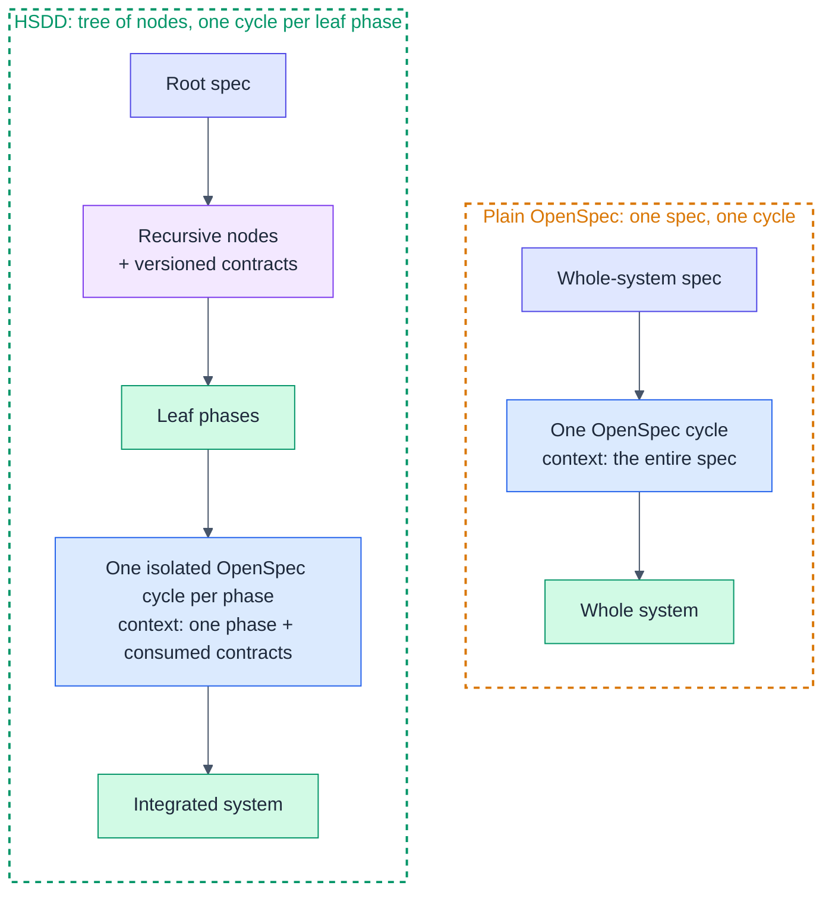
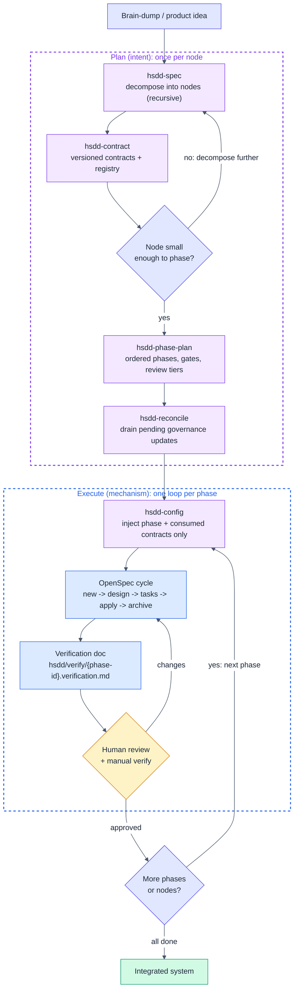
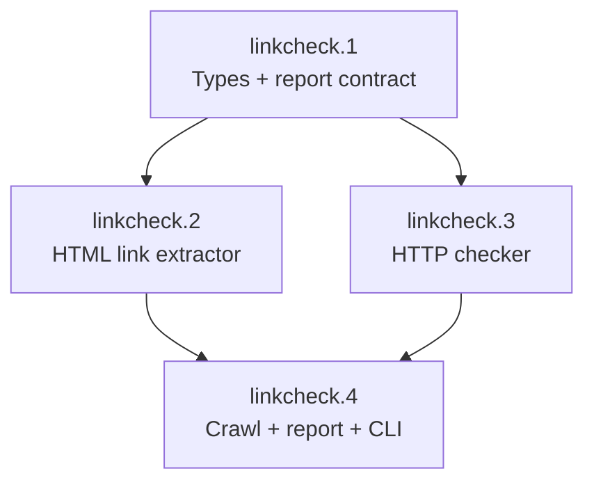
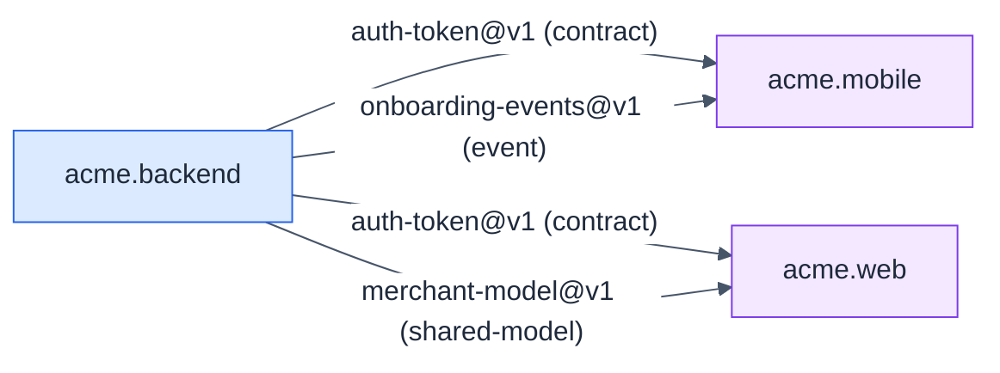

# HSDD User's Guide

A practical, example-driven walkthrough. For the full model and rationale, see the
[methodology spec](../spec/hsdd-spec-v0_3.md) — v0.3 is the base; read the
[v0.4](../spec/hsdd-spec-v0_4.md), [v0.4.2](../spec/hsdd-spec-v0_4_2.md),
[v0.5](../spec/hsdd-spec-v0_5.md), and [v0.6](../spec/hsdd-spec-v0_6.md) deltas
against it.

## Before you start

Install the skills (see the [README](../README.md)) and, ideally, [Obra's
superpowers](https://github.com/obra/superpowers) plugin. The HSDD loop, in one line:

> decompose -> contract -> phase-plan (parallel across leaf-parents) ->
> reconcile -> configure -> one OpenSpec cycle per phase -> human review ->
> repeat.

The default layout the skills emit (override it in `hsdd/conventions.md`). Every
HSDD artifact lives under one root directory, `hsdd/`, with singular directory
names; only OpenSpec's own files stay where OpenSpec expects them:

```text
hsdd/conventions.md                        naming, layout, and process conventions
hsdd/spec/{node-id}.md                     node specs and phase plans
hsdd/verify/{phase-id}.verification.md     per-phase verification docs
hsdd/contract/{slug}.md + INDEX.md         first-class contracts (registry generated)
hsdd/adr/{nnn}-{title}.md + INDEX.md       cross-cutting decisions (hsdd-adr, registry generated)
hsdd/scripts/gen-registry.mjs              registry generator (copied from hsdd-contract)
openspec/                                  config.yaml + one change per phase
```

**Where to run `openspec init`:** once, at the repo root (the directory that holds
`hsdd/`). One HSDD tree has one OpenSpec project. Every
phase, across every node, is a change under that single `openspec/changes/`;
phases are kept apart by the per-phase context switch (`hsdd-config`), not by
separate projects. If your system is split across repos, run `openspec init` at
each repo root and share `hsdd/contract/` and `hsdd/adr/` via a package or submodule.

A key principle worth internalizing early: **depth and ceremony are costs.** Use
exactly as many levels and artifacts as the system needs, and no more. The two
examples below sit at opposite ends of that scale.

---

## How HSDD works

### Plain OpenSpec vs HSDD

Plain OpenSpec drives the whole system from one spec through one cycle, so every
session carries the entire spec as context. HSDD decomposes the system into a tree
of nodes coupled by versioned contracts, then runs one isolated OpenSpec cycle per
leaf phase. Each cycle sees only its phase plus the contract interfaces it
consumes.



The OpenSpec cycle itself is unchanged. HSDD only decides what each cycle sees and
in what order cycles run.

### The HSDD workflow

The one-line loop above, drawn out. Planning is done once per node and rarely
rewritten. Execution repeats once per phase: switch the context, run the cycle,
generate the verification doc, and pass a human review gate before moving on.



The single amber node is the human review gate. Every leaf phase ends there, at a
depth set by its review tier (`gate-only`, `spot-check`, or `full-review`).

### Review tiers

`hsdd-phase-plan` assigns one tier per phase, based on risk rather than size. The
tier sets how much attention the gate gets **and** the artifact profile of the
cycle: a `gate-only` phase skips `design.md` and gets a slim verification doc;
a `spot-check` phase skips `design.md` unless the phase settles a real design
decision, and gets a short verification doc; a `full-review` phase produces the
full set. Every phase still ends at the gate and still produces a verification
doc — only the depth scales with the tier.

- **`gate-only`** — scaffolding, types, boilerplate. A wrong turn here is cheap
  and mechanical to catch, so the automated gate (e.g. `cargo test`) passing is
  enough: you're notified and move on without reading the diff. Example:
  `linkcheck.1` and `acme.backend.auth.1`, both just "Types + contract" phases —
  there's no logic yet to get wrong.
- **`spot-check`** — well-constrained phases with a clear contract, where the
  output's shape is easy to eyeball even without tracing every line. Glance at
  the diff, confirm the gate passed, proceed. Example: `linkcheck.2`, a pure
  `HTML -> [Url]` extractor, and `acme.backend.auth.3`, the session store —
  narrow, single-purpose, easy to sanity-check at a glance.
- **`full-review`** — orchestration, business logic, integrations, security,
  where mistakes are expensive and not obviously visible in a diff. Read the
  diff, run the manual verification steps from the phase's verification doc,
  and think through edge cases before approving. Example: `linkcheck.3`, the
  HTTP checker with retries and timeouts, and `acme.backend.auth.2`, token
  issuance — see Step 6 in Example 2, where the manual verification runs
  before sign-off.

See the methodology spec, [§12](../spec/hsdd-spec-v0_3.md), for how tier
interacts with the ~5h review window, and the [v0.6 delta,
§3](../spec/hsdd-spec-v0_6.md) for the sizing floor and the tier-scaled
artifact profile.

---

## Example 1: A simple project (single level)

Sometimes the whole system is small enough that there is nothing to decompose:
the root node is already a leaf-parent, and you go straight to phases. HSDD does
not force a tree on you.

**The project:** `linkcheck`, a CLI that crawls a site and reports broken links.

### Step 1: Spec it

```text
You: "Write a high-level spec for linkcheck, a CLI that crawls a site and
      reports broken links."
```

`hsdd-spec` runs at the root. It recognizes the project is one coherent
responsibility that fits a handful of phases, so it marks the root a
**leaf-parent** rather than inventing sub-nodes. `hsdd/spec/linkcheck.md`:

```markdown
### linkcheck: Broken Link Checker CLI

- **Kind:** leaf-parent
- **Purpose:** crawl a site, check every link, report the broken ones
- **Consumes:** none
- **Produces:** [linkcheck-report@v1]
- **Decomposes into:** phases (see phase plan)
- **Isolation strategy:** pure HTML parsing and pure report formatting are testable
  with fixtures; the HTTP checker is mocked in tests.
```

For a project this small there is just one outward contract (the report format).
The "contracts" between phases are simply the domain types defined in phase 1.

### Step 2: One contract

```text
You: "Define the linkcheck-report contract."
```

`hsdd-contract` writes `hsdd/contract/linkcheck-report.md` with frontmatter plus the
report schema (JSON shape and exit codes). Then it regenerates the registry:

```bash
node hsdd/scripts/gen-registry.mjs
```

### Step 3: Phase-plan

```text
You: "Write the phase plan for linkcheck."
```

`hsdd-phase-plan` produces FP-ordered phases, each <= 8 OpenSpec tasks, opening
with the phase summary table:

| Phase | Name | Tier | Size | Depends on |
|------:|------|------|------|------------|
| linkcheck.1 | Types + report contract | gate-only | small | — |
| linkcheck.2 | HTML link extractor | spot-check | small | 1 |
| linkcheck.3 | HTTP checker | full-review | medium | 1 |
| linkcheck.4 | Crawl + report + CLI | full-review | medium | 2, 3 |

and the dependency graph as a Mermaid flowchart:



The plan ends with a `## Governance updates (pending reconcile)` section
(confirming the `linkcheck-report@v1` phase ids). Even serial, finish planning
with a quick reconcile:

```text
You: "Drain the pending governance updates."
```

`hsdd-reconcile` applies the confirms, flips the contract to
`phase_ids: final` and `status: stable`, and regenerates the registry. With
one node this takes a minute; the same step is what makes parallel planning
safe in Example 2.

### Step 4: Configure, run, review

```text
You: "Set up OpenSpec config for this project."
You: "/hsdd-phase linkcheck.1"      (switch context, then run the cycle)
You: "opsx: new ..."                 (proposal -> design -> tasks -> apply -> archive)
```

At `apply`, the agent writes `hsdd/verify/linkcheck.1.verification.md`. Because
phase 1 is `gate-only`, you confirm the gate passed and move on. Phase 3 (the HTTP
checker) is `full-review`: you read the diff and run the manual verification
before approving. Repeat for `.2`, `.3`, `.4`.

**That is the whole project.** No internal nodes, one contract, four phases. The
methodology stayed out of the way.

---

## Example 2: A multi-level system

Now a system big enough to need the tree: `acme`, a full-stack merchant
onboarding platform with backend, mobile, and web, built by separate teams.
This stack-first split is the decomposition-axis rule (v0.6
[§6](../spec/hsdd-spec-v0_6.md)) — the axis follows ownership, which is why
`acme` does not decompose into `auth-end-to-end` / `billing-end-to-end`
slices spanning both stacks.

### Step 1: Decompose the root

```text
You: "Write a high-level spec for acme, a merchant onboarding platform with a
      backend, a mobile app, and a web console."
```

`hsdd-spec` splits the root into three internal nodes and names the contracts
between them. `hsdd/spec/acme.md` includes this typed dependency DAG:



Because the edges are `contract`, `shared-model`, and `event` (not `hard`), the
mobile and web teams can build against mocks as soon as the contracts are
`stable`. They do not wait for the backend implementation.

### Step 2: Recurse into the backend

```text
You: "Break down @hsdd/spec/acme.backend.md into auth, billing, and catalog subsystems."
```

`hsdd-spec` runs again, now for an internal node, producing
`acme.backend.auth.md`, `acme.backend.billing.md`, `acme.backend.catalog.md`. The
`auth` node is small enough to phase, so it is marked `leaf-parent`. If `billing`
were too big, you would recurse once more (insert an internal node) rather than
forcing a flat phase split.

### Step 3: Contracts and a decision

```text
You: "Define the auth-token contract: auth produces it, billing and mobile consume it."
```

`hsdd-contract` writes `hsdd/contract/auth-token.md` (frontmatter + interface +
guarantees + `v1`). The choice of auth provider affects more than one node and
must outlive the auth subsystem, so `hsdd-spec` proposes an ADR and hands it to
`hsdd-adr` to materialize:

```text
You: "Write the ADR for the auth provider decision."
```

`hsdd-adr` writes `hsdd/adr/001-auth-provider.md`. The frontmatter mirrors a contract,
so the same generator projects it into `hsdd/adr/INDEX.md`:

```markdown
---
id: ADR-001
status: accepted
affects: [acme.backend.auth, auth-token@v1]
date: 2026-07-02
---

# ADR-001: Auth provider

## Context
Login must work across mobile and web, and key material must rotate.
## Decision
Use provider X with rotating asymmetric keys.
## Consequences
- token verification needs the public JWKS endpoint
- key rotation is a hard dependency for auth.2
```

It also sets `Governed by: [ADR-001]` on `acme.backend.auth` and `auth-token@v1`,
then regenerates the registry (`node hsdd/scripts/gen-registry.mjs`). The ADR is a
file, not a section in the node spec, so `hsdd-config` can later inject only its
Decision and Consequences into the `auth.2` phase context.

### Step 4: Phase-plan the leaf-parent

```text
You: "acme.backend.auth is small enough to phase. Write its phase plan."
```

| Phase | Name | Tier | Size | Depends on | Collides with |
|------:|------|------|------|------------|---------------|
| acme.backend.auth.1 | Types + auth-token contract | gate-only | small | — | — |
| acme.backend.auth.2 | Token issuance (provider X) | full-review | medium | 1 | — |
| acme.backend.auth.3 | Session store | spot-check | small | 1 | 4 |
| acme.backend.auth.4 | Auth API + wiring | full-review | medium | 2, 3 | 3 |

The plan ends with a pending-governance section; drain it with a quick
reconcile before configuring, as in Example 1.

### Step 5: Configure and switch phase context

```text
You: "Set up OpenSpec config for this project."
You: "/hsdd-phase acme.backend.auth.2"
```

The phase switch injects only what `auth.2` needs. The OpenSpec session for
`auth.2` never sees the billing spec, the web spec, or sibling phases:

```yaml
  ## Current Phase: acme.backend.auth.2 - Token issuance
  Scope: issue JWTs on login via provider X; sign, set claims, handle errors.
  Produces: auth-token@v1
  Gate: cargo test
  Review tier: full-review

  ## Contracts from Prior Phases / Nodes
  auth-token@v1: { sub, exp, iat, scopes }; exp > iat; sub immutable. (interface only)

  ## Governing Decisions
  ADR-001: use provider X with rotating asymmetric keys; verification needs JWKS.
```

### Step 6: Run, verify, parallelize

```text
You: "opsx: new ..."   (proposal -> design -> tasks -> apply -> archive)
```

`apply` writes `hsdd/verify/acme.backend.auth.2.verification.md`. You give it a
`full-review`. Meanwhile, in a separate session or by another teammate, the web
team starts `acme.web.dashboard` against the `auth-token@v1` mock, and billing
starts against the same contract. Three teams, three small contexts, one shared
contract.

### Step 7: Parallel leaf-parents, worktrees, reconcile

When two leaf-parents are independent (their only edges are contracts), plan
them concurrently, one git worktree per node:

```bash
git worktree add ../acme-auth plan-auth
git worktree add ../acme-billing plan-billing
```

Run `hsdd-phase-plan` in each worktree. Under the governance freeze, neither
run edits `hsdd/contract/`, `hsdd/adr/`, or `hsdd/conventions.md`; each emits its
intended changes into its own plan file, so the branches touch disjoint files.
Billing's section might read:

```markdown
## Governance updates (pending reconcile)

> Emitted by hsdd-phase-plan on 2026-07-05. Drained by hsdd-reconcile;
> do not apply by hand.

- confirm `auth-token@v1` consumers: [acme.backend.billing.2]
- request `auth-token@v1`: which fixture do consumers mock against?
  - assumption: `hsdd/contract/fixtures/auth-token.json`, owned by
    acme.backend.auth.1
  - contingent phases: acme.backend.billing.2
```

Merge both branches (clean by construction), then at the root:

```text
You: "Reconcile the worktrees."
```

`hsdd-reconcile` drains both sections: applies the `confirm` ids, resolves the
fixture `request` with you, flips `auth-token@v1` to `phase_ids: final` and
`status: stable`, and
regenerates the registry. Only then do billing's per-phase OpenSpec cycles start.

### Step 8: Execute phases on branches

Planning worktrees (Step 7) keep governance frozen while node specs are built.
Execution has its own branch discipline, one level down. Each node gets one
**integration branch**: `acme.backend.auth`'s phase branches —
`acme.backend.auth.1` through `.4` — merge into `integration/acme.backend.auth`
as each phase's OpenSpec cycle lands; `acme.backend.billing`'s phases merge
into their own `integration/acme.backend.billing` the same way. Node
integration branches then merge into the root branch. A node's plan file
(`hsdd/spec/acme.backend.auth.md`) is written on exactly one lineage — never
re-planned or copied onto a diverged sibling lineage — and `hsdd-reconcile`
runs once, at the root, after the node's integration branch lands there, never
per-worktree or per-phase.

```bash
git checkout -b integration/acme.backend.auth main
git merge acme.backend.auth.1
git merge acme.backend.auth.2
# ... one merge per phase, in dependency order
git checkout main
git merge integration/acme.backend.auth
```

`openspec/config.yaml`'s `## Current Phase` block is rewritten by every
`/hsdd-phase` switch, so a merge conflict on it carries no information: take
either side and re-run `/hsdd-phase {next-phase}` before starting the next
cycle. If `acme.backend.auth.2` and `acme.backend.auth.3` land on
`integration/acme.backend.auth` in either order, do not hand-merge their two
`Current Phase` blocks — pick either one, then switch. Set
`openspec/config.yaml merge=ours` on integration branches in `.gitattributes`
to skip the conflict prompt entirely.

Not every pair of a node's phases parallelizes cleanly. If
`acme.backend.auth.3` (session store) and `acme.backend.auth.4` (auth API +
wiring) both touch the same router file, the phase plan says so —
`- **Collides with:** [acme.backend.auth.4]` on `.3`'s section — and the
summary table from Step 4 shows the column. Colliding phases execute serially
on the node's integration branch; spawn a worktree per phase only where the
table shows no collision between them, the same way Step 7 spawned one
worktree per non-colliding leaf-parent.

Finally, name the OpenSpec capability each phase's proposal targets after a
stable feature area of the node — `auth-sessions`, `auth-token-issuance` — not
after the phase (`acme-backend-auth-3`). A phase-named capability has nothing
left to say once that phase archives; a feature-area name keeps accumulating
requirements as later phases, or future changes, touch the same area. Accept
that phases sharing a capability serialize their archive — the same phases
that collide on files usually collide on capability too.

### The resulting tree

```text
hsdd/
  conventions.md
  spec/
    acme.md  acme.backend.md  acme.mobile.md  acme.web.md
    acme.backend.auth.md  acme.backend.billing.md  acme.backend.catalog.md
  contract/
    INDEX.md  auth-token.md  merchant-model.md  onboarding-events.md
  adr/
    INDEX.md  001-auth-provider.md
  verify/
    acme.backend.auth.1.verification.md  ...  acme.backend.auth.4.verification.md
  scripts/
    gen-registry.mjs
openspec/
  config.yaml  changes/...
```

---

## Tips

- **Size to the window.** If a phase will not fit one ~5h review window (AI run
  plus your review and verification), it is too big. Ask `hsdd-phase-plan` to
  split it. Too small is also a smell: merge adjacent phases under the sizing
  floor's conditions (same tier, same consumed contracts, no third phase
  depends on one without the other, still fits the window) rather than paying
  a full cycle for a phase that will not earn it.
- **Switch context before `opsx:new`, every time.** This is the one easy-to-forget
  step. `/hsdd-phase {phase-id}` exists for exactly this.
- **Config conflicts are noise.** A merge conflict on `openspec/config.yaml`'s
  `Current Phase` block carries no information — it is ephemeral per-session
  working state. Take either side and re-run `/hsdd-phase {next-phase}` before
  the next cycle.
- **Add a level, do not widen.** When a leaf-parent grows past a handful of
  phases, insert an internal node ("feature") instead of piling on phases.
- **Split where ownership splits.** Decompose along team, owner, or
  deploy-target boundaries first (backend vs. mobile vs. web); capability
  slicing over technology buckets applies only within one owner's territory.
- **Keep `hard` edges rare.** They are the critical path. Prefer `contract`,
  `event`, and `shared-model` edges so teams parallelize.
- **Plan against frozen governance.** `hsdd/contract/`, `hsdd/adr/`, and
  `hsdd/conventions.md` are read-only during phase planning, even at the root.
  Changes ride the plan's pending-governance section until `hsdd-reconcile`
  applies them; never resolve a contract gap by editing the contract mid-plan.
- **Regenerate the registry** after any contract or ADR change:
  `node hsdd/scripts/gen-registry.mjs`. Never hand-edit `INDEX.md`.
- **Materialize ADRs as files, not prose.** A cross-cutting decision belongs in
  `hsdd/adr/{nnn}-{title}.md` with frontmatter (via `hsdd-adr`), so the registry and
  the phase context can find it. A decision internal to one node stays a `D{n}` in
  that node's spec.
- **Match review depth to risk.** Reserve `full-review` for orchestration,
  business logic, integrations, and security. Let scaffolding be `gate-only`.
