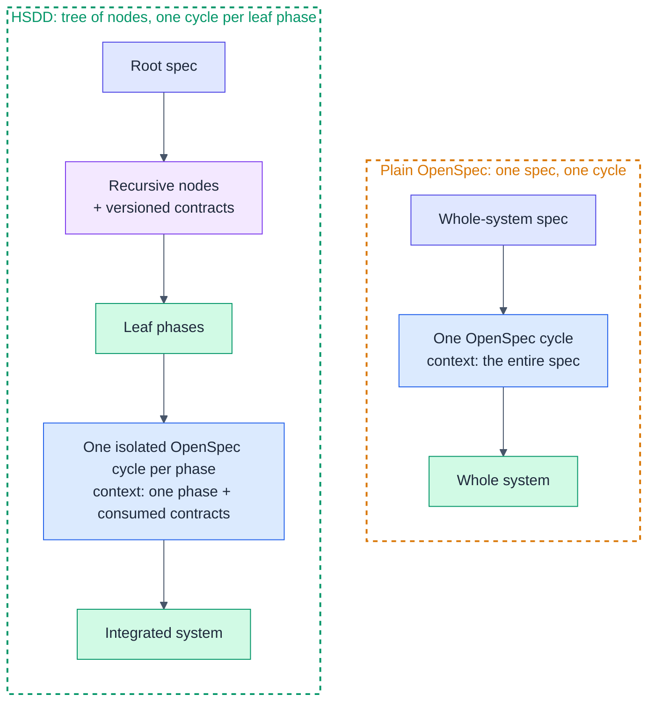
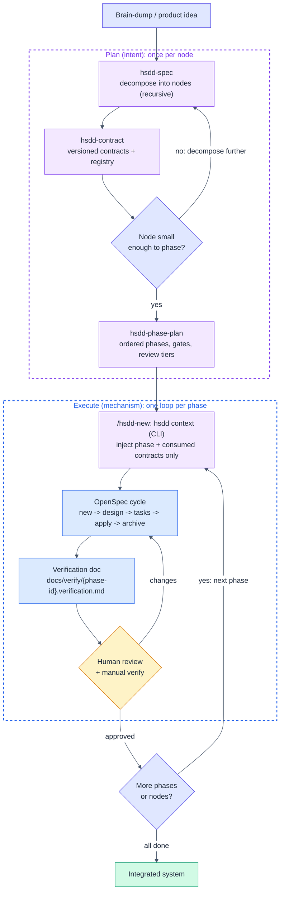
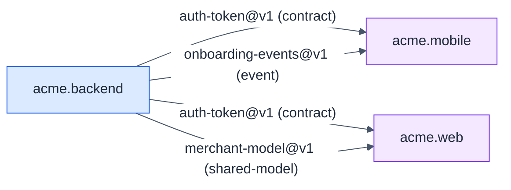

# HSDD User's Guide

A practical, example-driven walkthrough. For the full model and rationale, see the
[methodology spec](../spec/hsdd-spec-v0_3.md) and its deltas
([v0.4](../spec/hsdd-spec-v0_4.md), [v0.5](../spec/hsdd-spec-v0_5.md)).

## Before you start

Install the skills and the `hsdd` CLI (see the [README](../README.md)) and,
ideally, [Obra's superpowers](https://github.com/obra/superpowers) plugin. The
skills carry the judgment; the CLI (`npm i -D hsdd`) owns every deterministic
step: registry projection, phase-context assembly, lint, derived status, tree
renames, and scope checks. The HSDD loop, in one line:

> decompose -> contract -> phase-plan -> one OpenSpec cycle per phase
> -> human review gate -> learnings flow back -> repeat.

The default layout the skills emit (override it in `docs/conventions.md`
frontmatter; the CLI reads the same fields):

```text
docs/spec/{node-id}.md                    node specs and phase plans
docs/verify/{phase-id}.verification.md    per-phase verification docs
docs/STATUS.md                            generated by `npx hsdd status --write`
docs/renames.md                           tree-surgery ledger (hsdd rename)
contracts/{slug}.md + contracts/INDEX.md  first-class contracts (registry generated)
schemas/ + fixtures/                      executable contract validation artifacts
adr/{nnn}-{title}.md + adr/INDEX.md        cross-cutting decisions (hsdd-adr, registry generated)
openspec/                                  config.yaml + one change per phase
```

**Where to run `openspec init`:** once, at the repo root (the directory that holds
`docs/`, `contracts/`, and `adr/`). One HSDD tree has one OpenSpec project. Every
phase, across every node, is a change under that single `openspec/changes/`;
phases are kept apart by the per-phase context switch (`hsdd context`), not by
separate projects. If your system is split across repos, run `openspec init` at
each repo root and share `contracts/` and `adr/` via a package or submodule.

A key principle worth internalizing early: **depth and ceremony are costs.** Use
exactly as many levels and artifacts as the system needs, and no more. The two
examples below sit at opposite ends of that scale.

---

## How HSDD works

### Plain OpenSpec vs HSDD

Plain OpenSpec drives the whole system from one spec through one cycle, so every
session carries the entire spec as context. HSDD decomposes the system into a tree
of nodes coupled by versioned contracts, then runs one isolated OpenSpec cycle per
leaf phase. Each cycle sees only its phase plus the contract interfaces it
consumes.



The OpenSpec cycle itself is unchanged. HSDD only decides what each cycle sees and
in what order cycles run.

### The HSDD workflow

The one-line loop above, drawn out. Planning is done once per node and rarely
rewritten. Execution repeats once per phase: switch the context, run the cycle,
generate the verification doc, and pass a human review gate before moving on.



The single amber node is the human review gate. Every leaf phase ends there, at a
depth set by its review tier (`gate-only`, `spot-check`, or `full-review`).

---

## Example 1: A simple project (single level)

Sometimes the whole system is small enough that there is nothing to decompose:
the root node is already a leaf-parent, and you go straight to phases. HSDD does
not force a tree on you.

**The project:** `linkcheck`, a CLI that crawls a site and reports broken links.

### Step 1: Spec it

```text
You: "Write a high-level spec for linkcheck, a CLI that crawls a site and
      reports broken links."
```

`hsdd-spec` runs at the root. It recognizes the project is one coherent
responsibility that fits a handful of phases, so it marks the root a
**leaf-parent** rather than inventing sub-nodes. `docs/spec/linkcheck.md`:

```markdown
### linkcheck: Broken Link Checker CLI

**Kind:** leaf-parent
**Purpose:** crawl a site, check every link, report the broken ones
**Consumes:** []
**Produces:** [linkcheck-report@v1]
**Decomposes into:** phases (see phase plan)
**Isolation strategy:** pure HTML parsing and pure report formatting are testable
  with fixtures; the HTTP checker is mocked in tests.
```

For a project this small there is just one outward contract (the report format).
The "contracts" between phases are simply the domain types defined in phase 1.

### Step 2: One contract

```text
You: "Define the linkcheck-report contract."
```

`hsdd-contract` writes `contracts/linkcheck-report.md` with frontmatter plus the
report schema (JSON shape and exit codes), and points its `schema:` field at
`schemas/linkcheck-report.schema.json` so the contract is `stable` in the
machine-checkable sense. Then it regenerates the registry:

```bash
npx hsdd registry
```

### Step 3: Phase-plan

```text
You: "Write the phase plan for linkcheck."
```

`hsdd-phase-plan` reads the ordering policy from `docs/conventions.md` (default
`interfaces-first`; this project picks `fp-progression`) and produces ordered
phases, each <= 8 OpenSpec tasks:

```text
linkcheck.1  Types + report contract   spot-check   (Url, LinkStatus, Report; CLI args type)
linkcheck.2  HTML link extractor        spot-check   (pure: HTML -> [Url])
linkcheck.3  HTTP checker               full-review  (effects: Url -> LinkStatus, retries/timeouts)
linkcheck.4  Crawl + report + CLI       full-review  (compose 2+3, emit linkcheck-report, wire main)
```

Phase 1 is `spot-check`, not `gate-only`: its types feed every later phase (the
highest fan-out in the plan), they are cheap to read, and they are expensive to
get wrong. `gate-only` is reserved for artifacts with no downstream consumers,
like CI config or codegen output. Phase 4's gate also runs
`contract:verify linkcheck-report`, proving the real report validates against
the contract's schema.

```text
linkcheck.1
 |-- linkcheck.2   <- parallel
 |-- linkcheck.3   <- parallel with .2
      |-- linkcheck.4  <- depends on .2 and .3
```

### Step 4: Configure once, then one command per phase

```text
You: "Set up OpenSpec config for this project."   (hsdd-config: context, rules, markers)
You: "/hsdd-new linkcheck.1"
```

`/hsdd-new` runs `npx hsdd context linkcheck.1 --write` (the CLI derives the
phase context from the tree and splices it between the markers in
`openspec/config.yaml`), then starts the OpenSpec cycle with a change named
`linkcheck-1` whose proposal opens with `Phase: linkcheck.1`. Nothing to
remember, nothing stale to inherit.

At `apply`, the agent writes `docs/verify/linkcheck.1.verification.md`.

### Step 5: The gate

```text
You: "/hsdd-review linkcheck.1"
```

`hsdd-review` runs the gate command and the checks, walks you through the
`spot-check` checklist (diff summary plus the produced type surface), asks for a
disposition on every learning, and records your sign-off. Phase 3 (the HTTP
checker) is `full-review`: you read the diff and run the manual verification
before approving. Repeat for `.2`, `.3`, `.4`; `npx hsdd status` shows where you
are at any point.

**That is the whole project.** No internal nodes, one contract, four phases. The
methodology stayed out of the way.

---

## Example 2: A multi-level system

Now a system big enough to need the tree: `acme`, a full-stack merchant
onboarding platform with backend, mobile, and web, built by separate teams.

### Step 1: Decompose the root

```text
You: "Write a high-level spec for acme, a merchant onboarding platform with a
      backend, a mobile app, and a web console."
```

`hsdd-spec` splits the root into three internal nodes and names the contracts
between them. `docs/spec/acme.md` includes this typed dependency DAG:



Because the edges are `contract`, `shared-model`, and `event` (not `hard`), the
mobile and web teams can build against mocks as soon as the contracts are
`stable`. They do not wait for the backend implementation.

### Step 2: Recurse into the backend

```text
You: "Break down @spec/acme.backend.md into auth, billing, and catalog subsystems."
```

`hsdd-spec` runs again, now for an internal node, producing
`acme.backend.auth.md`, `acme.backend.billing.md`, `acme.backend.catalog.md`. The
`auth` node is small enough to phase, so it is marked `leaf-parent`. If `billing`
were too big, you would recurse once more (insert an internal node) rather than
forcing a flat phase split.

### Step 3: Contracts and a decision

```text
You: "Define the auth-token contract: auth produces it, billing and mobile consume it."
```

`hsdd-contract` writes `contracts/auth-token.md` (frontmatter + interface +
guarantees + `v1`). The choice of auth provider affects more than one node and
must outlive the auth subsystem, so `hsdd-spec` proposes an ADR and hands it to
`hsdd-adr` to materialize:

```text
You: "Write the ADR for the auth provider decision."
```

`hsdd-adr` writes `adr/001-auth-provider.md`. The frontmatter mirrors a contract,
so the same generator projects it into `adr/INDEX.md`:

```markdown
---
id: ADR-001
status: accepted
affects: [acme.backend.auth, auth-token@v1]
date: 2026-07-02
---

# ADR-001: Auth provider

## Context
Login must work across mobile and web, and key material must rotate.
## Decision
Use provider X with rotating asymmetric keys.
## Consequences
- token verification needs the public JWKS endpoint
- key rotation is a hard dependency for auth.2
```

It also sets `governed_by: [ADR-001]` on `acme.backend.auth` and `auth-token@v1`,
then regenerates the registry (`npx hsdd registry`). The ADR is a file, not a
section in the node spec, so `hsdd context` can later inject only its Decision
and Consequences into the `auth.2` phase context; `npx hsdd lint` keeps the
`affects`/`governed_by` links honest in both directions.

### Step 4: Phase-plan the leaf-parent

```text
You: "acme.backend.auth is small enough to phase. Write its phase plan."
```

```text
acme.backend.auth.1  Types + auth-token contract   spot-check   (feeds .2-.4: leverage rule)
acme.backend.auth.2  Token issuance (provider X)    full-review
acme.backend.auth.3  Session store                  spot-check
acme.backend.auth.4  Auth API + wiring              full-review
```

Because `acme.backend`'s children exchange contracts, `hsdd-spec` also adds an
integration node (`acme.backend.integration`) with `hard` edges to the producing
siblings; its phases replay the contract fixtures against the live composition
once the producers ship.

### Step 5: Configure once, then start the phase

```text
You: "Set up OpenSpec config for this project."   (hsdd-config)
You: "/hsdd-new acme.backend.auth.2"
```

`/hsdd-new` derives the context with `npx hsdd context acme.backend.auth.2
--write` and injects only what `auth.2` needs into the marked region of
`config.yaml`. The OpenSpec session for `auth.2` never sees the billing spec,
the web spec, or sibling phases:

```yaml
  <!-- hsdd:phase-context:begin -->
  ## Current Phase: acme.backend.auth.2: Token issuance
  Scope: issue JWTs on login via provider X; sign, set claims, handle errors.
  Produces: auth-token@v1
  Gate: cargo test && npm run contract:verify auth-token
  Review tier: full-review

  ## Contracts from Prior Phases / Nodes
  auth-token@v1: { sub, exp, iat, scopes }; exp > iat; sub immutable. (interface only)

  ## Governing Decisions
  ADR-001: use provider X with rotating asymmetric keys; verification needs JWKS.
  <!-- hsdd:phase-context:end -->
```

Only the marked region is ever rewritten; the project-wide context and the
rules around it are untouched by construction.

### Step 6: Run, verify, parallelize

The OpenSpec cycle proceeds as usual (proposal -> design -> tasks -> apply ->
archive); `apply` writes `docs/verify/acme.backend.auth.2.verification.md`,
including a `## Learnings` section. Then:

```text
You: "/hsdd-review acme.backend.auth.2"
```

You give it a `full-review`: gate plus scope check, full diff, manual
verification, learnings dispositioned (one of them bumps `auth-token` to add a
`scopes` claim: that is the feedback loop working), sign-off recorded on the
phase's PR.

Meanwhile, in a separate git worktree (branch `hsdd/acme.web.dashboard.1`) or by
another teammate, the web team builds against the `auth-token@v1` fixtures, and
billing starts against the same contract. Three teams, three small contexts, one
shared contract. Worktree-per-active-phase is required for concurrency: one
checkout has one `config.yaml`, and each worktree carries its own spliced
context, so parallel phases cannot race.

### The resulting tree

```text
docs/spec/
  acme.md  acme.backend.md  acme.mobile.md  acme.web.md
  acme.backend.auth.md  acme.backend.billing.md  acme.backend.catalog.md
contracts/
  INDEX.md  auth-token.md  merchant-model.md  onboarding-events.md
adr/
  INDEX.md  001-auth-provider.md
docs/verify/
  acme.backend.auth.1.verification.md  ...  acme.backend.auth.4.verification.md
openspec/
  config.yaml  changes/...
```

---

## Tips

- **Size to the sitting.** If a phase will not fit one review sitting (the
  largest change you can genuinely review and manually verify in one go, plus
  the agent run producing it), it is too big. Ask `hsdd-phase-plan` to split it.
- **Start phases with `/hsdd-new`, every time.** The context is derived fresh
  from the tree at cycle start, so nothing stale can be inherited and nothing
  needs remembering.
- **Add a level, do not widen.** When a leaf-parent grows past a handful of
  phases, insert an internal node ("feature") instead of piling on phases.
- **Keep `hard` edges rare.** They are the critical path. Prefer `contract`,
  `event`, and `shared-model` edges so teams parallelize.
- **Let the CLI do the mechanics.** `npx hsdd registry` after contract/ADR
  changes, `npx hsdd lint` in pre-commit or CI, `npx hsdd status` instead of
  archaeology. Never hand-edit `INDEX.md` or `STATUS.md`; they are projections.
- **Fixtures are the mocks.** Consumers test against a contract's fixtures, so
  a contract bump breaks consumer tests loudly instead of drifting silently.
- **Disposition every learning at the gate.** `spec-updated`, `contract-bumped`,
  `adr-proposed`, or `dropped (reason)`. "No learnings" is a valid entry;
  silence is not.
- **Materialize ADRs as files, not prose.** A cross-cutting decision belongs in
  `adr/{nnn}-{title}.md` with frontmatter (via `hsdd-adr`), so the registry and
  the phase context can find it. A decision internal to one node stays a `D{n}` in
  that node's spec.
- **Match review depth to leverage, not only risk.** A phase whose outputs feed
  two or more later phases is `spot-check` at minimum; reserve `gate-only` for
  consumer-less scaffolding, and `full-review` for orchestration, business
  logic, integrations, and security.
- **Wrong boundary? Rename, don't hand-edit.** Re-decompose with `hsdd-spec`,
  then `npx hsdd rename old.id new.id` rewrites every authored artifact (never
  the archive) and logs the move in `docs/renames.md`.
- **One worktree per concurrent phase.** Branch `hsdd/{phase-id}`. Required, not
  suggested: one checkout has one `config.yaml`.
