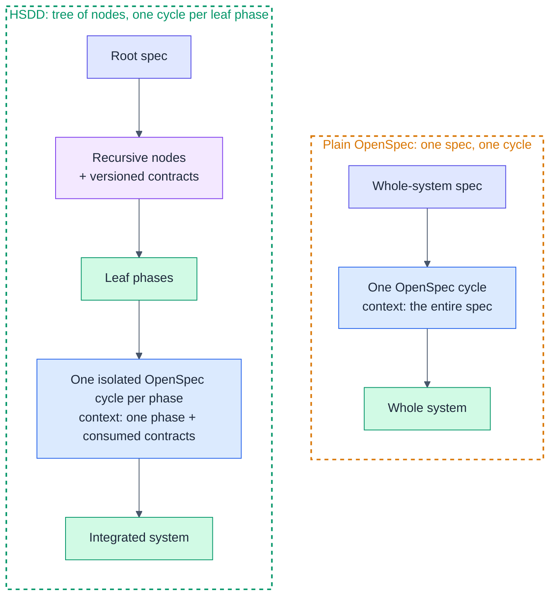
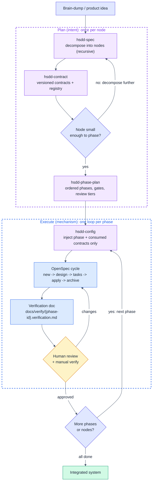
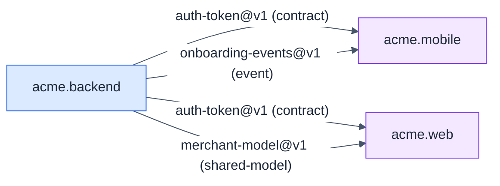

# HSDD User's Guide

A practical, example-driven walkthrough. For the full model and rationale, see the
[methodology spec](../spec/hsdd-spec-v0_3.md).

## Before you start

Install the skills (see the [README](../README.md)) and, ideally, [Obra's
superpowers](https://github.com/obra/superpowers) plugin. The HSDD loop, in one line:

> decompose -> contract -> phase-plan -> configure -> one OpenSpec cycle per phase
> -> human review -> repeat.

The default layout the skills emit (override it in `docs/conventions.md`):

```text
docs/spec/{node-id}.md                    node specs and phase plans
docs/verify/{phase-id}.verification.md    per-phase verification docs
contracts/{slug}.md + contracts/INDEX.md  first-class contracts (registry generated)
adr/{nnn}-{title}.md                       cross-cutting decisions
openspec/                                  config.yaml + one change per phase
```

A key principle worth internalizing early: **depth and ceremony are costs.** Use
exactly as many levels and artifacts as the system needs, and no more. The two
examples below sit at opposite ends of that scale.

---

## How HSDD works

### Plain OpenSpec vs HSDD

Plain OpenSpec drives the whole system from one spec through one cycle, so every
session carries the entire spec as context. HSDD decomposes the system into a tree
of nodes coupled by versioned contracts, then runs one isolated OpenSpec cycle per
leaf phase. Each cycle sees only its phase plus the contract interfaces it
consumes.



The OpenSpec cycle itself is unchanged. HSDD only decides what each cycle sees and
in what order cycles run.

### The HSDD workflow

The one-line loop above, drawn out. Planning is done once per node and rarely
rewritten. Execution repeats once per phase: switch the context, run the cycle,
generate the verification doc, and pass a human review gate before moving on.



The single amber node is the human review gate. Every leaf phase ends there, at a
depth set by its review tier (`gate-only`, `spot-check`, or `full-review`).

---

## Example 1: A simple project (single level)

Sometimes the whole system is small enough that there is nothing to decompose:
the root node is already a leaf-parent, and you go straight to phases. HSDD does
not force a tree on you.

**The project:** `linkcheck`, a CLI that crawls a site and reports broken links.

### Step 1: Spec it

```text
You: "Write a high-level spec for linkcheck, a CLI that crawls a site and
      reports broken links."
```

`hsdd-spec` runs at the root. It recognizes the project is one coherent
responsibility that fits a handful of phases, so it marks the root a
**leaf-parent** rather than inventing sub-nodes. `docs/spec/linkcheck.md`:

```markdown
### linkcheck: Broken Link Checker CLI

**Kind:** leaf-parent
**Purpose:** crawl a site, check every link, report the broken ones
**Consumes:** []
**Produces:** [linkcheck-report@v1]
**Decomposes into:** phases (see phase plan)
**Isolation strategy:** pure HTML parsing and pure report formatting are testable
  with fixtures; the HTTP checker is mocked in tests.
```

For a project this small there is just one outward contract (the report format).
The "contracts" between phases are simply the domain types defined in phase 1.

### Step 2: One contract

```text
You: "Define the linkcheck-report contract."
```

`hsdd-contract` writes `contracts/linkcheck-report.md` with frontmatter plus the
report schema (JSON shape and exit codes). Then it regenerates the registry:

```bash
node scripts/gen-registry.mjs
```

### Step 3: Phase-plan

```text
You: "Write the phase plan for linkcheck."
```

`hsdd-phase-plan` produces FP-ordered phases, each <= 8 OpenSpec tasks:

```text
linkcheck.1  Types + report contract   gate-only    (Url, LinkStatus, Report; CLI args type)
linkcheck.2  HTML link extractor        spot-check   (pure: HTML -> [Url])
linkcheck.3  HTTP checker               full-review  (effects: Url -> LinkStatus, retries/timeouts)
linkcheck.4  Crawl + report + CLI       full-review  (compose 2+3, emit linkcheck-report, wire main)
```

```text
linkcheck.1
 |-- linkcheck.2   <- parallel
 |-- linkcheck.3   <- parallel with .2
      |-- linkcheck.4  <- depends on .2 and .3
```

### Step 4: Configure, run, review

```text
You: "Set up OpenSpec config for this project."
You: "/hsdd-phase linkcheck.1"      (switch context, then run the cycle)
You: "opsx: new ..."                 (proposal -> design -> tasks -> apply -> archive)
```

At `apply`, the agent writes `docs/verify/linkcheck.1.verification.md`. Because
phase 1 is `gate-only`, you confirm the gate passed and move on. Phase 3 (the HTTP
checker) is `full-review`: you read the diff and run the manual verification
before approving. Repeat for `.2`, `.3`, `.4`.

**That is the whole project.** No internal nodes, one contract, four phases. The
methodology stayed out of the way.

---

## Example 2: A multi-level system

Now a system big enough to need the tree: `acme`, a full-stack merchant
onboarding platform with backend, mobile, and web, built by separate teams.

### Step 1: Decompose the root

```text
You: "Write a high-level spec for acme, a merchant onboarding platform with a
      backend, a mobile app, and a web console."
```

`hsdd-spec` splits the root into three internal nodes and names the contracts
between them. `docs/spec/acme.md` includes this typed dependency DAG:



Because the edges are `contract`, `shared-model`, and `event` (not `hard`), the
mobile and web teams can build against mocks as soon as the contracts are
`stable`. They do not wait for the backend implementation.

### Step 2: Recurse into the backend

```text
You: "Break down @spec/acme.backend.md into auth, billing, and catalog subsystems."
```

`hsdd-spec` runs again, now for an internal node, producing
`acme.backend.auth.md`, `acme.backend.billing.md`, `acme.backend.catalog.md`. The
`auth` node is small enough to phase, so it is marked `leaf-parent`. If `billing`
were too big, you would recurse once more (insert an internal node) rather than
forcing a flat phase split.

### Step 3: Contracts and a decision

```text
You: "Define the auth-token contract: auth produces it, billing and mobile consume it."
```

`hsdd-contract` writes `contracts/auth-token.md` (frontmatter + interface +
guarantees + `v1`). The choice of auth provider affects more than one node and
must outlive the auth subsystem, so `hsdd-spec` proposes an ADR:

```markdown
# ADR-001: Auth provider

**Status:** accepted
**Affects:** acme.backend.auth, auth-token@v1

## Decision
Use provider X with rotating asymmetric keys.
## Consequences
- token verification needs the public JWKS endpoint
- key rotation is a hard dependency for auth.2
```

### Step 4: Phase-plan the leaf-parent

```text
You: "acme.backend.auth is small enough to phase. Write its phase plan."
```

```text
acme.backend.auth.1  Types + auth-token contract   gate-only
acme.backend.auth.2  Token issuance (provider X)    full-review
acme.backend.auth.3  Session store                  spot-check
acme.backend.auth.4  Auth API + wiring              full-review
```

### Step 5: Configure and switch phase context

```text
You: "Set up OpenSpec config for this project."
You: "/hsdd-phase acme.backend.auth.2"
```

The phase switch injects only what `auth.2` needs. The OpenSpec session for
`auth.2` never sees the billing spec, the web spec, or sibling phases:

```yaml
  ## Current Phase: acme.backend.auth.2 - Token issuance
  Scope: issue JWTs on login via provider X; sign, set claims, handle errors.
  Produces: auth-token@v1
  Gate: cargo test
  Review tier: full-review

  ## Contracts from Prior Phases / Nodes
  auth-token@v1: { sub, exp, iat, scopes }; exp > iat; sub immutable. (interface only)

  ## Governing Decisions
  ADR-001: use provider X with rotating asymmetric keys; verification needs JWKS.
```

### Step 6: Run, verify, parallelize

```text
You: "opsx: new ..."   (proposal -> design -> tasks -> apply -> archive)
```

`apply` writes `docs/verify/acme.backend.auth.2.verification.md`. You give it a
`full-review`. Meanwhile, in a separate session or by another teammate, the web
team starts `acme.web.dashboard` against the `auth-token@v1` mock, and billing
starts against the same contract. Three teams, three small contexts, one shared
contract.

### The resulting tree

```text
docs/spec/
  acme.md  acme.backend.md  acme.mobile.md  acme.web.md
  acme.backend.auth.md  acme.backend.billing.md  acme.backend.catalog.md
contracts/
  INDEX.md  auth-token.md  merchant-model.md  onboarding-events.md
adr/
  INDEX.md  001-auth-provider.md
docs/verify/
  acme.backend.auth.1.verification.md  ...  acme.backend.auth.4.verification.md
openspec/
  config.yaml  changes/...
```

---

## Tips

- **Size to the window.** If a phase will not fit one ~5h review window (AI run
  plus your review and verification), it is too big. Ask `hsdd-phase-plan` to
  split it.
- **Switch context before `opsx:new`, every time.** This is the one easy-to-forget
  step. `/hsdd-phase {phase-id}` exists for exactly this.
- **Add a level, do not widen.** When a leaf-parent grows past a handful of
  phases, insert an internal node ("feature") instead of piling on phases.
- **Keep `hard` edges rare.** They are the critical path. Prefer `contract`,
  `event`, and `shared-model` edges so teams parallelize.
- **Regenerate the registry** after any contract change:
  `node scripts/gen-registry.mjs`. Never hand-edit `INDEX.md`.
- **Match review depth to risk.** Reserve `full-review` for orchestration,
  business logic, integrations, and security. Let scaffolding be `gate-only`.
