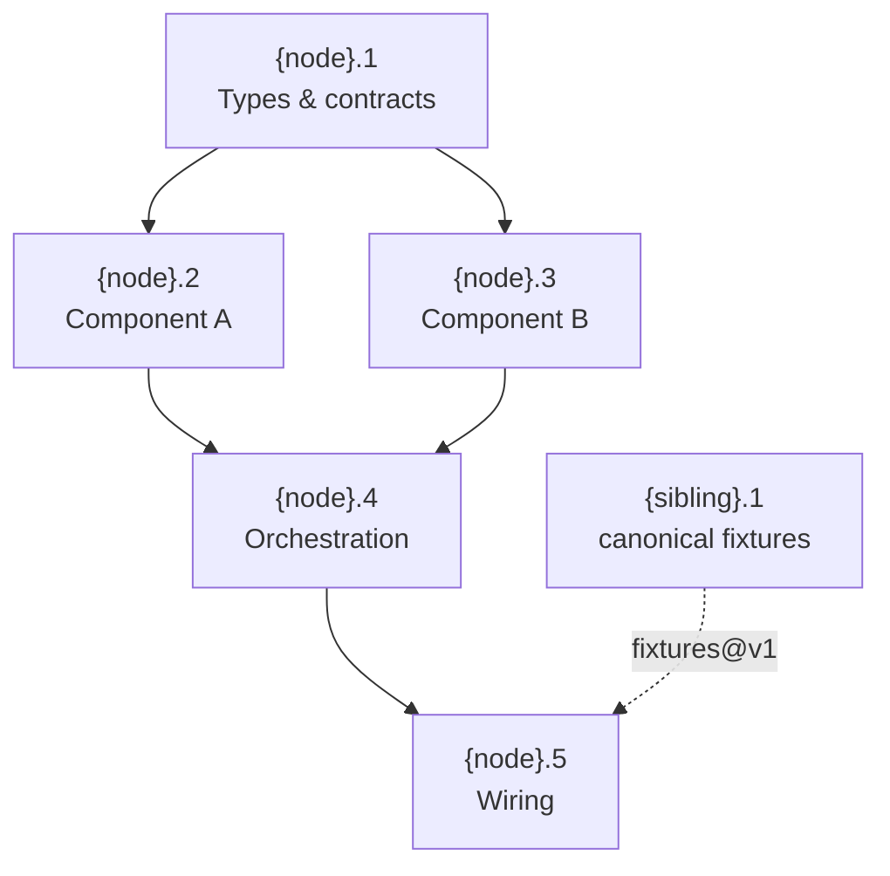

# HSDD Phase Plan: Leaf-Parent to Ordered Phases

Take one leaf-parent node and produce an implementation-ready set of phases. Each
phase is the atomic unit of HSDD: it drives exactly one OpenSpec cycle and is
sized so the AI run plus human review and manual verification fit one Claude Code
rolling window (target ~5h).

**Core principle:** Define contracts and phases before any code. Each phase is
independently testable, contract-bounded, and follows FP progression: types ->
pure functions -> effects -> composition.

## When to Use

- A node spec (`hsdd-spec`) marked a node `leaf-parent`.
- You are ready to deep-dive one node before starting OpenSpec.

**Do NOT use for** decomposing into sub-nodes (`hsdd-spec`) or OpenSpec artifacts
(proposal/design/tasks belong to the OpenSpec cycle, configured by `hsdd-config`).

**Precondition:** the node must already be a leaf-parent. If a request like
"break X into pieces" is ambiguous and X still contains subsystems, hand back to
`hsdd-spec` to decompose first, then return here for the leaf-parent.

## Process

1. **Load conventions.** Read `hsdd/conventions.md` (single source of truth for
   naming, layout, and the parallel development protocol; a pre-0.5 project has
   it at `docs/conventions.md`: honor its layout and offer to migrate). Do not
   re-scan every prior spec.
2. **Reference the node spec.** Load `hsdd/spec/{node-id}.md`: purpose,
   consumed/produced contract ids, governing ADRs, isolation strategy. Reference
   ADRs by id (`Governed by: [ADR-NNN]`); they are authored as files by
   `hsdd-adr`, never inline here.
3. **Define phases** using the template below, applying FP ordering and the
   sizing rule. Reference contracts by id (`hsdd-contract` owns the bodies).
   Open the `## Phase Plan` section with the phase summary table (one row
   per phase), then the detailed phase sections.
4. **Draw the phase dependency graph** as a Mermaid flowchart, showing
   parallel lanes and cross-node dependencies.
5. **Assign a review tier** per phase.
6. **Emit governance updates.** Append the
   `## Governance updates (pending reconcile)` section (template below) to this
   node's plan file. Never edit `hsdd/contract/`, `hsdd/adr/`,
   `hsdd/conventions.md`, or any `INDEX.md`: they are frozen inputs, applied
   later by `hsdd-reconcile` at the root.

## Governance Freeze (Read-Only Inputs)

Phase planning reads governance files; it never writes them. `hsdd/contract/*`,
`hsdd/adr/*`, `hsdd/conventions.md`, and both `INDEX.md` registries are a frozen
snapshot, whether you run at the repo root or in a worktree, serial or
parallel. Every intended change is emitted as data in the node's own plan file
and applied once, at the root, by `hsdd-reconcile`.

Append this section to `hsdd/spec/{node-id}.md`:

```markdown
## Governance updates (pending reconcile)

> Emitted by hsdd-phase-plan on {YYYY-MM-DD}. Drained by hsdd-reconcile;
> do not apply by hand.

- confirm `{contract-id}@v{n}` {produced_by|consumers}: [{phase-ids}]
- note: {conventions-worthy fact: a new package, a shared artifact created
  by an owned phase}
- amend `{contract-id}@v{n}`: {a guarantee or semantic this plan settled for
  a contract this node owns, that consumers may rely on}
- request `{contract-id}@v{n}`: {the gap, phrased as a question}
  - assumption: {what this plan assumes while the gap is open}
  - contingent phases: {phase ids that must not start until resolved, or none}
```

Any entry may carry short rationale sub-bullets; `hsdd-reconcile` reads them.

**Contract gaps (two-tier rule).** If a gap in a consumed contract changes the
shape of the plan (which phases exist, what they produce), stop and ask the
human now; a wrong structural assumption poisons every downstream phase.
Otherwise proceed conservatively and record a `request` entry with the
assumption stated and the contingent phases listed.

**Producer-side discoveries (`amend`).** Planning often settles semantics of a
contract this node owns (an error mapping, an ordering guarantee) that would
otherwise hide as a node-local decision consumers never see. If a consumer
could reasonably depend on it, emit an `amend` entry so `hsdd-reconcile` folds
it into the contract body; keep it node-local only when it is invisible across
the boundary. If the amendment could break an existing consumer, say so in the
entry; reconcile takes breaking amends to the human.

**Sibling isolation.** Do not read sibling worktree folders or other nodes'
phase plans. Contracts are the only inter-node knowledge; a sibling's
half-written plan on the same disk is not a contract. Sibling node specs as
written by `hsdd-spec` (purpose, contracts, DAG) are shared decomposition
artifacts and fine to read; a sibling's phase-plan sections and its worktree
are not.

## Phase Ordering (FP Progression)

1. **Phase 1 (always):** domain types, core traits/interfaces, scaffolding. No
   business logic, only the type-level skeleton.
2. **Early phases (parallel-safe):** config, state, IO utilities, independent
   modules consuming Phase 1 types.
3. **Middle phases:** pure-core logic, then effects/IO at boundaries; concrete
   implementations of the traits.
4. **Final phase:** integration wiring, entry point, dependency assembly. The
   imperative shell.

## Phase Summary Table

The `## Phase Plan` section of the node spec opens with a summary table, one
row per phase:

```markdown
| Phase | Name | Tier | Size | Depends on | Collides with |
|------:|------|------|------|------------|---------------|
| {n}.1 | Skeleton and test rig | gate-only | ~400 loc, ≤7 tasks | — | 2, 3 |
| {n}.2 | Visual composition | spot-check | ~250 loc, ≤6 tasks | 1 | 1, 3 |
```

The table is the human index; the bullet sections remain the machine-consumed
detail (`hsdd-config` injects only the detailed phase section, so per-phase
context cost is unchanged). Omit the *Collides with* column when no phase
collides.

## Phase Template

```markdown
### {phase-id}: {Phase Name}

- **Consumes:** [contract-id@version, ...] — prior-phase or cross-node
  contracts, or "none"
- **Produces:** [contract-id@version, ...], or "none"
- **Governed by:** [ADR-NNN, ...]            (omit when empty)
- **Scope:** concrete, verifiable deliverable
- **Size estimate:** ~N files (~N lines), <= 8 OpenSpec tasks
- **Gate:** exact command, or "node default" (see node-level default gate)
- **Verification:** 1-3 lines of intent: what a human should confirm works
  beyond the gate (observable behavior, not commands)
- **Review tier:** gate-only | spot-check | full-review
- **Collides with:** [phase-ids]             (omit when none)
- **Dependencies:** which prior phases, and what specifically (contracts only)
```

**Verification is a description, not a document.** The plan's only output is
the phase sections in `hsdd/spec/{node-id}.md`. Never create files under
`hsdd/verify/` during planning: the verification doc
(`hsdd/verify/{phase-id}.verification.md`, with exact commands, expected
output, what to inspect) is written during the OpenSpec cycle at apply, by the
documentation task that `hsdd-config` injects, once the implementation details
exist. The human uses that doc to manually verify the completed change before
archive. The plan's Verification line is the intent that task expands on.

**Rendering rule.** Field blocks are bullet lists (or tables); never bare
`**Field:** value` lines separated by soft line breaks — every compliant
markdown renderer collapses those into one paragraph. Empty lists render
"none", not `[]`.

**`Collides with` marks textual contention** — phases editing the same
files. It never reshapes logical dependencies: colliding phases execute
serially on the node's integration branch; spawn parallel worktrees only for
phases with no collision between them.

**Node-level default gate.** A phase plan may state one default gate above
the summary table — ``**Default gate:** `<command>` `` — and a phase's
`- **Gate:**` field then reads `node default` unless it overrides.

## Review Tiers

| Tier | For | At the gate |
|------|-----|-------------|
| gate-only | scaffolding, types, boilerplate | gate passes, auto-proceed, human notified |
| spot-check | well-constrained phases with clear contracts | glance at diff, confirm gate, proceed |
| full-review | orchestration, business logic, integrations, security | read diff, run verification, consider edge cases |

**Review tier sets the artifact profile.** The tier also sets the artifact
profile of the phase's OpenSpec cycle — gate-only: no `design.md`, slim
verification doc; spot-check: `design.md` only if the phase settles a real
design decision, short verification doc; full-review: the full set.
`tasks.md` and the requirement/scenario deltas never scale (they drive TDD
at every tier), and every phase still produces a verification doc.
`hsdd-config`'s rules enforce this.

Phase 1 (types/scaffolding) is gate-only. Pure utilities are spot-check. External
integrations and orchestration are full-review.

## Sizing to the Review Window

Each phase must fit one window: `[AI: new -> design -> tasks -> apply -> verify]`
plus `[human: review specs + read diff + run manual verification]` within ~5h. The
review tier modulates the human half. If a phase cannot fit, it is too big: split
it. Phase sizing is the control knob for context, tokens, time, and quality.

> **Sizing floor.** A phase must be big enough to earn its cycle. Two
> adjacent phases are merge candidates when all hold: (i) same review tier,
> (ii) same consumed contracts, (iii) no third phase depends on one without
> the other, (iv) the merged phase still fits the review window with <= 8
> OpenSpec tasks. Textual contention strengthens the case: phases that would
> serialize anyway (same file, same owner) have a lower bar to merge. Keep a
> small phase separate only for a reason you can name: a tier boundary, a
> parallel lane assigned to another owner, or a risk you want reviewed in
> isolation. Smell: if a phase's predicted process artifacts (proposal +
> design + spec deltas + tasks + verification doc) exceed its predicted
> diff, it is a merge candidate by default.

## Phase Dependency Graph

The graph is a Mermaid flowchart: one node per phase labeled
`{phase-id}<br/>{short name}`; edges are logical dependencies only
(contention is carried by `Collides with`, not drawn); cross-node
dependencies appear as **dashed** edges with the dependency named on the
edge label. If `mermaid-pastel-style` is installed, follow it.



## Phase Design Checklist

- [ ] Phase 1 defines all shared types and contract-bounded interfaces.
- [ ] Phases 2..N-1 are maximally independent (parallelizable where possible).
- [ ] Each phase has <= 8 OpenSpec tasks (split if more).
- [ ] Contract ids are defined before the phase that implements them.
- [ ] Phase N is testable with mocks even if Phase N-1 is not implemented.
- [ ] No phase couples to another phase's internals.
- [ ] Each phase has a concrete gate, a verification description, and a review tier.
- [ ] The phase dependency graph is included.
- [ ] Summary table present and matches the phase sections.
- [ ] Dependency graph is Mermaid and matches the Dependencies fields.
- [ ] Field blocks are bullet lists; empty lists say "none".

## Anti-Rationalization

| Thought | Reality |
|---------|---------|
| "I'll figure out phases during implementation" | Phases defined after coding starts are retrofitted, not designed. Contracts leak. |
| "Merge them so there's less to review" | Merging to dodge review defeats the tiers. Merge only under the sizing floor's conditions. |
| "Small phases are always a feature" | Small phases are a feature when they buy parallelism or isolated review. A phase below the floor buys neither and still costs a full cycle. |
| "This phase is a bit big but fine" | If it overflows the review window, the human becomes the bottleneck. Split it. |
| "The contract is obvious" | Explicit contracts enable mock testing and phase isolation. Reference the id. |
| "Skip the dependency graph" | Without it, phases are assumed sequential and parallel teams stall. |
| "The contract gap is obvious, I'll just fix the contract file" | Governance files are frozen during planning. Emit a `request`; `hsdd-reconcile` applies the answer at the root. |
| "I'll create the shared artifact locally; the merge will be trivial" | Two agents generating from the same prose are never byte-identical. Record a `request`; the contract must name one canonical owner. |
| "I'll peek at the sibling worktree's plan to coordinate" | Contracts are the only inter-node knowledge. Peeking couples plans invisibly and races the sibling's edits. |
| "I'll write the verification doc now while the phase is fresh" | Planning cannot know the implementation. The doc is written at apply by an OpenSpec task; the plan carries only the one-line intent. |
