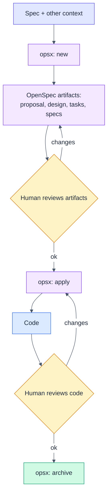
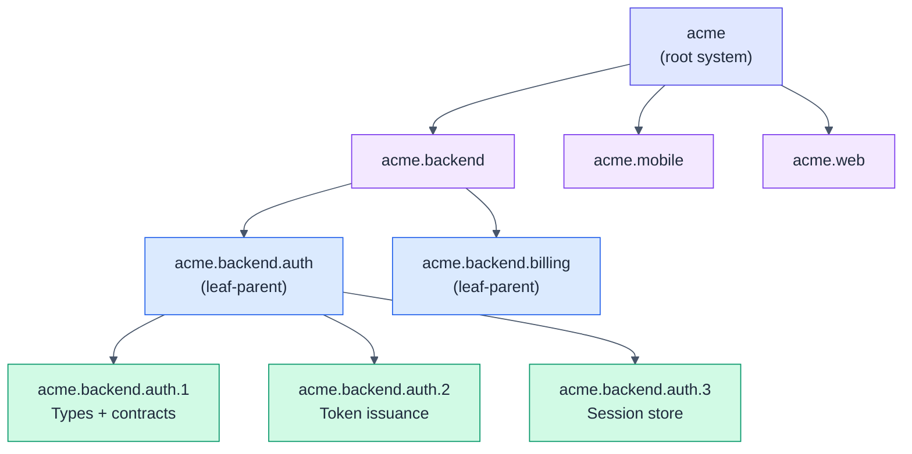
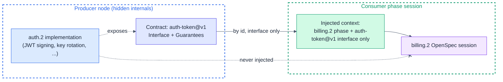
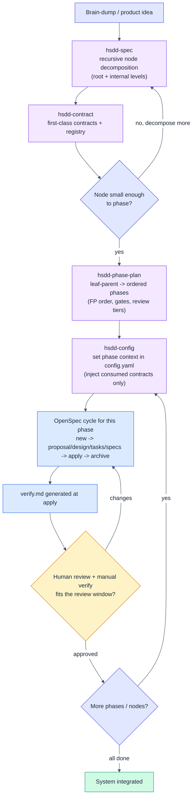

# HSDD: Hierarchical Spec-Driven Development

> Specification for a skill set that scales spec-driven development from a single
> spec to large, multi-team systems through recursive decomposition, first-class
> contracts, and context isolation.

**Version:** 0.1 (draft)
**Status:** For review
**Date:** 2026-06-30
**Author:** Purbo Mohamad
**Supersedes:** the ad-hoc `system-spec-brainstorm` + `subsystem-design-spec` +
`openspec-config` skill trio.

---

## 1. Why HSDD Exists

OpenSpec is excellent for one spec driving one change. It breaks down once a
system grows past a single context window: the spec becomes a 100-page monolith,
every session re-reads everything, tokens explode, and the model loses focus.

HSDD keeps OpenSpec as the **execution engine** but changes the **unit of work**.

> The unit of spec-driven development is not the product. It is the smallest
> independently verifiable phase with explicit contracts.

Everything above that unit is decomposition. Everything inside it is one ordinary
OpenSpec cycle. The leverage comes from three ideas working together:

1. **Recursive decomposition.** A large system is a tree, not a flat spec. Only
   the leaves drive code.
2. **Contracts as the dependency mechanism.** Nodes depend on named, versioned
   contracts, never on each other's internals. Context becomes a dependency
   graph, not a monolith.
3. **Human review at every leaf.** Each phase is sized so the AI run plus the
   human review and manual verification fit one Claude Code rolling window
   (target: ~5 hours). The human owns correctness; the agent owns throughput.

This document specifies the methodology, the artifact model, and the skill set.
It does not yet rewrite the `SKILL.md` files; that is the v0.2 deliverable.

---

## 2. Relationship to OpenSpec

### 2.1 Standard OpenSpec flow

One spec feeds one change. The human reviews the generated artifacts, the agent
applies them to code, the human reviews the code, the change is archived.



### 2.2 What HSDD adds

HSDD wraps a **decomposition front-end** and a **contract substrate** around the
OpenSpec cycle. The OpenSpec cycle is untouched. HSDD decides *what* each cycle
sees and *in what order* cycles run.

```text
OpenSpec:  one spec ........................... one cycle .... whole system
HSDD:      recursive node tree -> leaf phases -> one cycle each, contract-isolated
```

---

## 3. Core Concepts

| Concept | Definition |
|---------|------------|
| **Spec node** | A unit of responsibility with a uniform shape (purpose, contracts, decomposition). The whole tree is made of these. |
| **Internal node** | A node that decomposes into child nodes. The system, a domain (backend), or a subsystem are all internal nodes. |
| **Leaf-parent node** | A node whose children are phases, not further sub-nodes. Where decomposition stops and execution planning starts. |
| **Leaf phase** | The atomic, independently verifiable unit. Drives exactly one OpenSpec cycle. Sized for one review window. |
| **Contract** | A named, versioned interface artifact. The only thing one node may know about another. |
| **Dependency type** | How an edge couples two nodes: hard, contract, event, or shared-model. |
| **Context isolation** | A phase's OpenSpec session sees its own spec plus only the interfaces of contracts it consumes, never producer internals. |
| **Review window** | The wall-clock budget (target ~5h) for one phase: AI run + human review + manual verification. |

The mental model is functional: **each node is a function with typed inputs and
outputs (its consumed and produced contracts), and the dependency DAG is the
composition.** Internals are private. This is dependency rejection at the
architecture level: a node is developed against contract values, not against the
live implementations behind them.

---

## 4. The Recursive Node Model

### 4.1 Uniform node shape

Every node, at every level, has the same shape. This is the single biggest
change from the current `system-spec` vs `subsystem-spec` split, which baked the
level into the structure.

```markdown
### {node-id}: {Node Name}

**Kind:** internal | leaf-parent
**Purpose:** one coherent responsibility
**Owns:** ...
**Does not own:** ...
**Consumes:** [contract-id@version, ...]      # by reference, never inline copy
**Produces:** [contract-id@version, ...]
**Decomposes into:** child node ids, OR "phases (see leaf phase plan)"
**Isolation strategy:** how to build and test this node using only consumed
  contracts (fixtures, mocks, schemas)
```

A **leaf phase** is the same shape plus the execution attributes OpenSpec needs:

```markdown
### {phase-id}: {Phase Name}

**Consumes:** [contract-id@version, ...]
**Produces:** [contract-id@version, ...]
**Scope:** concrete, verifiable deliverable
**Size estimate:** ~N files, ~N lines, <= 8 OpenSpec tasks
**Gate:** exact command (e.g. `cargo build && cargo test`)
**Verification:** how a human manually confirms it works (feeds verify.md)
**Review tier:** gate-only | spot-check | full-review
```

### 4.2 Where recursion stops

A node becomes a **leaf-parent** (decomposes into phases rather than sub-nodes)
when both hold:

- One owner or pair can hold its full scope in their head.
- It splits into phases that each fit one review window.

Otherwise, decompose further. The "feature" layer that ChatGPT proposed is not a
fixed tier here; it is simply an internal node you insert when a subsystem is too
big to phase directly. Depth is a judgment, not a constant.

### 4.3 The tree



Only the green leaf phases drive OpenSpec cycles. Blue leaf-parents own a phase
plan. Purple internal nodes only decompose and route contracts.

### 4.4 Identification scheme

Identity is the **dotted path of node slugs from the root**, with leaf phases
numbered for ordering.

| Element | Format | Example |
|---------|--------|---------|
| Root | `{slug}` | `acme` |
| Internal / leaf-parent node | `{parent}.{slug}` | `acme.backend.auth` |
| Leaf phase | `{leaf-parent}.{n}` | `acme.backend.auth.3` |
| Contract | `{slug}@v{n}` | `auth-token@v1` |
| Design decision | `D{n}` (node-scoped) | `D2` |
| User story / acceptance | `US-{n}` / `AC-{n}.{y}` | `AC-3.1` |

This is backward compatible: the current `S1` (subsystem) and `S1.2` (phase)
scheme is just the depth-2 special case of `{slug}` and `{slug}.{n}`. Existing
specs remain valid; only the top of the tree gains levels.

---

## 5. Contracts as First-Class Citizens

Contracts are the core of HSDD. They are standalone, versioned artifacts, not
prose buried in a spec. A node references contracts by id; it never copies
another node's internals.

### 5.1 Contract artifact

`contracts/{slug}.md`:

```markdown
# Contract: auth-token

**Version:** v1
**Status:** stable | draft | deprecated
**Kind:** api | event | schema | shared-model | file | cli
**Owner node:** acme.backend.auth

## Interface
<schema, signature, endpoint, event payload, or file layout>

## Produced by
- acme.backend.auth.2 (issues JWT on login)

## Consumed by
- acme.backend.billing.2
- acme.mobile.session.1

## Guarantees / invariants
- token.sub is immutable for the token's lifetime
- exp is always greater than iat

## Versioning
- v1 current. Breaking changes require v2 + a migration note. v1 stays until
  all consumers migrate.

## Validation
- fixture: fixtures/auth-token.json
- schema: schemas/auth-token.schema.json
```

### 5.2 Dependency types

Edges in the dependency DAG are typed (adopted from ChatGPT, it sharpens
sequencing). The type tells you whether a consumer can start immediately.

| Type | Meaning | Can consumer start before producer ships? |
|------|---------|--------------------------------------------|
| **hard** | Needs the producer's real output. | No. Producer first. |
| **contract** | Can build against the interface with mocks/fixtures. | Yes, once contract is `stable`. |
| **event** | Loose, async coupling via emitted events. | Yes, against the event schema. |
| **shared-model** | Shares a value type (Money, Address). | Yes, once the type exists. |

A system whose edges are mostly `contract`, `event`, and `shared-model` is a DAG
that parallelizes well. `hard` edges are the critical path; minimize them.

### 5.3 The registry

`contracts/INDEX.md` is a generated table: id, version, kind, owner, status,
consumers. It is the map for cross-team coordination and the source the config
skill reads when injecting a phase's consumed contracts.

### 5.4 Context isolation: the payoff

This is the mechanism behind the token and focus savings. The OpenSpec session
for a phase receives its own phase section plus only the **Interface** and
**Guarantees** of the contracts it consumes. It never sees the producing node's
implementation, sibling phases, or the full subsystem spec.



Benefits: loose coupling, independent evolution, parallel development across
teams, and a small, focused context per session.

---

## 6. The HSDD Workflow

### 6.1 End to end



### 6.2 Planning vs execution

HSDD draws a hard line, which answers ChatGPT's "separate planning from
execution" point:

- **Planning artifacts (intent):** node specs, contracts, phase plans. Stable,
  rarely rewritten.
- **Execution artifacts (mechanism):** the OpenSpec change (proposal, design,
  tasks, specs) plus `verify.md`. Disposable and re-runnable. Archived per phase.

You can re-run execution for a phase without rewriting its intent.

---

## 7. The Skill Set

Four skills, named by **role** rather than by tree level, because the recursive
model uses the same operation at multiple levels. (Naming is an open decision;
see Section 11.)

| Skill | Evolves | Role | Key outputs |
|-------|---------|------|-------------|
| `hsdd-spec` | `system-spec-brainstorm` | Recursive node decomposition at the root and any internal level: normalize the idea, split into child nodes, assign contracts by id, build the typed dependency DAG and dev flow. | node spec(s), dependency DAG, dev-flow sequencing |
| `hsdd-contract` | new | Author and version first-class contracts; classify dependency type; maintain `contracts/INDEX.md`. | `contracts/*.md`, registry |
| `hsdd-phase-plan` | `subsystem-design-spec` | Turn a leaf-parent into ordered, OpenSpec-sized phases with FP progression (types to pure functions to effects to composition), gates, verification, review tiers, and a phase DAG. | leaf-parent phase plan, `conventions.md` |
| `hsdd-config` | `openspec-config` | Generate and maintain `config.yaml`; per-phase context switch that injects the current phase plus only its consumed contract interfaces. | `openspec/config.yaml` |

### 7.1 How they chain

```text
hsdd-spec        (root)            -> nodes + contracts referenced by id
  hsdd-contract  (define/version)  -> contracts/*.md + INDEX.md
  hsdd-spec      (recurse internal levels until leaf-parents)
    hsdd-phase-plan (per leaf-parent) -> phases with gates + tiers
      hsdd-config   (per phase)    -> config.yaml phase context
        OpenSpec cycle             -> code + verify.md
        human review gate          -> approve / iterate
```

### 7.2 Why role-based names, not level-based

The current names bind a skill to a level (`system` vs `subsystem`). Under the
recursive model the same decomposition skill runs at the system level, the
backend level, and the subsystem level. Binding the name to a tier is misleading.
`hsdd-spec` (decompose any internal node) and `hsdd-phase-plan` (plan a
leaf-parent's phases) describe the operation, which is stable across depth.

A reasonable alternative is to keep `system`/`subsystem` because they are
domain-familiar. Section 11 lists naming options for you to pick.

### 7.3 Should `hsdd-spec` and `hsdd-phase-plan` be one skill?

They are two specializations of "decompose a node": into sub-nodes vs into
phases. They stay separate because phase planning carries sharply different
discipline (FP ordering, OpenSpec sizing, gates, review tiers, verify docs).
Merging is possible but would make one large skill that branches on node kind.
Recommendation: keep separate. Flagged as an open question.

---

## 8. Artifact Model and Repository Layout

```text
docs/
  hsdd-spec-v0.1.md            # this methodology spec
  spec/
    acme.md                    # root node spec (hsdd-spec)
    acme.backend.md            # internal node spec
    acme.backend.auth.md       # leaf-parent phase plan (hsdd-phase-plan)
  conventions.md               # naming + structure, single source of truth
contracts/
  INDEX.md                     # generated registry
  auth-token.md
  user-model.md
  billing-events.md
adr/                           # optional, see Section 9.4
  001-auth-provider.md
openspec/
  config.yaml                  # phase context (hsdd-config)
  changes/
    auth-2-token-issuance/     # one OpenSpec change per phase
      proposal.md design.md tasks.md
      verify.md                # generated at apply
  specs/                       # OpenSpec capability specs
```

### 8.1 Minimal artifact set

To respect ChatGPT's over-documentation warning, the **required** artifacts are
deliberately few:

- node specs (only as deep as the tree needs),
- contracts + registry,
- leaf-parent phase plans,
- per-phase OpenSpec change + `verify.md`,
- `conventions.md`.

`adr/` and `retrospective.md` are **optional** and used only when they earn their
keep. Depth and ceremony are costs; spend them deliberately.

---

## 9. Human-in-the-Loop and the Review Window

Human responsibility is central, not a rubber stamp. Two mechanisms keep the
human effective without becoming the bottleneck.

### 9.1 Review tiers

Carried forward from the current `subsystem-design-spec`. Each phase is assigned
a tier that scales human attention to risk.

| Tier | For | At the gate |
|------|-----|-------------|
| **gate-only** | scaffolding, types, boilerplate | gate passes, auto-proceed, human notified |
| **spot-check** | well-constrained phases with clear contracts | glance at diff, confirm gate, proceed |
| **full-review** | orchestration, business logic, integrations, security | read diff, run verification guide, consider edge cases |

### 9.2 The verify document

At `apply`, the agent generates `verify.md` for the phase (this makes the current
"manual verification guide" rule a named, durable artifact, and absorbs
ChatGPT's verification-spec idea):

```markdown
# Verify: acme.backend.auth.2 — Token Issuance

## Implemented
- ...
## Not implemented / deferred
- ...
## Test evidence
- unit: <command + result>
- integration: <command + result>
## Manual verification steps
- run X, expect Y
## Human sign-off
- reviewed by ____  date ____  tier: full-review
```

This gives traceability that pays off months later: what was built, how it was
proven, who approved it.

### 9.3 The ~5-hour window

Each leaf phase is sized so that the full loop fits one Claude Code rolling
window:

```text
[ AI: new -> proposal/design/tasks/specs -> apply -> verify.md ]
+ [ Human: review specs + read diff + run manual verification ]
<= one ~5h window
```

Review tier modulates the human half: a gate-only phase costs minutes, a
full-review phase costs the most. If a phase cannot fit the window, it is too big
and `hsdd-phase-plan` should split it. This is how HSDD paces development and
keeps context, tokens, time, and quality jointly optimized. Phase sizing is the
control knob.

### 9.4 ADRs (optional)

Node-scoped ADRs (`adr/NNN-title.md`) capture durable "why" for cross-cutting
decisions. Design decisions (`D{n}`) inside a node spec already cover local
choices; reserve ADRs for decisions that outlive a single node. Optional by
default to avoid doc sprawl.

---

## 10. OpenSpec vs HSDD

| Dimension | OpenSpec | HSDD |
|-----------|----------|------|
| Unit of work | the whole spec | smallest independently verifiable phase |
| Structure | one flat spec | recursive node tree, multi-level |
| Decomposition | none | nodes split until phases fit a window |
| Coupling | implicit, whole-spec context | explicit, versioned contracts by id |
| Context per session | the full spec | one phase + consumed contract interfaces |
| Parallelism | one cycle at a time | independent phases/nodes run in parallel |
| Dependency model | implicit | typed DAG (hard, contract, event, shared-model) |
| Cycle engine | OpenSpec | OpenSpec, unchanged, run once per phase |
| Human review | per change | per phase, tiered, with verify.md |
| Pacing | none | phase sized to a ~5h review window |
| Scales to | small systems | multi-team, multi-domain systems |

HSDD does not replace OpenSpec. It is OpenSpec plus DDD bounded contexts plus
contract-first architecture plus tiered human review plus context isolation for
LLMs.

---

## 11. Assessment of the ChatGPT Suggestions

| Suggestion | Verdict | How HSDD handles it |
|------------|---------|---------------------|
| Multi-level decomposition is the right abstraction | **Adopt** | The recursive node model is the spine of the methodology. |
| Context isolation is the key contribution | **Adopt** | Section 5.4: config injects only consumed contract interfaces. |
| Contracts are the right dependency mechanism | **Adopt** | Section 5: first-class versioned artifacts. |
| Human review every phase | **Adopt** | Sections 9.1 to 9.3, with review tiers added on top. |
| Make contracts first-class citizens | **Adopt** | `contracts/` directory, registry, versioning. |
| Add dependency types (hard/contract/event/shared-model) | **Adopt** | Section 5.2; types annotate the DAG and drive sequencing. |
| Introduce verification specs (`verify.md`) | **Adopt** | Section 9.2; generated at apply, named artifact. |
| Separate planning from execution | **Adopt** | Section 6.2: planning artifacts vs disposable execution artifacts. |
| Add ADRs | **Adopt, optional** | Section 9.4; node-scoped, used sparingly. |
| Add a fixed "feature" layer (Subsystem -> Feature -> Phase) | **Adapt** | Not a fixed tier. Insert an internal node when a leaf-parent is too big. Recursion subsumes it. |
| `retrospective.md` per phase | **Adapt, optional** | Useful but ceremony; opt-in, not required. |
| Over-documentation risk | **Adopt as principle** | Section 8.1 minimal required set; depth and ceremony are deliberate costs. |
| Rename to HCSDD / MSDD | **Reject** | Keep HSDD. "Hierarchical" already implies contracts and modularity; the name is yours and is established. |

Net: nearly all of it is adopted. The one structural disagreement is the fixed
feature layer, which the recursive model handles more flexibly.

---

## 12. Open Questions for v0.2

1. **Skill names.** Pick one scheme:
   - A (recommended): `hsdd-spec`, `hsdd-contract`, `hsdd-phase-plan`, `hsdd-config` (role-based, recursion-friendly).
   - B: `hsdd-system-spec`, `hsdd-contract`, `hsdd-subsystem-spec`, `hsdd-config` (keeps familiar level names).
   - C: keep the current three names, add `hsdd-contract`, document the methodology only.
2. **Merge `hsdd-spec` and `hsdd-phase-plan`?** Recommendation: keep separate.
3. **Contract versioning policy.** How strict: semantic versions, or just `v{n}`
   with a migration note (current proposal)?
4. **Where does `verify.md` live**, inside the OpenSpec change dir (current
   proposal) or under `docs/`? Archival implications differ.
5. **ID readability vs length.** Dotted slug paths can get long
   (`acme.backend.auth.3`). Do we want short-code aliases for deep trees?
6. **Tooling.** Should the contract registry (`INDEX.md`) be generated by a small
   script, or maintained by `hsdd-contract` directly?

---

## 13. Glossary

- **Node:** any unit in the spec tree.
- **Leaf phase:** the unit that drives one OpenSpec cycle.
- **Contract:** a named, versioned interface; the only cross-node knowledge.
- **Dependency type:** hard, contract, event, or shared-model.
- **Review tier:** gate-only, spot-check, full-review.
- **Review window:** the ~5h budget for one phase, AI plus human.
- **Context isolation:** injecting only consumed contract interfaces into a
  phase's session.
```
