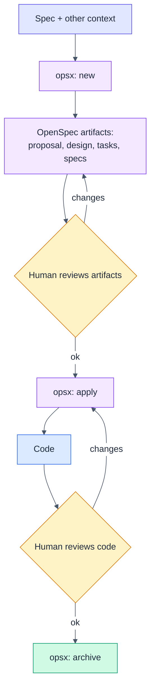
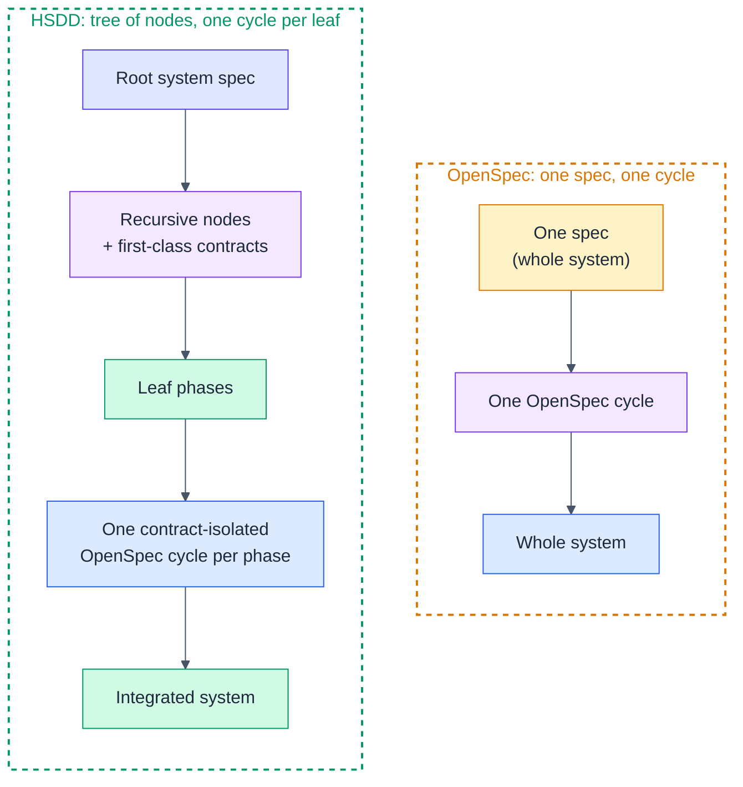
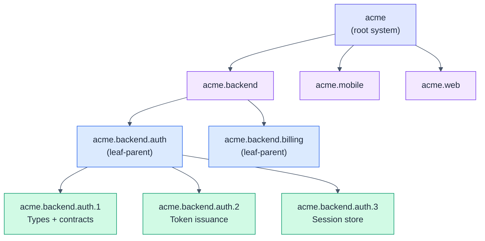
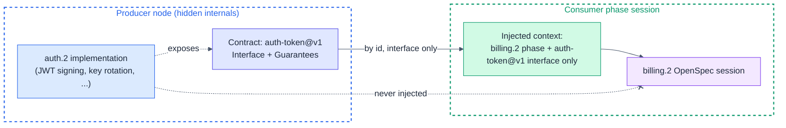
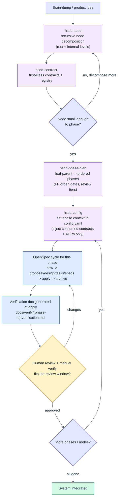

# HSDD: Hierarchical Spec-Driven Development

> Specification for a skill set that scales spec-driven development from a single
> spec to large, multi-team systems through recursive decomposition, first-class
> contracts, and context isolation.

**Version:** 0.3 (draft)
**Status:** For review
**Date:** 2026-06-30
**Author:** Purbo Mohamad
**Supersedes:** v0.2, v0.1, and the ad-hoc `system-spec-brainstorm` +
`subsystem-design-spec` + `openspec-config` skill trio.

---

## 1. Why HSDD Exists

OpenSpec is excellent for one spec driving one change. It breaks down once a
system grows past a single context window: the spec becomes a 100-page monolith,
every session re-reads everything, tokens explode, and the model loses focus.

HSDD keeps OpenSpec as the **execution engine** but changes the **unit of work**.

> The unit of spec-driven development is not the product. It is the smallest
> independently verifiable phase with explicit contracts.

Everything above that unit is decomposition. Everything inside it is one ordinary
OpenSpec cycle. The leverage comes from three ideas working together:

1. **Recursive decomposition.** A large system is a tree, not a flat spec. Only
   the leaves drive code.
2. **Contracts as the dependency mechanism.** Nodes depend on named, versioned
   contracts, never on each other's internals. Context becomes a dependency
   graph, not a monolith.
3. **Human review at every leaf.** Each phase is sized so the AI run plus the
   human review and manual verification fit one Claude Code rolling window
   (target: ~5 hours). The human owns correctness; the agent owns throughput.

This document specifies the methodology, the artifact model, and the skill set.
It does not author the `SKILL.md` files; that is the implementation step that
follows (Section 16).

---

## 2. Relationship to OpenSpec

### 2.1 Standard OpenSpec flow

One spec feeds one change. The human reviews the generated artifacts, the agent
applies them to code, the human reviews the code, the change is archived.



### 2.2 What HSDD adds

HSDD wraps a **decomposition front-end** and a **contract substrate** around the
OpenSpec cycle. The cycle itself is untouched. HSDD decides *what* each cycle
sees and *in what order* cycles run. The two shapes side by side:



OpenSpec carries the whole system in one spec and one cycle. HSDD splits the
system into a tree, drives one isolated cycle per leaf phase, and integrates.

---

## 3. Core Concepts

| Concept | Definition |
|---------|------------|
| **Spec node** | A unit of responsibility with a uniform shape (purpose, contracts, decomposition). The whole tree is made of these. |
| **Internal node** | A node that decomposes into child nodes. The system, a domain (backend), or a subsystem are all internal nodes. |
| **Leaf-parent node** | A node whose children are phases, not further sub-nodes. Where decomposition stops and execution planning starts. |
| **Leaf phase** | The atomic, independently verifiable unit. Drives exactly one OpenSpec cycle. Sized for one review window. |
| **Contract** | A named, versioned interface artifact. The only thing one node may know about another. |
| **Dependency type** | How an edge couples two nodes: hard, contract, event, or shared-model. |
| **Context isolation** | A phase's OpenSpec session sees its own spec plus only the interfaces of contracts it consumes, never producer internals. |
| **Review window** | The wall-clock budget (target ~5h) for one phase: AI run + human review + manual verification. |

The mental model is functional: **each node is a function with typed inputs and
outputs (its consumed and produced contracts), and the dependency DAG is the
composition.** Internals are private. This is dependency rejection at the
architecture level: a node is developed against contract values, not against the
live implementations behind them.

---

## 4. The Recursive Node Model

### 4.1 Uniform node shape

Every node, at every level, has the same shape. This is the single biggest
change from the old `system-spec` vs `subsystem-spec` split, which baked the
level into the structure.

```markdown
### {node-id}: {Node Name}

**Kind:** internal | leaf-parent
**Purpose:** one coherent responsibility
**Owns:** ...
**Does not own:** ...
**Consumes:** [contract-id@version, ...]      # by reference, never inline copy
**Produces:** [contract-id@version, ...]
**Governed by:** [ADR-NNN, ...]               # cross-cutting decisions, optional
**Decomposes into:** child node ids, OR "phases (see leaf phase plan)"
**Isolation strategy:** how to build and test this node using only consumed
  contracts (fixtures, mocks, schemas)
```

A **leaf phase** is the same shape plus the execution attributes OpenSpec needs:

```markdown
### {phase-id}: {Phase Name}

**Consumes:** [contract-id@version, ...]
**Produces:** [contract-id@version, ...]
**Governed by:** [ADR-NNN, ...]               # optional
**Scope:** concrete, verifiable deliverable
**Size estimate:** ~N files, ~N lines, <= 8 OpenSpec tasks
**Gate:** exact command (e.g. `cargo build && cargo test`)
**Verification:** how a human manually confirms it works (feeds the verification doc)
**Review tier:** gate-only | spot-check | full-review
```

### 4.2 Where recursion stops

A node becomes a **leaf-parent** (decomposes into phases rather than sub-nodes)
when both hold:

- One owner or pair can hold its full scope in their head.
- It splits into phases that each fit one review window.

Otherwise, decompose further. An intermediate "feature" layer is not a fixed tier
here; it is simply an internal node you insert when a subsystem is too big to
phase directly. Depth is a judgment, not a constant.

### 4.3 The tree



Only the green leaf phases drive OpenSpec cycles. Blue leaf-parents own a phase
plan. Purple internal nodes only decompose and route contracts.

### 4.4 Identification scheme

Identity is the **dotted path of node slugs from the root**, with leaf phases
numbered for ordering.

| Element | Format | Example |
|---------|--------|---------|
| Root | `{slug}` | `acme` |
| Internal / leaf-parent node | `{parent}.{slug}` | `acme.backend.auth` |
| Leaf phase | `{leaf-parent}.{n}` | `acme.backend.auth.3` |
| Contract | `{slug}@v{n}` | `auth-token@v1` |
| Design decision (node-local) | `D{n}` | `D2` |
| ADR (cross-cutting) | `ADR-{nnn}` | `ADR-001` |
| User story / acceptance | `US-{n}` / `AC-{n}.{y}` | `AC-3.1` |

This is backward compatible: the old `S1` (subsystem) and `S1.2` (phase) scheme
is just the depth-2 special case of `{slug}` and `{slug}.{n}`. Existing specs
remain valid; only the top of the tree gains levels.

---

## 5. Contracts as First-Class Citizens

Contracts are the core of HSDD. They are standalone, versioned artifacts, not
prose buried in a spec. A node references contracts by id; it never copies
another node's internals.

### 5.1 Contract artifact

A contract carries machine-readable metadata in YAML frontmatter (the source for
the registry) and a human-facing interface in the body (the source for context
injection). `contracts/{slug}.md`:

```markdown
---
id: auth-token
version: v1
status: stable          # stable | draft | deprecated
kind: api               # api | event | schema | shared-model | file | cli
owner: acme.backend.auth
produced_by: [acme.backend.auth.2]
consumers: [acme.backend.billing.2, acme.mobile.session.1]
---

# Contract: auth-token

## Interface
<schema, signature, endpoint, event payload, or file layout>

## Guarantees / invariants
- token.sub is immutable for the token's lifetime
- exp is always greater than iat

## Versioning
- v1 current. Breaking changes require v2 + a migration note. v1 stays until
  all consumers migrate.

## Validation
- fixture: fixtures/auth-token.json
- schema: schemas/auth-token.schema.json
```

The split is deliberate and functional: **frontmatter is the metadata projected
into the registry; the body is the interface injected into a consuming phase's
context.** Each downstream consumer reads exactly one of those, never the whole
producing node.

### 5.2 Dependency types

Edges in the dependency DAG are typed. The type sharpens sequencing: it tells you
whether a consumer can start before the producer ships.

| Type | Meaning | Can consumer start before producer ships? |
|------|---------|--------------------------------------------|
| **hard** | Needs the producer's real output. | No. Producer first. |
| **contract** | Can build against the interface with mocks/fixtures. | Yes, once contract is `stable`. |
| **event** | Loose, async coupling via emitted events. | Yes, against the event schema. |
| **shared-model** | Shares a value type (Money, Address). | Yes, once the type exists. |

A system whose edges are mostly `contract`, `event`, and `shared-model` is a DAG
that parallelizes well. `hard` edges are the critical path; minimize them.

### 5.3 The registry (generated, not hand-maintained)

`contracts/INDEX.md` is a table of id, version, kind, owner, status, and consumer
count. It is **derived data**: a pure projection over the frontmatter of every
`contracts/*.md`. It is therefore generated by a small deterministic script, not
maintained by an agent.

Rationale, since this was an open question:

- **Determinism.** Agent-maintained indexes drift: formatting changes, entries
  get missed, ordering wobbles. A script is a pure function of the contract
  frontmatter, so the registry is always exactly consistent with the contracts.
- **Token cost.** Agent maintenance forces a read of every contract plus a
  rewrite of the index on each change. The script costs zero model tokens and can
  run in a pre-commit or CI hook.

`hsdd-contract` owns the contract files (the source of truth); the generator
owns the projection. This is the pure-core/derived-artifact split applied to
documentation.

### 5.4 Context isolation: the payoff

This is the mechanism behind the token and focus savings. The OpenSpec session
for a phase receives its own phase section plus only the **Interface** and
**Guarantees** of the contracts it consumes. It never sees the producing node's
implementation, sibling phases, or the full subsystem spec.



Benefits: loose coupling, independent evolution, parallel development across
teams, and a small, focused context per session.

---

## 6. The HSDD Workflow

### 6.1 End to end



### 6.2 Planning vs execution

HSDD draws a hard line between planning and execution:

- **Planning artifacts (intent):** node specs, contracts, ADRs, phase plans.
  Stable, rarely rewritten.
- **Execution artifacts (mechanism):** the OpenSpec change (proposal, design,
  tasks, specs) plus the verification doc. Disposable and re-runnable. Archived
  per phase.

You can re-run execution for a phase without rewriting its intent.

---

## 7. The Skill Set

Four skills, named by **role** rather than by tree level, because the recursive
model uses the same operation at multiple levels.

| Skill | Evolves | Role | Key outputs |
|-------|---------|------|-------------|
| `hsdd-spec` | `system-spec-brainstorm` | Recursive node decomposition at the root and any internal level: normalize the idea, split into child nodes, assign contracts by id, build the typed dependency DAG and dev flow, and record cross-cutting decisions as ADRs. | node spec(s), dependency DAG, dev-flow sequencing, ADRs |
| `hsdd-contract` | new | Author and version first-class contracts (frontmatter + interface body); classify dependency type. The registry is generated from frontmatter by a script. | `contracts/*.md` |
| `hsdd-phase-plan` | `subsystem-design-spec` | Turn a leaf-parent into ordered, OpenSpec-sized phases with FP progression (types to pure functions to effects to composition), gates, verification, review tiers, and a phase DAG. | leaf-parent phase plan, `conventions.md` |
| `hsdd-config` | `openspec-config` | Generate and maintain `config.yaml`; per-phase context switch that injects the current phase plus only its consumed contract interfaces and governing ADR decisions; wire companion skills into each workflow step. | `openspec/config.yaml` |

### 7.1 How they chain

```text
hsdd-spec        (root)            -> nodes + contracts referenced by id + ADRs
  hsdd-contract  (define/version)  -> contracts/*.md (registry generated)
  hsdd-spec      (recurse internal levels until leaf-parents)
    hsdd-phase-plan (per leaf-parent) -> phases with gates + tiers
      hsdd-config   (per phase)    -> config.yaml phase context
        OpenSpec cycle             -> code + verification doc
        human review gate          -> approve / iterate
```

### 7.2 Why role-based names, not level-based

Level-based names bind a skill to a tier (`system` vs `subsystem`). Under the
recursive model the same decomposition skill runs at the system level, the
backend level, and the subsystem level, so a tier in the name would be
misleading. `hsdd-spec` (decompose any internal node) and `hsdd-phase-plan`
(plan a leaf-parent's phases) describe the operation, which is stable across
depth.

### 7.3 Why `hsdd-spec` and `hsdd-phase-plan` stay separate

They are two specializations of "decompose a node": into sub-nodes vs into
phases. They stay separate because phase planning carries sharply different
discipline (FP ordering, OpenSpec sizing, gates, review tiers, verification
docs). Merging would force one large skill that branches on node kind.

---

## 8. Recommended Companion Skills

HSDD is self-contained for decomposition, contracts, and config, but it is
designed to **compose** with general-purpose discipline skills rather than
re-implement them. The recommended companion is Obra's **superpowers** plugin
(`github.com/obra/superpowers`), the same collection the predecessor skills leaned
on. `hsdd-config` is the mechanism that wires these into each OpenSpec phase
session, so the discipline persists across the stateless session boundary.

| Companion skill | Used at | Role in HSDD |
|-----------------|---------|--------------|
| `superpowers:brainstorming` | `hsdd-spec`, `hsdd-phase-plan` | Drive the dialogue: explore intent and alternatives before committing a decomposition or a phase split. |
| `superpowers:test-driven-development` | OpenSpec `apply` | Red-green-refactor per task. Wired in via `hsdd-config` rules. |
| `superpowers:verification-before-completion` | OpenSpec `apply`, review gate | Evidence before "done". Feeds the verification doc. |
| `superpowers:systematic-debugging` | OpenSpec `apply` | When a phase's tests fail. |
| `superpowers:requesting-code-review` / `receiving-code-review` | review gate | Structured review at the human gate. |
| `superpowers:using-git-worktrees` | parallel phases | Isolate parallel phase work across teams or sessions. |
| `superpowers:writing-plans` / `executing-plans` | large phases (optional) | When one phase still warrants a written sub-plan. |
| `superpowers:finishing-a-development-branch` | after `archive` | Integrate and clean up the phase branch. |

**Domain and tooling skills (optional, stack-specific):** `mermaid-pastel-style`
(consistent diagrams in specs; this document uses it), `fp-rust`,
`fp-kstream-design` / `fp-kstream-implement`. These are also wired into `apply`
through the `hsdd-config` skill mapping.

`hsdd-config` only references skills that are actually installed. It discovers
what is present in the environment and maps the available ones to workflow steps;
missing companions degrade gracefully (the workflow still runs, just without that
discipline auto-invoked).

---

## 9. Example Prompts and Usage

### 9.1 Trigger quick reference

| You type | Loads | What happens |
|----------|-------|--------------|
| "Write a high-level spec for a merchant onboarding platform." | `hsdd-spec` (root) | Normalize the idea, decompose the root into child nodes, name contracts by id, build the typed DAG. |
| "Break down @spec/acme.md into backend, mobile, and web." | `hsdd-spec` (internal node) | Treat `acme` as the parent; produce a child node spec per domain. |
| "Decompose acme.backend into auth, billing, catalog." | `hsdd-spec` (deeper node) | Same operation, one level down. |
| "Define the auth-token contract: auth produces it, billing and mobile consume it." | `hsdd-contract` | Write `contracts/auth-token.md` (frontmatter + interface); registry regenerates. |
| "Bump auth-token to v2; exp is now required." | `hsdd-contract` | New version with a migration note. |
| "acme.backend.auth is small enough to phase. Write its phase plan." | `hsdd-phase-plan` | Ordered phases, FP progression, gates, review tiers, phase DAG. |
| "Set up OpenSpec config for this project." | `hsdd-config` (init) | `config.yaml` with project context + companion-skill mapping. |
| "Switch the phase context to acme.backend.auth.2." | `hsdd-config` (phase switch) | Inject the phase + its consumed contract interfaces + governing ADR decisions. Run before `opsx: new`. |

### 9.2 End-to-end scripted session

A walkthrough of the `acme` example. Each step shows the prompt and what it
triggers. Note that `hsdd-spec` appears twice: once at the root, once for an
internal node. That is the recursion.

```text
1. "I'd like to write a high-level spec for a merchant onboarding platform."
   -> hsdd-spec (root). With superpowers:brainstorming, decomposes acme into
      backend/mobile/web, names contracts by id, builds the DAG.
      Writes docs/spec/acme.md.

2. "Break down my spec @spec/acme.md into backend, mobile, and web."
   -> hsdd-spec (internal node). Produces docs/spec/acme.backend.md,
      acme.mobile.md, acme.web.md, each consuming/producing contracts by id.

3. "Decompose acme.backend into auth, billing, and catalog subsystems."
   -> hsdd-spec (deeper internal node). Three more node specs.

4. "Define the auth-token contract: auth produces it, billing and mobile consume it."
   -> hsdd-contract. Writes contracts/auth-token.md. The registry script
      regenerates contracts/INDEX.md.

5. "acme.backend.auth is small enough to phase. Write its phase plan."
   -> hsdd-phase-plan. Phases auth.1 (types+contracts), auth.2 (token issuance),
      auth.3 (session store), with gates and review tiers. Writes
      docs/spec/acme.backend.auth.md and updates docs/conventions.md.

6. "Set up OpenSpec config for this project."
   -> hsdd-config (init). config.yaml gains project context + TDD/fp-rust
      mappings for the apply step.

7. "Switch the phase context to acme.backend.auth.2 before I start the change."
   -> hsdd-config (phase switch). Injects the auth.2 phase section, the
      auth-token@v1 interface, and any governing ADR decisions. REQUIRED before step 8.

8. "opsx: new ..."  (then design / tasks / apply / archive)
   -> OpenSpec native cycle. apply runs TDD; at apply it writes
      docs/verify/acme.backend.auth.2.verification.md.

9. Human reviews per the phase's review tier and signs off in the verification doc.

10. Back to step 7 for auth.3, and so on.
```

The only HSDD-specific step that is easy to forget is step 7. If you skip it, the
OpenSpec change inherits the previous phase's context. That is the step most worth
a slash command (Section 10).

---

## 10. Packaging: Skills and Slash Commands

### 10.1 The two surfaces

| | Skill | Slash command |
|-|-------|---------------|
| Invoked by | the model, on trigger-phrase match | the user, explicitly with `/name` |
| Strength | conversational, auto-discovered, fits brainstorming | deterministic, takes `$ARGUMENTS`, hard to forget |
| Best for | the decomposition and planning dialogue | the mechanical, sequenced, or argument-shaped steps |

### 10.2 Recommendation

Keep the **skills as the source of truth**. The decomposition and phase-planning
work is conversational and benefits from natural-language triggering plus a
brainstorming dialogue, so forcing it through a command adds little.

Add **thin slash-command wrappers** for the steps where explicit, deterministic
invocation pays off, above all the `hsdd-config` phase-context switch (step 7
above), which must run before `opsx: new` and is the easiest step to forget. A
command is a one-line delegator to the skill, so there is no logic to keep in
sync and no drift:

```markdown
---
description: Switch the HSDD OpenSpec phase context before starting a change
---
Use the hsdd-config skill to switch the OpenSpec phase context to: $ARGUMENTS
Then confirm config.yaml reflects the new phase and its consumed contracts
before I run `opsx: new`.
```

Usage: `/hsdd-phase acme.backend.auth.3`

### 10.3 Suggested command set

- `/hsdd-phase {phase-id}` (recommended): wrapper over `hsdd-config` phase switch.
  The highest-value command.
- `/hsdd-contract {slug}` (optional): jump straight into authoring or versioning a
  contract.
- `/hsdd-phase-plan {node-id}` (optional): start the phase plan for a leaf-parent.
- `/hsdd-spec {text}` (optional): some users prefer an explicit entry point even
  for the conversational decomposition step.

Keep every command a thin delegator. The moment a command embeds logic that the
skill also owns, the two drift apart.

---

## 11. Artifact Model and Repository Layout

### 11.1 Default layout (overridable)

This layout is the **recommended default** that the skills emit. It is recorded
in `conventions.md` at project setup; a project that wants different paths
overrides them there, and every skill honors the override. Paths are never
hard-coded in a skill's behavior, only defaulted.

```text
docs/
  conventions.md                 # naming + structure + chosen paths (source of truth)
  spec/
    acme.md                      # root node spec (hsdd-spec)
    acme.backend.md              # internal node spec
    acme.backend.auth.md         # leaf-parent phase plan (hsdd-phase-plan)
  verify/
    acme.backend.auth.3.verification.md   # one per leaf phase (see 11.3)
contracts/
  INDEX.md                       # generated registry (script, see 5.3)
  auth-token.md
  user-model.md
  billing-events.md
adr/
  001-auth-provider.md           # cross-cutting decisions (see 12.4)
  INDEX.md                       # generated, same mechanism as contracts
openspec/
  config.yaml                    # phase context (hsdd-config)
  changes/
    auth-2-token-issuance/       # one OpenSpec change per phase
      proposal.md design.md tasks.md
  specs/                         # OpenSpec capability specs
```

### 11.2 Minimal artifact set

To avoid documentation sprawl, the **required** artifacts are deliberately few:

- node specs (only as deep as the tree needs),
- contracts (registry is generated),
- leaf-parent phase plans,
- per-phase OpenSpec change + verification doc,
- `conventions.md`.

`adr/` and `retrospective.md` are **optional** and used only when they earn their
keep. Depth and ceremony are costs; spend them deliberately.

### 11.3 Verification document convention

The verification document for a phase lives under `docs/verify/` and is named for
the phase id with a `.verification.md` suffix:

```text
docs/verify/{phase-id}.verification.md
e.g. docs/verify/acme.backend.auth.3.verification.md
```

It is generated during the OpenSpec `apply` step (see 12.2) and kept under `docs/`
(not inside the OpenSpec change directory) so it survives `archive` and stays
discoverable as durable project history.

---

## 12. Human-in-the-Loop and the Review Window

Human responsibility is central, not a rubber stamp. The mechanisms below keep
the human effective without becoming the bottleneck.

### 12.1 Review tiers

Each phase is assigned a tier that scales human attention to risk.

| Tier | For | At the gate |
|------|-----|-------------|
| **gate-only** | scaffolding, types, boilerplate | gate passes, auto-proceed, human notified |
| **spot-check** | well-constrained phases with clear contracts | glance at diff, confirm gate, proceed |
| **full-review** | orchestration, business logic, integrations, security | read diff, run verification guide, consider edge cases |

### 12.2 The verification document

At `apply`, the agent generates the verification document for the phase at
`docs/verify/{phase-id}.verification.md`. This turns the manual verification guide
into a named, durable artifact:

```markdown
# Verification: acme.backend.auth.2 (Token Issuance)

## Implemented
- ...
## Not implemented / deferred
- ...
## Test evidence
- unit: <command + result>
- integration: <command + result>
## Manual verification steps
- run X, expect Y
## Human sign-off
- reviewed by ____  date ____  tier: full-review
```

This gives traceability that pays off months later: what was built, how it was
proven, who approved it.

### 12.3 The ~5-hour window

Each leaf phase is sized so that the full loop fits one Claude Code rolling
window:

```text
[ AI: new -> proposal/design/tasks/specs -> apply -> verification doc ]
+ [ Human: review specs + read diff + run manual verification ]
<= one ~5h window
```

Review tier modulates the human half: a gate-only phase costs minutes, a
full-review phase costs the most. If a phase cannot fit the window, it is too big
and `hsdd-phase-plan` should split it. This is how HSDD paces development and
keeps context, tokens, time, and quality jointly optimized. Phase sizing is the
control knob.

### 12.4 Architecture Decision Records

ADRs capture durable "why" for decisions that span more than one node or must
outlive the node that introduced them. Node-local choices stay as `D{n}` inside a
node spec; an ADR is for cross-cutting decisions (auth provider, event bus, cache
strategy). Three questions, answered:

**Who authors them?** Not auto-generated in bulk. `hsdd-spec` proposes an ADR when
a cross-cutting decision surfaces during decomposition, and the human accepts,
edits, or writes one directly. They stay few on purpose. An ADR has an id
(`ADR-{nnn}`) and a status (`proposed` / `accepted` / `superseded-by ADR-{mmm}`).

**How do they connect to specs?** The link is bidirectional and by id. The ADR
lists `Affects: [node-ids, contract-ids]`. Each affected node spec, phase, and
contract lists `Governed by: [ADR-NNN]` in its header (see the node shape in 4.1).
An optional `adr/INDEX.md` is generated the same way as the contract registry.

```markdown
# ADR-001: Auth provider

**Status:** accepted
**Affects:** acme.backend.auth, auth-token@v1

## Context
...
## Decision
Use provider X with rotating asymmetric keys.
## Consequences
- token verification needs the public JWKS endpoint
- key rotation is a hard dependency for auth.2
```

**How are they injected into an OpenSpec phase?** Through the same minimal
mechanism as contracts. When `hsdd-config` builds a phase's context, it resolves
the ADRs referenced by (a) the phase's node and (b) the contracts the phase
consumes, then injects only each ADR's **Decision** and **Consequences**, not the
full Context or alternatives. The phase session learns the binding decisions
without loading the deliberation behind them.

---

## 13. OpenSpec vs HSDD

| Dimension | OpenSpec | HSDD |
|-----------|----------|------|
| Unit of work | the whole spec | smallest independently verifiable phase |
| Structure | one flat spec | recursive node tree, multi-level |
| Decomposition | none | nodes split until phases fit a window |
| Coupling | implicit, whole-spec context | explicit, versioned contracts by id |
| Context per session | the full spec | one phase + consumed contract interfaces + governing ADRs |
| Parallelism | one cycle at a time | independent phases/nodes run in parallel |
| Dependency model | implicit | typed DAG (hard, contract, event, shared-model) |
| Cycle engine | OpenSpec | OpenSpec, unchanged, run once per phase |
| Human review | per change | per phase, tiered, with a verification doc |
| Pacing | none | phase sized to a ~5h review window |
| Scales to | small systems | multi-team, multi-domain systems |

HSDD does not replace OpenSpec. It composes OpenSpec with bounded-context
decomposition, contract-first architecture, tiered human review, and context
isolation for LLMs.

---

## 14. Design Decisions and Non-Goals

### 14.1 What HSDD includes and why

| Decision | Rationale |
|----------|-----------|
| Recursive node model | A flat spec stops scaling at the context window. A tree lets only the leaves drive code. |
| Context isolation via contracts | The dependency graph, not the whole spec, defines what a session sees. This is the central token and focus win. |
| First-class versioned contracts | Contracts are the dependency mechanism. Standalone, versioned files give loose coupling and independent evolution. |
| Typed dependency edges | `hard`/`contract`/`event`/`shared-model` make the parallelizable parts of the DAG explicit. |
| Per-phase verification doc | Durable evidence of what was built, how it was proven, and who approved it. |
| Tiered human review | Scales human attention to risk so the human is not the bottleneck. |
| Phase sized to a review window | Makes pacing a first-class control knob over context, tokens, time, and quality. |
| Planning/execution separation | Lets execution re-run without rewriting intent. |
| Generated registries | Derived data should be a pure projection, not hand-maintained. Deterministic and zero-token. |
| Compose, do not re-implement discipline | TDD, debugging, review come from companion skills, wired in via config. |

### 14.2 Non-goals (deliberate exclusions)

| Excluded | Why |
|----------|-----|
| A fixed `Feature` tier between subsystem and phase | The recursive model already lets you insert an internal node when a leaf-parent is too big. A constant tier is rigidity without benefit. |
| Mandatory `retrospective.md` per phase | Useful occasionally, ceremony usually. Opt-in only. |
| Agent-maintained contract / ADR registries | Non-deterministic and token-expensive. Generated instead. |
| Heavy, always-on documentation | Sprawl nobody reads is a liability. The required set is minimal; everything else earns its keep. |
| Re-implementing TDD / review / debugging in HSDD | Those are solved by companion skills. HSDD wires them in, it does not duplicate them. |

---

## 15. Settled Decisions

This version closes the v0.1 open questions.

| Question | Decision |
|----------|----------|
| Skill names | Role-based: `hsdd-spec`, `hsdd-contract`, `hsdd-phase-plan`, `hsdd-config`. |
| Merge spec and phase-plan | No. Keep separate (Section 7.3). |
| Contract versioning | Simple `v{n}` with a migration note on breaking change. No semver. |
| Verification doc location | `docs/verify/{phase-id}.verification.md` (Section 11.3). |
| Node identification | Dotted slug path from root, leaf phases numbered (Section 4.4). |
| Registry maintenance | Generated by script from contract frontmatter (Section 5.3). |
| Companion plugin | Recommend Obra's superpowers, wired in via `hsdd-config` (Section 8). |
| Slash commands | Optional thin wrappers; primary surface is skills. `/hsdd-phase` is the high-value one (Section 10). |

---

## 16. Next Steps

1. Author the four `SKILL.md` files (`hsdd-spec`, `hsdd-contract`,
   `hsdd-phase-plan`, `hsdd-config`), migrating the three existing skills.
2. Implement the registry generator script (contracts and ADRs) for
   `INDEX.md`, wireable into pre-commit or CI.
3. Add the thin slash-command wrappers, starting with `/hsdd-phase`.
4. Extend `hsdd-config` to inject governing ADR decisions alongside consumed
   contract interfaces, and to map installed companion skills to workflow steps.
5. Seed the default layout, naming, and companion-skill recommendation into a
   `conventions.md` template.

---

## 17. Glossary

- **Node:** any unit in the spec tree.
- **Leaf phase:** the unit that drives one OpenSpec cycle.
- **Contract:** a named, versioned interface; the only cross-node knowledge.
- **Dependency type:** hard, contract, event, or shared-model.
- **ADR:** an architecture decision record for cross-cutting, durable decisions.
- **Review tier:** gate-only, spot-check, full-review.
- **Review window:** the ~5h budget for one phase, AI plus human.
- **Companion skill:** a general-purpose discipline skill (e.g. from superpowers)
  that HSDD composes with rather than re-implements.
- **Context isolation:** injecting only consumed contract interfaces (and
  governing ADR decisions) into a phase's session.
```
