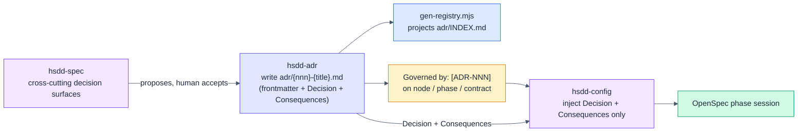
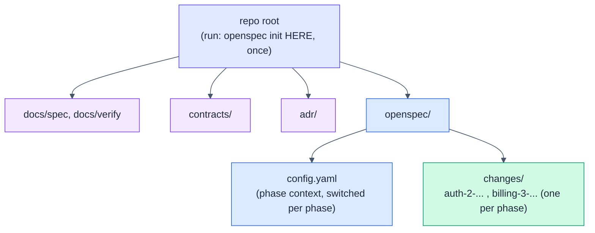

# HSDD: Hierarchical Spec-Driven Development (v0.4 delta)

> Delta specification. It adds ADR authoring as a first-class skill, reconciles
> the ADR artifact with the registry generator, and pins where `openspec init`
> runs. Read it against v0.3; only the changes are stated here. Everything in v0.3
> not touched below still stands.

**Version:** 0.4 (draft)
**Status:** For review
**Date:** 2026-07-02
**Author:** Purbo Mohamad
**Supersedes (in part):** the ADR-authoring provisions of v0.3 §12.4 and the
skill-set table of v0.3 §7. All other v0.3 sections are unchanged.

---

## 1. What 0.4 Changes and Why

Two gaps surfaced in real use.

### 1.1 ADRs are first-class everywhere except authoring

The tooling and conventions already treat ADRs as first-class files, but no skill
writes them there, so they drift into inline prose inside a node spec and the
consumer cannot find them.

| Layer | ADR support in v0.3 | State |
|-------|---------------------|-------|
| `gen-registry.mjs` | scans `adr/`, reads frontmatter, emits `adr/INDEX.md` | present |
| `conventions.md` template | declares the layout `adr/{nnn}-{title}.md` | present |
| Node / phase shape | `Governed by: [ADR-NNN]` field (§4.1) | present |
| `hsdd-config` | injects each ADR's Decision + Consequences (§12.4) | present, but assumes the file exists |
| **Authoring an ADR file** | `hsdd-spec` only says "propose an `ADR-{nnn}` and let the human accept or edit it": no location, no template, no "write the file" | **missing** |

Two consequences follow: a broken handoff (nothing materializes `adr/*.md`, so
ADRs become sections in the node spec and `hsdd-config` cannot resolve them), and
a format mismatch (the v0.3 §12.4 example uses bold body fields and no YAML
frontmatter, so `gen-registry` would silently skip it).

### 1.2 The `openspec init` point was never pinned

v0.3 references "after `openspec init`" (§ hsdd-config) but never says where in the
repo to run it or how many OpenSpec projects one HSDD tree has. Section 5 pins it.

---

## 2. New Skill: `hsdd-adr`

HSDD grows from four skills to five. The new skill owns the `adr/` directory the
same way `hsdd-contract` owns `contracts/`: it authors first-class files and lets
the deterministic generator project the registry.

Updated skill-set table (adds the last row to v0.3 §7):

| Skill | Evolves | Role | Key outputs |
|-------|---------|------|-------------|
| `hsdd-spec` | `system-spec-brainstorm` | Recursive node decomposition; proposes ADRs and hands materialization to `hsdd-adr`. | node specs, dependency DAG, ADR proposals |
| `hsdd-contract` | new (v0.3) | Author and version first-class contracts. | `contracts/*.md` |
| `hsdd-phase-plan` | `subsystem-design-spec` | Leaf-parent to ordered phases with gates and tiers. | phase plans, `conventions.md` |
| `hsdd-config` | `openspec-config` | Per-phase OpenSpec context; injects consumed contract interfaces and governing ADR decisions. | `openspec/config.yaml` |
| **`hsdd-adr`** | **new (v0.4)** | **Author and maintain cross-cutting Architecture Decision Records as first-class files (`adr/{nnn}-{title}.md`) with registry-compatible frontmatter; manage the status lifecycle and the bidirectional `Affects` / `Governed by` links.** | **`adr/*.md`** |

### 2.1 Updated chain (v0.3 §7.1 plus one line)

```text
hsdd-spec        (root)            -> nodes + contracts referenced by id + ADRs proposed
  hsdd-contract  (define/version)  -> contracts/*.md (registry generated)
  hsdd-adr       (materialize)     -> adr/*.md       (registry generated)   [NEW in 0.4]
  hsdd-spec      (recurse internal levels until leaf-parents)
    hsdd-phase-plan (per leaf-parent) -> phases with gates + tiers
      hsdd-config   (per phase)    -> config.yaml: consumed contracts + governing ADR decisions
        OpenSpec cycle             -> code + verification doc
        human review gate          -> approve / iterate
```

### 2.2 Why a separate skill, not a branch of `hsdd-spec`

An ADR is a distinct artifact with its own lifecycle (status transitions,
superseding, a registry projection), exactly the shape that made `hsdd-contract`
its own skill rather than a branch of `hsdd-spec`. `hsdd-spec` decides *that* a
cross-cutting decision exists; `hsdd-adr` owns *how* it is recorded and evolved.
Same separation of concerns, same one-artifact-one-skill rule.

---

## 3. The ADR Artifact (reconciled with the registry generator)

This supersedes the ADR example in v0.3 §12.4. The artifact now carries YAML
frontmatter, mirroring a contract, so `gen-registry.genAdrs()` (which reads
`id`, `status`, `affects` from frontmatter) picks it up. **No change to
`gen-registry.mjs` is required; the fix is that the skill emits the frontmatter
the generator already expects.**

Write to `adr/{nnn}-{title}.md`:

```markdown
---
id: ADR-001
status: accepted            # proposed | accepted | superseded | deprecated
affects: [acme.backend.auth, auth-token@v1]
date: 2026-07-02
supersedes: []              # optional, e.g. [ADR-000]
superseded_by: []           # optional, set when a later ADR replaces this one
---

# ADR-001: Auth provider

## Context
Forces and constraints that make this decision necessary.

## Decision
Use provider X with rotating asymmetric keys.

## Consequences
- token verification needs the public JWKS endpoint
- key rotation is a hard dependency for acme.backend.auth.2

## Alternatives considered            # optional
- Provider Y: rejected because ...
```

The split is the same functional idea as a contract: **frontmatter is the
metadata projected into the registry; the body carries the human-facing
decision.** `hsdd-config` injects only `## Decision` and `## Consequences` into a
phase context, so those two sections stay clean and free of the deliberation in
`## Context` and `## Alternatives considered`.

Filename uses the number and a slug (`adr/001-auth-provider.md`); the frontmatter
`id` is the display id `ADR-001`. This mirrors contracts, where the filename is
`{slug}.md` and `id` is the slug. ADR numbers are global across the whole tree,
not per node. Node-local decisions stay as `D{n}` inside the node spec and never
become files.

---

## 4. Handoff Fixes

### 4.1 `hsdd-spec`: materialize, do not narrate

v0.3 §step 6 of `hsdd-spec` ends at "propose an `ADR-{nnn}` and let the human
accept or edit it." In 0.4 it continues: once accepted, hand off to `hsdd-adr` to
write `adr/{nnn}-{title}.md` with frontmatter, then set `Governed by: [ADR-NNN]`
on each affected node, phase, and contract. ADRs are never left as inline prose in
a node spec.

### 4.2 `hsdd-config`: fallback when the ADR file is missing

When `hsdd-config` builds a phase context it resolves the ADRs referenced by the
phase's node and by its consumed contracts, then injects each one's Decision and
Consequences. 0.4 adds a fallback: if a referenced `ADR-NNN` has no file under
`adr/`, it was never materialized. Stop and author it with `hsdd-adr` before
injecting. Do not fabricate a Decision from the referencing text, and do not
silently drop the reference.

### 4.3 ADR authoring and consumption



---

## 5. Where to Run `openspec init`

**Run `openspec init` once, at the repository root:** the same directory that
holds `docs/`, `contracts/`, and `adr/`. One HSDD tree has exactly one OpenSpec
project. Every phase, across every node, is a change under that single
`openspec/changes/`. Phases are isolated not by separate OpenSpec projects but by
the per-phase context switch (`hsdd-config`), which rewrites `config.yaml` before
each `opsx:new`.



### 5.1 Sequence at project start

1. `openspec init` at the repo root (creates `openspec/`).
2. `hsdd-spec` at the root: writes `docs/spec/{root}.md` and seeds
   `docs/conventions.md` next to it.
3. `hsdd-config` (init): fills `openspec/config.yaml` with project context and the
   companion-skill mapping.
4. Per phase from then on: `hsdd-config` phase switch, then the OpenSpec cycle.

`openspec init` is a one-time step and is not owned by any HSDD skill; the skills
assume `openspec/` already exists at the root. `hsdd-config` (init) is the first
HSDD step that touches it.

### 5.2 Rationale and the polyrepo case

A single project at the root is what makes the layout in v0.3 §11.1 coherent: one
`config.yaml` to switch, one `changes/` history, one place the contract and ADR
registries sit beside. It keeps context isolation a property of the phase switch,
not of the filesystem.

If the system is split across repositories (a separate deployable per repo rather
than a monorepo), run `openspec init` at the root of each repo and share
`contracts/` and `adr/` through a package or a git submodule. The single-project
default is canonical; the polyrepo variant is the exception, chosen only when the
code is already physically split.

---

## 6. Slash Command

Add one thin wrapper, consistent with the others (v0.3 §10):

- `/hsdd-adr {id-or-title}`: delegate to `hsdd-adr` to author or update an ADR.

```markdown
---
description: Author or update an HSDD Architecture Decision Record
---
Use the hsdd-adr skill for the ADR: $ARGUMENTS
```

The command stays a one-line delegator; the skill remains the source of truth.

---

## 7. Settled Decisions (0.4)

| Question | Decision |
|----------|----------|
| Who authors ADR files? | `hsdd-adr`. `hsdd-spec` proposes; `hsdd-adr` materializes. |
| ADR artifact format | YAML frontmatter (`id`, `status`, `affects`, `date`, optional `supersedes` / `superseded_by`) plus body. Reconciled with the existing generator. |
| Generator change needed? | None. The skill emits the frontmatter `gen-registry` already reads. |
| ADR numbering | Global across the tree, `ADR-{nnn}`; filename `adr/{nnn}-{title}.md`. |
| `openspec init` location | Once, at the repo root. One OpenSpec project per HSDD tree. |
| Missing ADR at config time | `hsdd-config` stops and hands off to `hsdd-adr`; never fabricates a Decision. |

---

## 8. Implementation Steps

1. Author `skills/hsdd-adr/SKILL.md` in the house style of the other four skills.
2. Edit `hsdd-spec` step 6 to hand ADR materialization to `hsdd-adr`.
3. Edit `hsdd-config` to add the missing-ADR fallback and to note the
   root-level `openspec init` point.
4. Add the `/hsdd-adr` command wrapper.
5. Update `conventions.md` template, README, and the user's guide: five skills,
   ADR authoring, and the `openspec init` location.
6. No change to `gen-registry.mjs`.
