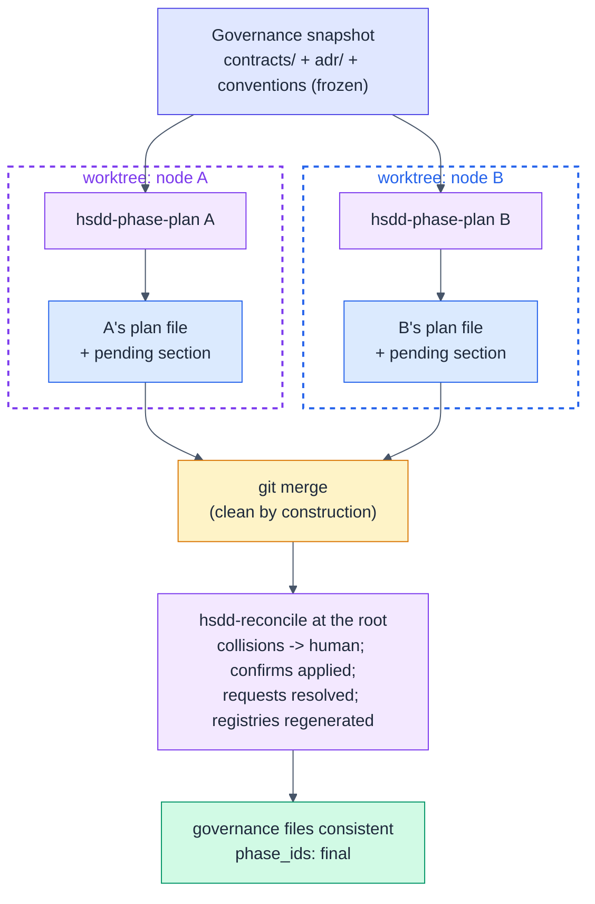

# HSDD: Hierarchical Spec-Driven Development (v0.4.2 delta)

> Delta specification. It makes parallel leaf-parent development safe:
> governance files become read-only during phase planning, intended changes
> are emitted as data, and a new skill (`hsdd-reconcile`) applies them at the
> root. Read it against v0.4; only the changes are stated here. Everything in
> v0.3/v0.4 not touched below still stands.

**Version:** 0.4.2 (draft)
**Status:** For review
**Date:** 2026-07-05
**Author:** Purbo Mohamad
**Supersedes (in part):** `hsdd-phase-plan` process step 6 (the conventions
update), the `## Established contracts` section of the conventions template,
and the conventions-update clause of the `hsdd-config` tasks rule. All other
v0.3/v0.4 provisions are unchanged.

---

## 1. What 0.4.2 Changes and Why

A field test on a mid-size production React monorepo ran the flow the
methodology itself recommends: one root checkout plus one git worktree per
leaf-parent, with `hsdd-phase-plan` running concurrently in both worktrees.
The methodology invites this parallelism (typed contract edges exist "so teams
parallelize") but defined no write protocol for the files every branch shares.
Three failures followed:

1. Both runs rewrote the same prose paragraph of the shared contract (a
   "phase ids are provisional, update them then" note), each from its own
   perspective. The note was addressed to "whoever runs next", which under
   parallelism is both runs at once.
2. Both runs rewrote the same `## Established contracts` bullet in
   `docs/conventions.md`.
3. Worst: both phase plans claimed creation of the same shared artifact (the
   contract's TypeScript event map and its fixtures). The contract never named
   a canonical location, so each planner filled the gap unilaterally. One even
   invented a private coordination rule ("create it verbatim if absent;
   identical by construction; the merge is trivial"). Two independent
   generations from the same prose are not byte-identical; the rule papered
   over exactly the divergence it tried to prevent.

Root cause: `contracts/`, `adr/`, `docs/conventions.md`, and the INDEX
registries are shared mutable state with concurrent writers, and no skill
defined a write protocol.

The fix is the functional one the methodology already applies to code:
**governance files become immutable inputs during phase planning, intended
mutations are emitted as data, and a single writer applies them at the root.**

---

## 2. New Skill: `hsdd-reconcile`

HSDD grows from five skills to six. The new skill is the single writer for
governance effects, the same way `hsdd-contract` is the single author of
contract bodies.

Updated skill-set table (amends v0.4 §2; changed cells in bold):

| Skill | Evolves | Role | Key outputs |
|-------|---------|------|-------------|
| `hsdd-spec` | `system-spec-brainstorm` | Recursive node decomposition; proposes ADRs and hands materialization to `hsdd-adr`. | node specs, dependency DAG, ADR proposals |
| `hsdd-contract` | new (v0.3) | Author and version first-class contracts. **Root-only writer; carries `phase_ids` (provisional or final).** | `contracts/*.md` |
| `hsdd-adr` | new (v0.4) | Author and maintain cross-cutting ADRs as first-class files. | `adr/*.md` |
| `hsdd-phase-plan` | `subsystem-design-spec` | Leaf-parent to ordered phases with gates and tiers. **Governance files are frozen inputs; emits a pending-governance section instead of editing them.** | phase plans, **pending governance sections** |
| `hsdd-config` | `openspec-config` | Per-phase OpenSpec context. **Warns on provisional contracts; stops on request-contingent phases.** | `openspec/config.yaml` |
| **`hsdd-reconcile`** | **new (v0.4.2)** | **Drain pending governance sections at the root after phase-plan branches merge: apply confirms, resolve requests with the human, finalize `phase_ids`, regenerate registries.** | **updated `contracts/*.md`, `docs/conventions.md`, regenerated `INDEX.md`** |

### 2.1 Updated chain (v0.4 §2.1 plus one line)

```text
hsdd-spec        (root)            -> nodes + contracts referenced by id + ADRs proposed
  hsdd-contract  (define/version)  -> contracts/*.md (registry generated)
  hsdd-adr       (materialize)     -> adr/*.md       (registry generated)
  hsdd-spec      (recurse internal levels until leaf-parents)
    hsdd-phase-plan (per leaf-parent, parallel-safe) -> phases + pending governance sections
    hsdd-reconcile  (root, after branches merge)     -> contracts finalized, registry regenerated   [NEW in 0.4.2]
      hsdd-config   (per phase)    -> config.yaml: consumed contracts + governing ADR decisions
        OpenSpec cycle             -> code + verification doc
        human review gate          -> approve / iterate
```

### 2.2 Why a separate skill, not a mode of `hsdd-contract` or `hsdd-phase-plan`

The same one-artifact-one-skill rule as v0.4 §2.2. `hsdd-phase-plan` decides
*what a node needs* from governance; `hsdd-reconcile` owns *how and when*
governance actually changes. Folding reconcile into `hsdd-contract` gives that
skill two jobs (authoring bodies, merging plans) and a muddier trigger
surface; folding it into `hsdd-phase-plan` re-creates the concurrent writer
the protocol exists to remove.

---

## 3. The Governance Freeze Protocol

### 3.1 The rule

During phase planning, these are read-only: `contracts/*`, `adr/*`,
`docs/conventions.md`, `contracts/INDEX.md`, `adr/INDEX.md`.

The rule is unconditional: root or worktree, serial or parallel. There is no
environment detection and nothing to configure. A serial flow pays one
trivially fast reconcile step; a parallel flow becomes conflict-free by
construction, because every branch writes only its own node's plan file.



### 3.2 The pending section (wire format)

`hsdd-phase-plan` appends to its own node's plan file
(`docs/spec/{node-id}.md`):

```markdown
## Governance updates (pending reconcile)

> Emitted by hsdd-phase-plan on {YYYY-MM-DD}. Drained by hsdd-reconcile;
> do not apply by hand.

- confirm `{contract-id}@v{n}` {produced_by|consumers}: [{phase-ids}]
- note: {conventions-worthy fact}
- amend `{contract-id}@v{n}`: {a guarantee or semantic this plan settled for
  a contract this node owns, that consumers may rely on}
- request `{contract-id}@v{n}`: {the gap, phrased as a question}
  - assumption: {what this plan assumes while the gap is open}
  - contingent phases: {phase ids that must not start until resolved, or none}
```

Four entry kinds (any entry may carry short rationale sub-bullets):

- `confirm`: finalize provisional `produced_by` / `consumers` phase ids for a
  contract this node produces or consumes.
- `note`: a conventions-worthy fact (a new package, a shared artifact created
  by an owned phase). Notes that duplicate derived data are dropped at
  reconcile time; the registry already projects contract facts.
- `amend`: a producer-side enrichment of a contract this node owns, settled
  during planning (an error mapping, an ordering guarantee) that consumers may
  rely on. Without it, such semantics hide as node-local decisions consumers
  never see. Reconcile applies it to the contract body; a backward-compatible
  addition keeps the version, a breaking one goes to the human and bumps it.
- `request`: a gap or ambiguity in a consumed contract, with the assumption
  taken and the phases contingent on it. Contingent phases must not start
  until the request is resolved.

After draining, `hsdd-reconcile` replaces the section's entries with one line:
`> Reconciled {YYYY-MM-DD} by hsdd-reconcile. Drained entries are in git history.`

### 3.3 Contract gaps: ask or record

If a gap in a consumed contract changes the shape of the plan (which phases
exist, what they produce), the planner stops and asks the human immediately; a
wrong structural assumption poisons every downstream phase. Otherwise it
proceeds conservatively and records a `request` entry.

### 3.4 Sibling isolation

A planner must not read sibling worktree folders or other nodes' phase plans.
Contracts are the only inter-node knowledge; a sibling's half-written plan on
the same disk is not a contract. (This is v0.3's isolation principle restated
for the filesystem reality of worktrees.) Sibling node specs as written by
`hsdd-spec` (purpose, contracts, DAG) are shared decomposition artifacts and
fine to read; a sibling's phase-plan sections and its worktree are not.

---

## 4. Artifact Changes

### 4.1 Contract frontmatter: `phase_ids`

Contracts are authored before phase plans exist, so `produced_by` and
`consumers` start as guesses. That state now lives in frontmatter instead of a
prose note:

```yaml
phase_ids: provisional  # provisional | final; flipped only by hsdd-reconcile
```

The v0.4-era habit of writing "phase ids are provisional, update them then" in
the body is retired; that paragraph was a standing invitation for two writers
to edit the same prose. **No change to `gen-registry.mjs` is required:** its
parser reads all frontmatter keys but projects only the known columns, so
`phase_ids` passes through without effect (verified against the bundled
generator).

### 4.2 Conventions template

The hand-maintained `## Established contracts` list is removed; it duplicated
what `contracts/INDEX.md` already projects, and hand-maintained projections
drift (the same argument v0.3 §12 makes for generating the registry at all).
In its place the template gains a `## Parallel development protocol` section
stating the freeze rule, the pending-section mechanism, the reconcile step,
and sibling isolation. Every skill already reads `docs/conventions.md` first,
so the protocol reaches every downstream session without new cross-skill
references.

---

## 5. Skill Edits (summary)

| Skill | Change |
|-------|--------|
| `hsdd-phase-plan` | Step 6 no longer updates `conventions.md`; it emits the pending-governance section. New sections: governance freeze, entry grammar, two-tier gap rule, sibling isolation. |
| `hsdd-contract` | Root-only writer rule; `phase_ids` field in the template; quality gate: any code-level artifact both sides consume names its canonical path and owning phase. |
| `hsdd-config` | The tasks rule no longer instructs phases to update `docs/conventions.md`. The phase context switch warns on `phase_ids: provisional` and stops on phases contingent on an open `request`. |
| `hsdd-spec` | Conventions template changes (§4.2). Seeding is unchanged; conventions stay root-owned. |

---

## 6. Slash Command

One thin wrapper, consistent with the others:

```markdown
---
description: Drain pending HSDD governance updates and finalize contracts
---
Use the hsdd-reconcile skill to reconcile: $ARGUMENTS
```

---

## 7. Settled Decisions (0.4.2)

| Question | Decision |
|----------|----------|
| Write model for governance files during planning | Freeze + effects-as-data. Unconditional: no worktree detection, serial and parallel flows identical. |
| Where reconciliation lives | A new skill, `hsdd-reconcile`, run at the root after branches merge. One artifact, one skill. |
| Contract gaps during planning | Two-tier: ask immediately when the gap changes the plan's shape; otherwise record a `request` with the stated assumption. |
| Collision resolution | The human arbitrates, once, at reconcile time. The skill never auto-picks a winner. |
| Who writes `docs/conventions.md` | Root only (`hsdd-spec` seeds it, `hsdd-reconcile` updates it). Phases and phase planning never touch it. |
| Sibling worktree reads | Forbidden. Contracts are the only inter-node knowledge. |
| Generator change | None. `phase_ids` is parsed and ignored by the projection (verified). |
| Producer-side contract discoveries | The `amend` entry kind: reconcile applies producer-settled semantics to the owned contract's body; a breaking amendment goes to the human and bumps the version. |
| `draft` to `stable` transition | Flipped by `hsdd-reconcile` in the same step as `phase_ids: final`, unless an unresolved `request` names the contract. Stable means interface-frozen (safe to build against), not producer-shipped. |

---

## 8. Implementation Steps

1. Edit `hsdd-phase-plan`: freeze rule, pending-section template, gap rule,
   sibling isolation, anti-rationalization rows.
2. Edit `hsdd-contract`: `phase_ids`, writer rule, canonical-artifact gate.
3. Edit the conventions template: registry pointer plus parallel protocol.
4. Author `skills/hsdd-reconcile/SKILL.md` and `commands/hsdd-reconcile.md`.
5. Edit `hsdd-config`: tasks-rule fix and the reconcile guard.
6. Update the user's guide (loop, workflow diagram, worked examples, tips).
7. Update README (six skills) and CHANGELOG (`[0.4.2]`).
8. No change to `gen-registry.mjs`.
