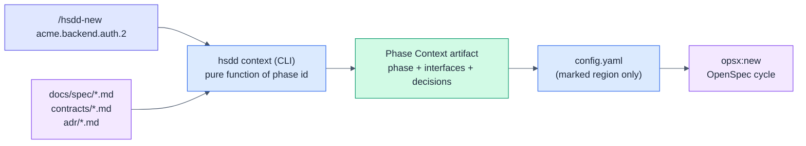
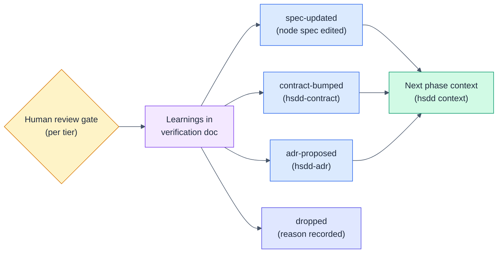

# HSDD: Hierarchical Spec-Driven Development (v0.5 delta)

> Delta specification. It mechanizes every prose-enforced guarantee into a small
> CLI, makes the phase context pull-based, wires contract fixtures into gates,
> adds the upward feedback loop, derives project state instead of declaring it,
> and opens brownfield and multi-team paths. Read it against v0.3 and v0.4; only
> the changes are stated here. Everything not touched below still stands.

**Version:** 0.5 (draft)
**Status:** For review
**Date:** 2026-07-03
**Owner:** Purbo Mohamad
**Drafted by:** Claude (Fable 5), from `review/hsdd-v0_4-review-fable.md`
**Supersedes (in part):** the registry-distribution rules of v0.3 §5.3 and the
0.4.1 verbatim-copy provisions; the push-based phase switch of v0.3 §7 / §9 step 7
and v0.4 §5; the contract frontmatter of v0.3 §5.1 (`produced_by`, `consumers`);
the PE/review-window definition of v0.3 §12.3; the tier defaults of v0.3 §12.1;
the FP-progression mandate of v0.3 §7 (`hsdd-phase-plan`); the isolation and token
claims as worded in the README.

---

## 1. What 0.5 Changes and Why

v0.4.1 fixed a corrupted-registry incident with stronger prose ("copy the script
verbatim"). The v0.4 review identified that as the wrong lesson: prose-enforced
invariants fail probabilistically, and each new artifact type adds more fragile
skill-to-skill handoffs. 0.5 draws the line differently:

> **Skills decide; tools do.** Every mechanical guarantee moves from skill prose
> into a deterministic CLI. Skills shrink to judgment: decomposition, contract
> design, decision capture, review.

The same review found the feedback loop missing (nothing flows from code back to
spec), the isolation and token claims overstated, the phase context to be a
mutable singleton that contradicts the parallelism pitch, and the methodology
greenfield-and-single-team only. 0.5 addresses each. Traceability:

| Review finding | v0.5 fix | Section |
|----------------|----------|---------|
| 2.2 Prose-enforced invariants | `hsdd` CLI: registry, context, lint, status, rename, check-scope | 3 |
| 2.2 / 2.7 Nothing machine-reads the specs | Frontmatter on node specs and conventions; normative phase block | 2 |
| 2.4 Singleton mutable phase context | Pull-based context (`hsdd context`), worktree-per-phase for parallelism | 4 |
| 2.5 Integration deferred, fixtures unwired | Stable contracts require executable validation; producer/consumer gate wiring; integration nodes | 5 |
| 2.6 No feedback loop, no tree surgery | Learnings with dispositions; renegotiation procedure; `hsdd rename` | 6 |
| 2.7 Write-only metadata, no project state | `consumers`/`produced_by` derived, not authored; derived phase lifecycle; `hsdd status` | 2, 7 |
| 2.3 Isolation claim not enforced | Claims rewritten; `Touches` allowlist + `hsdd check-scope` | 8 |
| 2.10 Gate has no skill; sign-off is honor-system; tier leverage inversion | `hsdd-review` skill; PR-wired approval; leverage rule | 9 |
| 2.10 PE anchored to a vendor window | PE redefined in human terms | 10 |
| 2.10 FP progression hard-baked | Phase ordering becomes a conventions policy | 11 |
| 2.8 Greenfield only | `hsdd-adopt` skill: lazy tree, as-built specs, contracts from seams | 12 |
| 2.9 Multi-team claims vs single-writer mechanics | Opt-in multi-team profile; claims rescoped | 13 |
| 2.1 Evidence vacuum | Evidence program: per-phase metrics, case-study requirement for v1.0 | 14 |
| 2.10 Delta-spec stacking | v0.5 is the last delta; v1.0 consolidates | 18 |

**What does not change:** the recursive node model, contracts as the only
cross-node knowledge, typed dependency edges, the OpenSpec cycle as the untouched
execution engine, review tiers, verification docs, ADRs as first-class files,
composition with superpowers, and the principle that depth and ceremony are costs.

---

## 2. The Machine-Readable Artifact Model

The CLI (Section 3) can only be deterministic if the artifacts it projects from
are machine-readable. 0.5 extends the contract/ADR frontmatter pattern (metadata
for machines, body for humans) to every authored artifact. One rule everywhere:

> **A field lives in exactly one place.** Machine-read fields live in frontmatter
> (or the normative phase block) and nowhere else. Anything derivable from other
> artifacts is never authored at all; a tool projects it.

### 2.1 Node spec frontmatter

`docs/spec/{node-id}.md` gains YAML frontmatter. The bold body fields that
duplicated it (`Kind`, `Consumes`, `Produces`, `Governed by`) are removed from
the body template; `Purpose`, `Owns`, `Does not own`, `Decomposes into`, and
`Isolation strategy` stay as body prose.

```markdown
---
id: acme.backend.auth
kind: leaf-parent            # internal | leaf-parent
consumes: [user-model@v1]
produces: [auth-token@v1]
governed_by: [ADR-001]       # optional
team: identity               # optional, multi-team profile only (Section 13)
adopted: as-built            # optional, brownfield only (Section 12)
---

### acme.backend.auth: Authentication

**Purpose:** ...
**Owns:** ...
**Does not own:** ...
**Decomposes into:** phases (see phase plan below)
**Isolation strategy:** ...
```

### 2.2 The normative phase block

Phases remain sections inside the leaf-parent file (no per-phase files). Because
frontmatter cannot appear mid-file, the phase block template becomes **normative
grammar**: `hsdd context` parses it and `hsdd lint` rejects blocks that do not
parse. The v0.3 template is unchanged except for one new optional field:

```markdown
### {phase-id}: {Phase Name}

**Consumes:** [contract-id@version, ...]
**Produces:** [contract-id@version, ...]
**Governed by:** [ADR-NNN, ...]            # optional
**Scope:** concrete, verifiable deliverable
**Size estimate:** ~N files, ~N lines, <= 8 OpenSpec tasks
**Gate:** exact command
**Verification:** how a human manually confirms it works
**Review tier:** gate-only | spot-check | full-review
**Touches:** [src/auth/**, tests/auth/**]  # optional file-scope globs (Section 8)
**Dependencies:** which prior phases, and what specifically (contracts only)
```

### 2.3 Contract frontmatter: authored intent only

`produced_by` and `consumers` are **removed**. They were write-only metadata:
hand-maintained, read by nothing but a count column, and guaranteed to rot. The
registry now derives consumers by scanning node frontmatter and phase blocks for
`consumes` entries, and checks `owner` against the node that lists the contract
under `produces`. Two fields are added to make validation executable (Section 5):

```markdown
---
id: auth-token
version: v1
status: stable          # stable | draft | deprecated
kind: api               # api | event | schema | shared-model | file | cli
owner: acme.backend.auth
schema: schemas/auth-token.schema.json    # required for stable (one of schema/fixtures)
fixtures: fixtures/auth-token/            # required for stable (one of schema/fixtures)
---
```

ADR frontmatter is unchanged. `affects` remains authored (it carries forward
references to artifacts that do not exist yet); `hsdd lint` enforces the
bidirectional match with `governed_by` once both sides exist.

### 2.4 Conventions frontmatter

`docs/conventions.md` gains frontmatter so the CLI reads layout overrides and
policies without parsing prose:

```markdown
---
specs_dir: docs/spec
verify_dir: docs/verify
contracts_dir: contracts
adr_dir: adr
openspec_dir: openspec
ordering_policy: fp-progression     # Section 11
profile: single-team                # single-team | multi-team (Section 13)
---
```

The body keeps the human-facing conventions exactly as before. Defaults apply
when frontmatter or fields are absent, so existing projects keep working.

### 2.5 Migration

`hsdd lint` reports node specs and contracts still in the v0.3/v0.4 shape.
Migration is mechanical (lift bold fields into frontmatter, drop
`produced_by`/`consumers`) and is a one-time step per project; the skills emit
the new shape from 0.5 on.

---

## 3. The `hsdd` CLI

### 3.1 Principle and distribution

One tool, `hsdd`, owns every deterministic operation. It is a zero-dependency
Node package (Node >= 20), published to npm, run as `npx hsdd <command>` or
installed as a devDependency. It absorbs `gen-registry.mjs`.

This **retires the 0.4.1 verbatim-copy rule entirely.** Skills no longer copy a
script into the project and defend it with prose; they instruct a one-time
install of a versioned package. The corrupted-registry failure mode (an agent
retyping the generator) becomes structurally impossible, and the `hsdd-adr`
bootstrap gap (generator ships only with `hsdd-contract`) disappears: every
command is available the moment the package is.

The CLI never calls a model and never guesses. Every command is a pure function
of the repository state; unresolvable input is a hard error with a message naming
the skill that owns the fix.

### 3.2 Command: `hsdd registry`

Replaces `gen-registry.mjs`. Projects `contracts/INDEX.md` and `adr/INDEX.md`
from frontmatter, as before, with one change: the contract table's `owner` and
`consumers` columns are **derived** from node/phase `produces` and `consumes`
declarations (Section 2.3). Deterministic output, no timestamps.

### 3.3 Command: `hsdd context <phase-id> [--write | --stdout]`

Deterministic phase-context assembly, replacing the prose steps of the
`hsdd-config` phase switch:

1. Resolve the leaf-parent file from the phase id (`{leaf-parent}.{n}` ->
   `{specs_dir}/{leaf-parent}.md`) and parse the phase block.
2. For each consumed contract id: load `contracts/{slug}.md`, extract only
   `## Interface` and `## Guarantees / invariants`.
3. Resolve governing ADRs from the phase block and from each consumed contract's
   `governed_by`; extract only `## Decision` and `## Consequences`, and only from
   ADRs with `status: accepted`.
4. Emit the **Phase Context artifact**: a self-contained markdown document with
   the `## Current Phase`, `## Contracts from Prior Phases / Nodes`, and
   `## Governing Decisions` sections.

`--stdout` prints it. `--write` splices it into `openspec/config.yaml` between
literal markers inside the `context:` block scalar:

```text
<!-- hsdd:phase-context:begin -->
...generated sections...
<!-- hsdd:phase-context:end -->
```

Only the marked region is replaced; project-wide context and `rules:` are
untouched by construction, not by instruction.

Failure modes (all hard errors, exit nonzero):

| Condition | Behavior |
|-----------|----------|
| Unknown phase id or unparseable phase block | Error naming the file and the normative grammar |
| Consumed contract file missing | Error: "author it with hsdd-contract" |
| Referenced ADR file missing | Error: "author it with hsdd-adr". The CLI never invents a decision |
| Referenced ADR is `proposed` | Excluded from output, warning printed; a proposed decision is never injected as binding |
| Consumed contract is `draft` | Warning (allowed: consumers may build against a draft at their own risk) |

This subsumes the v0.4 §4.2 fallback prose: the stop-and-author behavior is now
the tool's error path, and the anti-invention rule is not a skill instruction but
an impossibility.

### 3.4 Command: `hsdd lint [--strict] [--profile <name>]`

Referential-integrity checks across the whole tree. Errors unless noted:

1. Every id in `consumes`/`produces` (node frontmatter and phase blocks) resolves
   to `contracts/{slug}.md` with a matching version.
2. Every contract's `owner` node exists and lists the contract under `produces`;
   no two nodes produce the same contract.
3. Every `governed_by` ADR id resolves to a file in `adr/`.
4. ADR `affects` and artifact `governed_by` match bidirectionally for artifacts
   that exist; unmatched `affects` entries pointing at nonexistent ids are
   warnings (forward references).
5. ADR ids are unique, zero-padded, and match their filenames.
6. A `stable` contract has at least one of `schema`/`fixtures`, and the paths
   exist (Section 5).
7. A phase consuming a `draft` contract: warning.
8. Every phase block parses against the normative grammar; phase numbers are
   sequential per leaf-parent.
9. Every OpenSpec change carrying a `Phase:` line (Section 7.2) references an
   existing phase id.
10. Derived-state consistency (Section 7): e.g. a verification doc exists for a
    phase whose change was never archived.
11. Generated `INDEX.md` files match a fresh projection (regenerate-and-diff).
12. Frontmatter present on every node spec, contract, and ADR (`--strict` makes
    the v0.3-shape migration warnings errors).
13. Undispositioned learnings in verified phases (Section 6.1): warning;
    `--strict` error.

Designed to run in pre-commit or CI. Exit 0 clean, 1 errors, 2 warnings-only.

### 3.5 Command: `hsdd status [node-id] [--write]`

Projects the derived lifecycle state (Section 7) of every phase under the given
node (default: root) and rolls it up per node. Prints a table; `--write` emits
`docs/STATUS.md` with the generated-file header, same convention as the
registries. Answers "where are we?" mechanically instead of by archaeology.

### 3.6 Command: `hsdd rename <old-node-id> <new-node-id>`

Tree surgery. Dotted-path identity stays (it is the human-friendly choice), and
this command makes it refactorable:

- Rewrites the id and all dotted descendants across: node spec filenames and
  frontmatter, phase headings, `consumes`/`produces` references, contract
  `owner`, ADR `affects`, `governed_by` entries, and verification-doc filenames.
- **Never rewrites `openspec/changes/`**: the archive is immutable history.
- Appends the mapping (`old -> new`, date) to `docs/renames.md`, the ledger that
  keeps archived changes and old discussions resolvable.
- Runs `hsdd registry` and `hsdd lint` afterward and reports.

Moving a node (`acme.backend.auth -> acme.platform.auth`) and renaming a slug are
the same operation. Splitting or merging nodes remains a judgment task for
`hsdd-spec`, followed by renames for the mechanical part.

### 3.7 Command: `hsdd check-scope <phase-id> [--base <ref>]`

Compares the changed files (working tree, staged, and commits since `--base`,
default the branch fork point) against the phase's `Touches` globs. Lists any
out-of-scope files and exits nonzero. If the phase declares no `Touches`, prints
a note and exits 0 (the check is opt-in per phase). Wired into gates in
Section 8.2.

---

## 4. Pull-Based Phase Context and Parallel Phases

### 4.1 Context as a pure function

v0.3 §9 flagged its own step 7 (the manual context switch) as the easiest step to
forget. A methodology whose central mechanism depends on a human remembering a
manual pre-step has a design bug. 0.5 fixes it at the root:

> The phase context is a pure function of the phase id: `hsdd context` derives it
> from the tree at the moment the cycle starts. Nothing needs to be remembered,
> and stale context cannot be inherited.

The paved road is a new slash command:

- `/hsdd-new {phase-id}`: runs `hsdd context {phase-id} --write`, verifies exit 0,
  then starts `opsx:new` for a change named `{phase-id}` with dots as hyphens,
  whose proposal carries the `Phase: {phase-id}` line (Section 7.2).

`/hsdd-phase {phase-id}` is retained as the context-only step (it now simply runs
`hsdd context --write`), for users who want to inspect before starting the cycle.



### 4.2 Parallel phases require worktrees

One working copy has one `config.yaml`; that is a physical fact, not a policy.
0.5 states the consequence honestly:

- **Sequential phases (one session at a time):** the single checkout is fine;
  `/hsdd-new` re-derives context each time.
- **Concurrent phases (parallel sessions, one machine or many):** one git
  worktree per active phase is **required**, not suggested. Branch naming:
  `hsdd/{phase-id}`. Each worktree carries its own `config.yaml`, so contexts
  cannot race. `superpowers:using-git-worktrees` is promoted from optional
  companion to the standard mechanism for this case.

Merge story: each phase's OpenSpec change lives in its own directory under
`openspec/changes/{phase-id-slug}/`, and verification docs are one file per
phase, so parallel phases merge without conflicts by construction. Contract and
ADR edits are the only shared surfaces; they belong to their owning phase
(`Produces`) and cross-team edits follow Section 13.

### 4.3 The engine adapter boundary

The Phase Context artifact (Section 3.3) is engine-neutral markdown. Writing it
into OpenSpec's `config.yaml` is one adapter (the only one implemented today).
This is a thin but explicit boundary: if OpenSpec changes its config semantics or
a different execution engine is preferred later, only the adapter changes; the
tree, contracts, ADRs, and the context function survive. HSDD remains
OpenSpec-first; it stops being OpenSpec-shaped.

---

## 5. Contract Validation and Integration Nodes

### 5.1 Stable means machine-checkable

The v0.3 contract template already named `## Validation` (fixture + schema) and
wired it to nothing. 0.5 makes it normative:

> A contract may not be `stable` unless it carries at least one executable
> validation artifact: a `schema` (JSON Schema or equivalent for the kind) or a
> `fixtures` directory of concrete examples. `hsdd lint` enforces existence.

Guidance per kind: `api` and `event` want schema plus example payloads; `schema`
and `shared-model` want the schema plus edge-case fixtures; `file` wants a sample
tree; `cli` wants recorded invocations (args, stdout, exit code).

### 5.2 Both gates run the contract

Consumer-driven contract testing, wired into the existing gate mechanism:

- **Producer side:** the gate of any phase that `produces` a contract MUST
  include a check that its real output validates against the contract's schema
  and reproduces the fixtures. Concretely: the phase plan's `Gate:` includes a
  contract-verification command (e.g. `npm run contract:verify auth-token`), and
  `hsdd-phase-plan` writes it there by default.
- **Consumer side:** phases that `consume` a contract build and test against the
  fixtures, not hand-rolled mocks. The mocks ARE the fixtures. When the contract
  bumps, the fixtures change, and consumer tests fail loudly instead of drifting
  silently.

This closes the known failure mode of contract-first development (mocks pass,
live integration fails) with machinery the artifacts already sketched.

### 5.3 Integration nodes

Node-local wiring ("final phase: composition") is not enough; nothing exercised
the real composition across sibling nodes. 0.5 adds a decomposition rule that
preserves "only leaves drive code":

> When an internal node's children exchange contracts, `hsdd-spec` SHOULD add an
> **integration node**: a child leaf-parent named `{node}.integration` with
> `hard` edges to each producing sibling. Its phases exercise the real composed
> behavior: replay contract fixtures against live components, run end-to-end
> slices of the primary flows. Its phases default to `full-review`.

Because its edges are `hard`, the DAG schedules it after the producers ship,
exactly where integration belongs. Small trees that are one leaf-parent need no
integration node; their final composition phase already covers it.

---

## 6. The Feedback Loop

### 6.1 Learnings, dispositioned at the gate

The flow was strictly downward; real development learns upward. The verification
document gains a required section:

```markdown
## Learnings
- L1: auth-token needs a `scopes` claim the contract omits.
  -> disposition: contract-bumped (auth-token@v2)
- L2: session-store latency budget was guessed; measured 3x higher.
  -> disposition: spec-updated (acme.backend.auth: Isolation strategy)
- L3: considered switching JWT lib mid-phase.
  -> disposition: dropped (out of scope; current lib adequate)
```

Every learning carries exactly one disposition: `spec-updated`,
`contract-bumped (id@v)`, `adr-proposed (ADR-nnn)`, or `dropped (reason)`.
`hsdd-review` (Section 9) does not sign off while learnings are undispositioned,
and `hsdd lint` flags them (Section 3.4, check 13). "No learnings" is a valid
entry; silence is not.



### 6.2 Mid-phase contract renegotiation

When a phase discovers mid-`apply` that a consumed contract is wrong or
incomplete, the procedure is:

1. **Pause** the apply at a task boundary; do not improvise around the contract.
2. **Record** the gap as a learning in the in-progress verification notes.
3. **Renegotiate** via `hsdd-contract`: a backward-compatible addition amends the
   current version; a breaking change drafts `v{n+1}` with a migration note.
   Under the multi-team profile, cross-team consumers ack first (Section 13.2).
4. **Re-derive** the context: `hsdd context {phase-id} --write`.
5. **Resume** the change; OpenSpec's artifact flow absorbs the updated context.
6. Producer-side changes ship through the producing node's next phase; the
   consumer does not edit another node's internals (unchanged rule).

### 6.3 Boundary corrections

When shipped phases reveal a wrong decomposition (the auth/billing seam is in the
wrong place), the correction path is: `hsdd-spec` re-decomposes the affected
subtree (judgment), then `hsdd rename` executes the mechanical rewrites
(Section 3.6), then `hsdd lint` proves the tree consistent. Archived changes stay
put; `docs/renames.md` keeps old ids resolvable. This does not make
re-decomposition cheap (it cannot be), but it makes it a bounded, tool-assisted
operation instead of an untracked hand edit across a dozen files.

---

## 7. Derived Project State

### 7.1 State is derived, never declared

No hand-maintained status field is added anywhere. A phase's lifecycle state is a
pure projection of artifacts that already exist, in the same spirit as the
registries:

| State | Derived from |
|-------|--------------|
| `planned` | none of the below exist |
| `in-progress` | a linked change exists under `openspec/changes/` |
| `built` | the linked change is archived |
| `verified` | `docs/verify/{phase-id}.verification.md` exists with gate evidence |
| `approved` | sign-off recorded: merged PR reference, or reviewer + date line |

Node state is the rollup of its descendants (`planned` until any child starts,
`done` when all are `approved`). `hsdd status` prints it; `hsdd lint` flags
inconsistent combinations (a verification doc for a change never archived).


### 7.2 Linking changes to phases

Derivation needs a deterministic link between an OpenSpec change and its phase.
Two mechanisms, both written by `/hsdd-new`:

- The change directory is named `{phase-id}` with dots replaced by hyphens
  (`acme-backend-auth-2`).
- The proposal's first line is `Phase: {phase-id}` (added to the `proposal`
  rules in `config.yaml` by `hsdd-config`). This line is authoritative; the
  directory name is the human-friendly convention.

---

## 8. Scope: Honest Claims and Enforcement

### 8.1 Claims rewrite

Context injection bounds what is pushed into a session; it does not stop an agent
from grepping sibling internals in the working tree. The README and spec language
changes accordingly:

| Current claim | Replacement |
|---------------|-------------|
| "A session cannot wander into a sibling's concern or fabricate an interface it was never given, because neither is in context." | "Context injection shapes attention: the session is handed only its phase and its consumed interfaces, so it has no reason to load sibling internals. File-scope enforcement is available per phase via `Touches` + `hsdd check-scope`." |
| "Token cost does not scale with total system size." | "Per-session context is bounded by the phase, not the system. Total project tokens still scale with the number of phases, and decomposition itself costs tokens: below a handful of PEs, plain OpenSpec is cheaper. HSDD pays a planning overhead to buy bounded sessions, parallelism, and reviewability." |

### 8.2 Opt-in enforcement

For phases where information hiding matters (parallel teams, security-sensitive
seams), the phase block declares `Touches:` globs (Section 2.2) and the gate
includes `hsdd check-scope {phase-id}`. `hsdd-phase-plan` adds both by default
for phases in trees with parallel lanes. The diff either stays inside the
declared footprint or the gate fails; the reviewer sees the violation instead of
discovering the coupling months later. Worktrees with sparse checkouts remain an
optional harder wall for teams that want it.

---

## 9. The Review Gate: `hsdd-review`, Sign-Off, Tier Leverage

### 9.1 New skill: `hsdd-review`

The gate is the centerpiece of the methodology and was the only step with no
skill support. `hsdd-review` closes that:

- **Inputs:** phase id; its tier; the verification doc; the diff.
- **Behavior:** walk the reviewer through the per-tier checklist; run the gate
  command and `hsdd check-scope`; execute the manual verification steps from the
  verification doc; require every learning dispositioned (Section 6.1); record
  the sign-off.
- **Per-tier checklists:**
  - `gate-only`: gate green, scope check green, size within estimate. Minutes.
  - `spot-check`: the above, plus read the diff summary and the produced
    contract/type surface; confirm naming and shape match the phase scope.
  - `full-review`: the above, plus read the full diff, run the manual
    verification, probe edge cases listed in the phase's `Verification`, check
    error paths against contract guarantees.
- **Output:** the completed sign-off block, and any learnings escalated to
  `hsdd-spec` / `hsdd-contract` / `hsdd-adr`.

### 9.2 Sign-off uses real review infrastructure

A "reviewed by" line the agent can type is an honor-system record. The
recommended flow wires the gate to infrastructure that already enforces human
identity:

- Each phase is a branch (`hsdd/{phase-id}`) merged by pull request; the PR
  approval and merge are the approval event. The verification doc links the PR;
  `hsdd status` treats a merged linked PR as `approved`.
- Repos without PR flow fall back to the signed line in the verification doc,
  committed by the human. The doc records which mechanism was used.

Review tiers map onto PR ceremony (gate-only: auto-merge on green checks with
notification; spot-check: one approval; full-review: approval after running the
verification steps), so HSDD composes with branch protection instead of
parallel-inventing review records.

### 9.3 Tier assignment considers leverage, not only risk

v0.3 assigned Phase 1 (types, contracts, scaffolding) `gate-only`. That inverts
leverage: the type skeleton has the highest downstream fan-out in the plan, is
cheap to read (all signal), and is expensive to get wrong. New rule:

> A phase whose produced types or interfaces are consumed by two or more later
> phases gets `spot-check` at minimum. `gate-only` is reserved for artifacts with
> no downstream consumers: build scaffolding, CI config, codegen output,
> vendored boilerplate.

The tier table's "For" column is amended accordingly; the linkcheck and acme
examples in the user's guide are updated (their phase 1 becomes `spot-check`).

---

## 10. Sizing: the PE Redefined

The Phase Equivalent is redefined in terms of the durable constraint (human
review capacity), not a vendor's session window:

> **One PE is the largest unit of change one reviewer can genuinely review and
> manually verify in a single sitting**, plus the agent run that produces it.
> Working guidelines: a reviewable diff of roughly <= 400 changed lines of
> non-generated code, <= 8 OpenSpec tasks, about half a working day end to end.

Calibration note, explicitly non-normative: as of mid-2026 one PE happens to fit
one Claude Code rolling window (~5h). When windows change, the PE does not; the
review sitting is the invariant. All "~5h window" phrasing in the README, spec,
and skills is replaced by "one review sitting" with the calibration note.

---

## 11. Phase Ordering as Policy

The FP progression (types -> pure functions -> effects -> composition) moves from
a mandate in `hsdd-phase-plan` to a **named policy** selected in
`docs/conventions.md` frontmatter (`ordering_policy`, Section 2.4):

- `interfaces-first` (default): stable interfaces and shared types first, effects
  behind interfaces, composition and wiring last. The durable principle, stack-
  agnostic.
- `fp-progression`: the full FP ordering; the reference policy for FP stacks
  (Rust, Kafka Streams, etc.). This is `interfaces-first` sharpened.
- Projects may define their own (e.g. `walking-skeleton`: one thin end-to-end
  slice first, then widen), documented in the conventions body.

`hsdd-phase-plan` reads the policy and orders phases accordingly. The sizing
rules, tiers, and gates are policy-independent and unchanged.

---

## 12. Brownfield Adoption: `hsdd-adopt`

The systems that actually suffer the too-big-spec problem mostly already exist.
A new skill, `hsdd-adopt`, gives them a path in; its output feeds the standard
loop unchanged.

### 12.1 Process

1. **Archaeology.** Map the real seams: deployables, packages, API surfaces,
   event topics, schema/DB boundaries. Propose a shallow tree (depth 1 to 2) that
   follows the seams that exist, not the ones anyone wishes existed.
2. **As-built node specs.** Write node specs marked `adopted: as-built` in
   frontmatter: purpose, owns/does-not-own, and observed contracts. No invented
   decomposition below the level needed now.
3. **Contracts from seams.** Extract real interfaces as contracts:
   `version: v1` defined as **current behavior**, schemas taken from the code or
   traffic, fixtures generated from existing tests or captured payloads. These
   start `stable` (they describe reality) and immediately give the validation
   harness of Section 5 to code that never had one.
4. **Lazy tree.** Only the subtree about to change gets decomposed further and
   phased. Everything else remains an as-built stub. Depth on demand; the
   ceremony budget goes where the work is.
5. **First change.** From here the standard loop applies: `hsdd-phase-plan` on
   the target node, `/hsdd-new`, cycle, gate.

### 12.2 Rules

- `hsdd-adopt` never proposes refactoring the system to fit a nicer tree; the
  tree fits the system. Boundary improvements arrive later as learnings and
  ADRs, through the Section 6 loop.
- As-built specs are honest about ignorance: unknown internals stay unknown, and
  the `Isolation strategy` records how the node is exercised today (existing
  tests, staging environment), not an aspiration.

---

## 13. The Multi-Team Profile (opt-in)

The default profile is `single-team` (Section 2.4): one team, parallel sessions
via worktrees. The README's "multi-team" claim is rescoped to this honest
default, plus an explicit opt-in profile for genuine multi-team trees:

### 13.1 Ownership

Node frontmatter gains `team:` (Section 2.1). `hsdd lint --profile multi-team`
requires it on every internal and leaf-parent node, and `hsdd status` groups by
it. Teams own subtrees; a phase touching another team's `Touches` scope is a
lint error, not a courtesy.

### 13.2 Contract change negotiation

Bumping a contract with cross-team consumers is a negotiation, not an edit:

- The new version starts `draft`. The migration note lists every consuming team
  (derived, Section 2.3).
- Each consuming team records an ack line in the contract's `## Versioning`
  section: `Acked-by: web-team (2026-07-03)`.
- `hsdd lint --profile multi-team` blocks the version from `stable` until all
  derived cross-team consumers have acked.

### 13.3 ADR approval

An ADR whose `affects` spans more than one team's nodes lists the approving
teams in its body (`## Approvals`); it may not be flipped to `accepted` until
each is present. Same lint enforcement.

Anything heavier (roadmap sync, capacity planning, escalation) is out of scope:
HSDD coordinates artifacts, not organizations (Section 17).

---

## 14. The Evidence Program

The methodology's load-bearing claims are empirical and currently unmeasured.
0.5 defines the measurement protocol; v1.0 (Section 18) requires the results.

### 14.1 Per-phase metrics

The verification doc gains an optional but recommended `## Metrics` block,
filled at the gate:

```markdown
## Metrics
- agent wall-clock: 2h 40m
- review wall-clock: 35m (tier: full-review)
- gate failures before green: 2
- tokens (if reported by the harness): ~1.4M
- escaped defects (filled retroactively when found): 0
```

`hsdd status --write` aggregates whatever metrics exist into `docs/STATUS.md`.
No new tooling beyond that; the point is a consistent record, not a dashboard.

### 14.2 The case study

One real system, built end to end with HSDD, published with its tree, contracts,
verification docs, and metrics, including a comparison baseline (the same or a
comparable feature set driven as one monolithic spec): tokens per phase, review
minutes per tier, defects caught at gates, contract churn. This artifact, not
the spec, is what makes the methodology defensible. It is release criteria for
v1.0, stated here so the requirement is versioned like everything else.

---

## 15. Updated Skill Set, Commands, and Layout

### 15.1 Seven skills plus one tool

| Skill | Change in 0.5 |
|-------|---------------|
| `hsdd-spec` | Emits frontmattered node specs (2.1); proposes integration nodes (5.3); hands boundary corrections to `hsdd rename` (6.3). Judgment unchanged. |
| `hsdd-contract` | Drops `produced_by`/`consumers`; requires schema/fixtures for `stable` (5.1); registry via `hsdd registry`. The verbatim-copy rule is retired (3.1). |
| `hsdd-adr` | Unchanged authoring; consistency checks move to `hsdd lint`; bootstrap gap gone (3.1). |
| `hsdd-phase-plan` | Reads the ordering policy (11); writes contract-verification gates (5.2), `Touches` where scoping matters (8.2); applies the leverage tier rule (9.3). |
| `hsdd-config` | Shrinks to judgment: project init (context, rules, companion-skill mapping) and the engine adapter. The phase switch is `hsdd context` (3.3). |
| **`hsdd-review`** | **New (9.1): drives the human gate per tier; dispositions learnings; records sign-off.** |
| **`hsdd-adopt`** | **New (12): brownfield adoption; as-built tree; contracts from seams; lazy decomposition.** |
| `hsdd` CLI | New (3): registry, context, lint, status, rename, check-scope. Owns everything deterministic. |

### 15.2 Slash commands

| Command | Does |
|---------|------|
| `/hsdd-new {phase-id}` | **New, the paved road:** `hsdd context --write`, then `opsx:new` with the phase link (4.1, 7.2). |
| `/hsdd-review {phase-id}` | New: run the gate via `hsdd-review`. |
| `/hsdd-phase {phase-id}` | Retained: context switch only (now delegates to the CLI). |
| `/hsdd-spec`, `/hsdd-contract`, `/hsdd-adr`, `/hsdd-phase-plan` | Unchanged thin delegators. |

### 15.3 Layout additions

```text
docs/
  STATUS.md            # generated by hsdd status --write (7)
  renames.md           # tree-surgery ledger (3.6)
schemas/               # contract schemas (5.1)
fixtures/              # contract fixtures (5.1)
```

Everything else in the v0.3 §11.1 layout stands.

---

## 16. Settled Decisions (0.5)

| Question | Decision |
|----------|----------|
| Where do mechanical guarantees live? | In the `hsdd` CLI (npm, zero-dependency). Skills decide; tools do. The 0.4.1 verbatim-copy rule is retired. |
| Push or pull phase context? | Pull: `hsdd context` derives it from the phase id at cycle start; `/hsdd-new` is the paved road. Marked-region splice keeps rules and project context untouched by construction. |
| Parallel phases in one checkout? | No. Worktree per active phase, branch `hsdd/{phase-id}`. Required, not suggested. |
| `produced_by`/`consumers` on contracts? | Deleted. Derived by `hsdd registry` from node/phase `consumes`/`produces`. A field lives in exactly one place. |
| ADR `affects` vs `governed_by`? | Both authored (affects carries forward references); `hsdd lint` enforces the bidirectional match once both artifacts exist. |
| Phase/node status fields? | Never authored. Derived from changes, archive, verification docs, and sign-offs; projected by `hsdd status`. |
| When may a contract be `stable`? | Only with at least one executable validation artifact (schema or fixtures), enforced by lint; both gates run it. |
| Cross-node integration? | An integration child node with `hard` edges to producing siblings; phases replay fixtures against the live composition; `full-review`. |
| Node identity under refactoring? | Dotted paths stay; `hsdd rename` rewrites authored artifacts, never the archive; `docs/renames.md` is the ledger. |
| PE definition | One human review sitting (~<= 400 changed lines, <= 8 tasks, ~half a day end to end). The ~5h window is calibration, not definition. |
| Phase 1 review tier | `spot-check` minimum for any phase whose outputs feed 2+ later phases; `gate-only` only for consumer-less scaffolding. |
| FP progression | A named ordering policy (`fp-progression`), default `interfaces-first`, selected in conventions frontmatter. |
| Isolation claim | Rewritten as attention-shaping; enforcement is opt-in via `Touches` + `hsdd check-scope`. |
| Token claim | Rewritten: bounded per-session context; total tokens scale with phase count; planning overhead acknowledged. |
| Brownfield | `hsdd-adopt`: as-built specs, contracts from seams (v1 = current behavior), lazy tree. |
| Multi-team | Opt-in profile: `team` ownership, acked contract bumps, ADR approvals, lint-enforced. Default claim rescoped to single team with parallel sessions. |
| Evidence | Metrics block per phase; a published case study with a baseline is release criteria for v1.0. |
| Delta stack | v0.5 is the last delta. v1.0 consolidates v0.3 + v0.4 + v0.5 into one document. |

---

## 17. Non-Goals (0.5)

| Excluded | Why |
|----------|-----|
| A project-management tool | `hsdd status` projects state from artifacts; it does not plan capacity, assign work, or replace a tracker. |
| Forking or wrapping OpenSpec | The engine stays untouched; only the adapter writes to it. |
| Semantic lint | `hsdd lint` checks referential integrity and shape, never meaning. Judging whether a decomposition is good remains human plus skill work. |
| Mandatory multi-team ceremony | The profile is opt-in. A solo project never sees acks or approvals. |
| Agent-maintained derived data | Reaffirmed from v0.3 and extended: status, consumers, and indexes are all projections now. |
| A daemon, server, or heavy toolchain | The CLI is a zero-dependency Node package; nothing runs in the background. |
| Enforced file isolation by default | `Touches` is opt-in per phase. Sparse worktrees remain optional. Honest defaults over theatrical ones. |

---

## 18. Implementation Plan

Ordered by the review's priorities: mechanization and evidence are the race;
everything else is refinement.

**P0: mechanization core**
1. Implement `hsdd` CLI: `registry` (port of gen-registry.mjs), `context`,
   `lint` (checks 1 to 12); publish to npm.
2. Frontmatter migration: `hsdd-spec` and `hsdd-contract` emit the 2.x shapes;
   migration warnings in lint.
3. `/hsdd-new` command; `hsdd-config` shrinks to init plus adapter; retire the
   verbatim-copy prose from `hsdd-contract` and `hsdd-adr`.
4. Claims rewrite in README, spec, and user's guide (8.1, 10).

**P1: the loop and the gate**
5. `hsdd status` and `hsdd check-scope`; `Phase:` linkage rules.
6. Contract validation wiring: schema/fixtures requirements, gate templates in
   `hsdd-phase-plan`, integration-node rule in `hsdd-spec`.
7. Learnings section, dispositions, lint check 13; renegotiation procedure in
   skill prose.
8. `hsdd-review` skill and `/hsdd-review`; PR-based sign-off; tier leverage rule
   and example updates.

**P2: adoption and scale**
9. `hsdd rename` and `docs/renames.md`.
10. `hsdd-adopt` skill.
11. Multi-team profile (lint `--profile`, acks, approvals).
12. Metrics block and status aggregation.

**v1.0 release criteria**
- P0 and P1 shipped and dogfooded.
- The case study of Section 14.2 published.
- The delta stack (v0.3 + v0.4 + v0.5) consolidated into a single
  `hsdd-spec-v1_0.md`; deltas retired as the format for major revisions.

---

## 19. Glossary Additions

- **`hsdd` CLI:** the deterministic tool owning registry, context, lint, status,
  rename, and scope checks. Skills decide; tools do.
- **Phase Context artifact:** the engine-neutral markdown document produced by
  `hsdd context`; adapters write it into the execution engine's config.
- **PE (revised):** the largest change one reviewer can genuinely review and
  manually verify in one sitting, plus the agent run producing it.
- **Integration node:** a leaf-parent child with `hard` edges to producing
  siblings, whose phases exercise the real composed behavior.
- **Learning:** a gate-time finding that must be dispositioned (spec-updated,
  contract-bumped, adr-proposed, or dropped) before sign-off.
- **Derived state:** a phase's lifecycle (`planned` to `approved`) projected from
  existing artifacts; never authored.
- **`Touches`:** a phase's optional file-scope globs, enforced by
  `hsdd check-scope`.
- **As-built node:** a brownfield node spec describing the system as it exists,
  marked `adopted: as-built`.
- **Ordering policy:** the named phase-ordering discipline selected in
  conventions frontmatter (`interfaces-first` default, `fp-progression`
  reference).
- **Profile:** the coordination level of a tree: `single-team` (default) or
  `multi-team` (ownership, acks, approvals).
