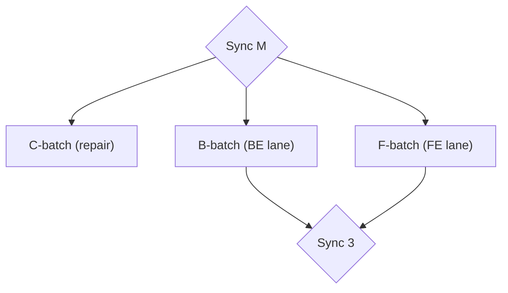

# HSDD: Hierarchical Spec-Driven Development (v0.7.1 delta)

> Patch delta. It gives the execution plan's human-facing surface the same
> structural anchors v0.7 gave its machine-facing surface: every 👤 step
> gets a written briefing (*Why / Do / Done when*) instead of a compressed
> table cell, every plan carries a **plan graph** (the lane-overview
> diagram the hand-made plans had and the first skill emission lost), and
> every load-bearing sync gets its own section — entry criteria, an agenda
> that defines its decisions once, exit criteria, and what it unblocks per
> lane. Read it against v0.7; only the changes are stated here. Everything
> in v0.3–v0.7 not touched below still stands.

**Version:** 0.7.1 (draft)
**Status:** For review
**Date:** 2026-08-01
**Author:** Purbo Mohamad
**Drafted from:** the first real-world `hsdd-checkpoint` run — the
moka-microsite adoption checkpoint of 2026-07-31
(`management/2026-07-31-execution-plan.md` and its progress report) — read
against the hand-prompted plan it superseded
(`management/2026-07-24-hsdd-execution-plan.md`), plus operator feedback
of 2026-08-01.
**Supersedes (in part):** v0.7 §2.4's required-section list for the
execution plan, and the matching "Copy-paste prompts with validation"
clause of `hsdd-checkpoint`'s execution-plan document shape. All other
provisions are unchanged.

---

## 1. What 0.7.1 Changes and Why

The 2026-07-31 checkpoint was the skill's first run on a live project, and
by v0.7's own letter it passed: every required section present, all 27
findings landed as steps or waivers, chain intact, baselines pinned,
milestone trigger evaluated and handed off. Set beside the hand-prompted
07-24 plan it superseded, it is also strictly **harder for its primary
audience to execute** — and §2.4 names that audience in its first line:
*"the people driving AI sessions this week."*

Three regressions, all in the emitted plan:

1. **Human-only steps arrived as compressed cells.** C-5 packs six repair
   actions across thirteen verification documents, three finding
   citations, and a per-breach reviewer ruling into one run-on table cell
   (§2.1) — while the 🤖 steps around it each got a numbered procedure and
   a grep-able *Validate:* line.
2. **The plan graph vanished.** The 07-24 plan's "Lane overview" — one
   Mermaid flowchart showing syncs, lane batches, and the dependency
   funnel — has no counterpart in the 07-31 plan. Operator: *"We really
   need to understand the sequence and the dependencies of the tasks to be
   executed in the upcoming week."*
3. **Sync M is load-bearing and undefined.** Three steps name it in their
   `Depends` column (C-4, B-6, G-1), its decisions D-a…D-d sit in a stray
   list between two tables, and nothing in the document says when the sync
   is discharged or what each lane starts once it is.

The miss has a direction. v0.7 §2.4 made the machine-facing surface
required — the copy-paste prompt and *Validate:* line are "required, not
decorative" — and left the human-facing surface to taste. The skill
reproduced the letter and dropped everything the letter didn't say: the
same failure class 0.6.1 closed (*rules that live only in prose — here,
only in exemplars — fire inconsistently*), landing this time on the one
executor who cannot be re-prompted. An agent that receives a terse step
can ask, retry, and read the repo; the human at a Monday sync has exactly
what the plan gave them. Operator verdict, 2026-08-01: *"We're human, not
AI! We drift and hallucinate too if you don't give us sufficient context
and focus."*

0.7.1 closes all three the 0.6.1 way — a structural anchor each, no new
invariants:

1. **Step details for every step** (§2): 👤 steps gain a briefing with the
   same standing the 🤖 prompt already has.
2. **The plan graph** (§3): a required section, derived from the tables
   like the atlas from the artifacts.
3. **Sync sections** (§4): entry, agenda, exit, unblocks — a sync a step
   can depend on becomes a gate with a discharge definition.

---

## 2. Every Step Readable: the 👤 Briefing

### 2.1 The observed failure

The 07-31 plan, step C-5, verbatim — a 👤 step, meaning a human executes
it with no prompt and no agent:

> Sign-off repair: fill the 8 blank `Reviewer / date` fields
> (gateway.1/.4, common.2–.5, shell.3, tracker.4); write real dispositions
> in common.3 (2 open Outstanding items) + shell.6; fix shell.1's re-entry
> date; retro-disposition the gateway.6/.9/.3 ceiling breaches (F-14):
> reviewer decides *accept as-is* or *schedule remediation*, written into
> each verify doc's change note. Also append the ADR-023-rode-in-gateway.4
> disposition (F-07) to gateway.4's doc

Six distinct actions, thirteen documents, a two-way reviewer decision —
one cell. Meanwhile C-6, a 🤖 step in the same plan, got a numbered
four-item procedure, file paths, and a *Validate:* line of grep commands.
The inversion is exact: the steps a machine executes were written for
comfortable execution; the steps a human executes were written for token
density. v0.7 caused this by requiring the expansion only "for every
delegable step" — the 👤 steps, by definition not delegable, are the only
steps the requirement skips.

### 2.2 The rule: one detail block per step

The §2.4 bullet **"Copy-paste prompts with validation"** is replaced by
**"Step details"**, and `hsdd-checkpoint`'s execution-plan shape changes
identically:

> - **Step details** — every step in every step table gets exactly one
>   detail block, keyed by step ID. For 🤖/🤝 steps: the exact copy-paste
>   prompt and a *Validate:* line — unchanged from v0.7, required, not
>   decorative. For 👤 steps: a **briefing** —
>   - *Why:* one or two sentences of context; finding IDs cited in
>     parentheses after the fact they justify, never as the subject —
>     humans read prose, IDs are for diffing;
>   - *Do:* a checklist, one checkbox per action, each naming its concrete
>     target (file, branch, field, person);
>   - *Done when:* one observable line — the human analogue of
>     *Validate:*.
>
>   The table cell holds a one-sentence summary: the cell indexes, the
>   block instructs. A cell that needs a second sentence, a
>   semicolon-chained list, or more than two parenthetical citations has
>   outgrown the table — move the content into the step's detail block.

C-5 rewritten under the rule — the cell:

| ID | Owner | Action | Depends | Finding | Done |
|----|-------|--------|---------|---------|------|
| C-5 | both 👤 | Sign-off repair across the 22 verified docs: blanks, dispositions, ceiling-breach rulings | C-1 | F-09, F-14, F-07 | ☐ |

and the block:

> **C-5 — sign-off repair** 👤 (both, at Sync M)
>
> *Why:* 8 of the 22 verified phases carry blank `Reviewer / date` fields,
> and two docs shipped the literal template disposition menu (F-09); three
> gateway phases breached their review-tier ceilings and no reviewer has
> ruled on whether that stands (F-14).
>
> *Do:*
> - [ ] Fill the blank `Reviewer / date` fields: gateway.1, gateway.4,
>       common.2–.5, shell.3, tracker.4.
> - [ ] common.3 — write real dispositions for its 2 open Outstanding
>       items.
> - [ ] shell.6 — replace the template disposition menu with a real
>       disposition.
> - [ ] shell.1 — correct the re-entry date (signed three days before the
>       re-entry happened).
> - [ ] gateway.3 / .6 / .9 — reviewer rules on each ceiling breach
>       (F-14): *accept as-is* or *schedule remediation*; write the ruling
>       into each verify doc's change note.
> - [ ] gateway.4 — append the disposition for the ADR-023 restructure
>       that rode inside this phase (F-07).
>
> *Done when:* no verification doc on spec main has a blank sign-off field
> or an undisposed Outstanding item, and each of the four incident
> dispositions is a dated change-note line in its doc.

Same facts, same citations — but a human can execute it top to bottom
without parsing a cell like a compiler.

New quality gates in `hsdd-checkpoint`:

- [ ] Every step in every step table has exactly one detail block — a
      prompt + *Validate:* for 🤖/🤝, a *Why / Do / Done when* briefing
      for 👤. No step's content lives only in its table cell.
- [ ] No Action cell in a step table carries more than one sentence.

New anti-rationalization row:

| Thought | Reality |
|---------|---------|
| "The table cell already says everything the briefing would" | Then the cell is unreadable, which is the defect. The agent running a 🤖 step can be re-prompted mid-task; the human running a 👤 step has only what the plan gave them. The cell indexes, the block instructs. |

---

## 3. The Plan Graph

### 3.1 The observed failure

The 07-24 plan carries a "Lane overview": one Mermaid flowchart — the
consolidation sync as a junction, each lane a dashed subgraph of step
batches, edges tracing the dependency funnel into the integration syncs.
Thirteen nodes; the whole week's shape in one glance. The 07-31 plan has
step tables whose `Depends` columns encode the same graph — and no
drawing. §2.4 never listed a diagram, so the skill never emitted one.

A `Depends` column is read row by row. The shape of a week — what runs in
parallel, what everything funnels through, which sync is the narrow waist
— only exists when drawn. The humans schedule their week from the shape;
the agents execute from the rows. The plan must serve both.

### 3.2 The rule

New required section in §2.4, between **Sync points** and the step tables,
mirrored in `hsdd-checkpoint`:

> - **Plan graph** — one Mermaid flowchart of the plan ahead: every
>   load-bearing sync (§4) as a junction node, every step batch as a node
>   inside its lane's subgraph, edges from the `Depends` column and the
>   sync sections' *Unblocks* lines. Derived from the tables the way the
>   atlas is derived from the artifacts: regenerated whole with every
>   plan, and when graph and tables disagree, the tables are right —
>   regenerate the graph. The atlas's ~20-node ceiling applies: chart
>   batches, never individual phases. Follow `mermaid-pastel-style` if
>   installed.

The shape, schematically:

Scoped-mode runs get no exemption: a scoped checkpoint still supersedes
the whole plan, so the plan it emits still carries the graph.

New quality gate in `hsdd-checkpoint`:

- [ ] Plan graph present and consistent with the tables: every
      load-bearing sync and every step batch appears exactly once, every
      edge traces to a `Depends` entry or an *Unblocks* line, and the
      graph stays under ~20 nodes.

New anti-rationalization row:

| Thought | Reality |
|---------|---------|
| "The Depends column already encodes the graph" | Rows are read one at a time; parallelism and funnels are shapes, invisible until drawn. The first thing the field asked for back was the diagram. Derive it from the tables and draw it. |

---

## 4. The Sync Section: Entry, Agenda, Exit, Unblocks

### 4.1 The observed failure

In the 07-31 plan, "Sync M" is a dependency three steps wait on (C-4,
B-6, G-1) — and a one-row table entry whose agenda cell numbers five
topics, four of which point elsewhere. The decisions it must settle
(D-a…D-d) sit in a stray list between two tables; G-1, in a third table,
points back at them; nothing anywhere states when the sync counts as done
or what BE and FE start once it is. A reader preparing for Monday must
reassemble the sync from four locations — and v0.7 §2.4's sync-points
bullet asked only for "when, who, agenda", so the skill emitted exactly
that. A sync steps can depend on is a gate; a gate with no discharge
definition ends when the meeting hour does, not when the project can
move.

### 4.2 The rule

Define: a sync is **load-bearing** when any step, decision, or lane start
names it as a dependency. New required section kind in §2.4, mirrored in
`hsdd-checkpoint`:

> - **Sync sections** — one section per load-bearing sync (the standing
>   weekly is exempt: it has a rhythm, not a gate), carrying:
>   - **Entry** — checkboxes: what must be done or brought before the
>     sync, citing step IDs;
>   - **Agenda** — the decisions the sync settles, **defined here once**:
>     each with a stable ID (the field's D-a scheme), the question, the
>     live options, and the governance artifact the answer must land in
>     ("→ ADR via `/hsdd-adr`"). Steps, tracks, and other syncs cite these
>     IDs; the definition never appears twice;
>   - **Exit** — checkboxes: the sync is discharged when every box ticks;
>     a decision's box names its landing artifact;
>   - **Unblocks** — one line per lane: what starts when this sync exits.
>
>   The sync-points table keeps one row per sync — when, who, a one-line
>   agenda — linking to the section. A step's `Depends` column may name a
>   sync only if that sync has a section.

This does not bend **cite, never define** (v0.7 §2.1): the agenda defines
the *question* — scheduling is management work — while the *answer* lands
in its governance artifact and the Exit box cites it. That is the
microsite R6/G-1 precedent made structural: decisions scheduled in the
plan, recorded in the spec.

The skeleton, on the field's own Sync M:

> ### Sync M — Monday consolidation (both, Mon Aug 3)
>
> **Entry**
> - [ ] C-1/C-2 merges landed, or ready to execute in the room (BE)
> - [ ] `clickstream-metrics-api` final handoff received; diff against the
>       authored v1 prepared (BE, E-2)
> - [ ] Decision briefs D-a…D-c below read by both lanes
>
> **Agenda**
> - **D-a** 30-day lat-lon refetch: mechanism + owner (scheduled job in
>   content? enrichment? on-serve staleness check? refetch-on-edit) →
>   ADR via `/hsdd-adr` (G-2)
> - **D-b** the refetch key: merchant-pasted maps link and/or `place_id`
>   (default **no** on Google-derived keys) → same ADR (G-2)
> - **D-c** self-proclaimed reviews: minimum stable field shape now vs
>   what waits for the design → `microsite-draft`/`published-page` v2
>   drafts (G-3)
> - **D-d** re-minute wizard G4 (mooted by the reviews-import removal) →
>   wizard spec Decisions block
>
> **Exit**
> - [ ] D-a/D-b recorded in the new ADR (G-2 underway)
> - [ ] D-c shape decision in the v2 contract drafts (G-3 unblocked)
> - [ ] D-d re-minuted in the wizard spec
> - [ ] `clickstream-metrics-api` verdict minuted: stable flip or delta
>       note (E-2)
> - [ ] C-4 phantom-verification disposition confirmed and minuted
>
> **Unblocks:** BE — B-6 (be-analytics against the settled metrics API);
> FE — nothing gated here (sw.1/.5+ wait on the design mini-sync, not on
> Sync M).

New quality gates in `hsdd-checkpoint`:

- [ ] Every load-bearing sync has a section with Entry / Agenda / Exit /
      Unblocks; no step depends on a sync that has no section.
- [ ] Every decision queued for a sync is defined once, in that sync's
      Agenda, and only cited everywhere else.

New anti-rationalization row:

| Thought | Reality |
|---------|---------|
| "The sync has an agenda row in the table — that's the checklist" | An agenda names topics; a gate needs entry criteria, exit criteria, and what they unblock. Steps depend on this sync: if nothing defines its discharge, every one of them inherits an undefined dependency. |

---

## 5. Skill Edits (summary)

| Skill | Change |
|-------|--------|
| `hsdd-checkpoint` | Execution-plan shape: "Copy-paste prompts with validation" becomes "Step details" with the 👤 briefing form and the one-sentence cell rule (§2.2); new required sections **Plan graph** (§3.2) and **Sync sections** (§4.2), inserted after Sync points; five new quality gates; three new anti-rationalization rows. |
| `hsdd-milestone` | No change. |
| `hsdd-spec`, `hsdd-phase-plan`, `hsdd-contract`, `hsdd-adr`, `hsdd-reconcile`, `hsdd-config` | No change. |
| Users guide | "Running the project" chapter: the execution-plan walkthrough gains the plan graph and a sync-section example; the delegation-guide passage states the briefing rule and its reason — the human is the one executor who cannot be re-prompted. |

---

## 6. Settled Decisions (0.7.1)

| Question | Decision |
|----------|----------|
| Which steps get a detail block | Every step, exactly one block each: 🤖/🤝 keep the v0.7 prompt + *Validate:*; 👤 gain the *Why / Do / Done when* briefing. Rejected: briefings only for "complex" steps — the complexity judgment is the loophole, and C-5 is exactly the step it would have skipped. Rejected: richer table cells — that is the defect, formalized. |
| Where detail blocks live | Existence is mandated, grouping is not: under the owning sync's section (the 07-24 shape) or in one step-details section (the 07-31 shape) both conform. What failed in the field was absence, not placement. |
| Plan-graph granularity | Load-bearing syncs + step batches, ≤ ~20 nodes, derived from the tables and regenerated whole; tables win on disagreement. Rejected: per-phase graphs (that is the atlas's tree, unreadable as a weekly map); rejected: optional-when-small (the smallest plan still has a shape; the cost is one fence). |
| Which syncs get sections | Load-bearing ones — any sync a step, decision, or lane start depends on; a `Depends` cell may name only sectioned syncs. The standing weekly stays a table row. Rejected: sections for every row (ceremony without a gate to define). |
| Do sync agendas violate cite-never-define? | No. The agenda defines the *question* (options + landing artifact); the *answer* lands in governance and the Exit box cites it — the R6/G-1 precedent made structural. |
| Does the progress report change? | No. Its dense tables are registers — diffed and compiled from, not executed from — and the operator's executability complaint lands on the plan, which is where 0.7.1's anchors go. If briefing-grade unreadability recurs in the progress report, that is 0.7.2's evidence, not this delta's guess. |
| The findings→plan loop | Unchanged invariant. Briefings and sync sections change how steps read, never whether findings land. |

---

## 7. Implementation Steps

1. Edit `hsdd-checkpoint`'s execution-plan document shape: replace the
   "Copy-paste prompts with validation" bullet with **Step details**
   (§2.2); insert **Plan graph** (§3.2) and **Sync sections** (§4.2)
   after **Sync points**; add the five quality gates; add the three
   anti-rationalization rows.
2. Update the users guide per §5.
3. Update README and CHANGELOG (`[0.7.1]`).
4. Re-test before release, per the writing-skills loop and against the
   §7.3 acceptance fixture: re-emit an execution plan from the microsite
   2026-07-31 evidence and check the three regressions by name — the
   C-5-class 👤 steps carry briefings a human can execute top to bottom;
   the plan graph exists and round-trips against the step tables; Sync M
   has Entry / Agenda / Exit / Unblocks with D-a…D-d defined there and
   only cited elsewhere. Then a fresh loophole hunt over the three new
   rows.
5. On release, re-sync the installed skill copies.
