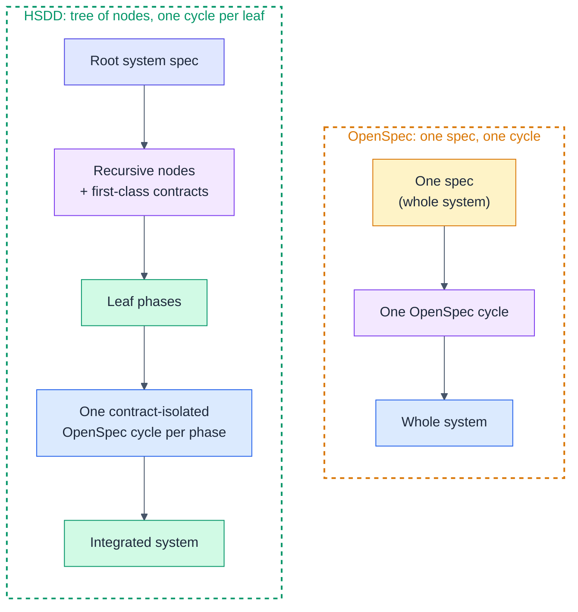
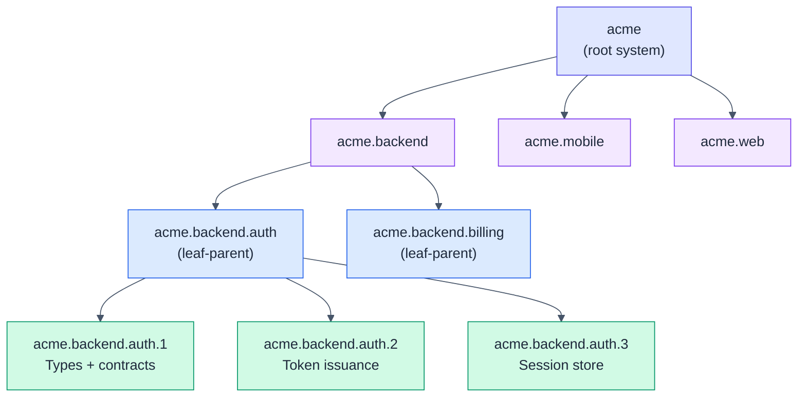
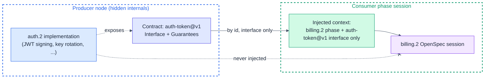
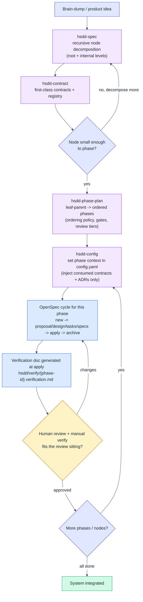

# HSDD: Hierarchical Spec-Driven Development

**Version:** 0.9.0
**Status:** Current specification
**Date:** 2026-10-10
**Owner:** Purbo Mohamad

This is the complete specification. It supersedes v0.8.0, which
consolidated the delta series v0.3 through v0.7.1; every earlier version
remains in `spec/` as history. Nothing here requires reading them.

---

## 1. What HSDD Is

### 1.1 The problem and the unit of work

Spec-driven development with a single spec breaks down once a system grows past
a context window: the spec becomes a monolith, every session re-reads
everything, tokens explode, and the model loses focus. HSDD keeps OpenSpec as
the **execution engine** and changes the **unit of work**:

> The unit of spec-driven development is not the product. It is the smallest
> independently verifiable phase with explicit contracts.

Everything above that unit is decomposition. Everything inside it is one
ordinary OpenSpec cycle. The leverage comes from three ideas working together:

1. **Recursive decomposition.** A large system is a tree, not a flat spec.
   Only the leaves drive code.
2. **Contracts as the dependency mechanism.** Nodes depend on named, versioned
   contracts, never on each other's internals. Context becomes a dependency
   graph, not a monolith.
3. **Human review at every leaf.** Each phase is sized so the AI run plus the
   human review and manual verification fit one review sitting (chapter 7
   defines the budget). The human owns correctness; the agent owns throughput.

### 1.2 Relationship to OpenSpec

The OpenSpec cycle is untouched: `new` → proposal/design/tasks/specs → human
review → `apply` → code → human review → `archive`. HSDD wraps a
**decomposition front-end** and a **contract substrate** around that cycle: it
decides *what* each cycle sees and *in what order* cycles run. One
contract-isolated OpenSpec cycle runs per leaf phase; the integrated system is
the composition.

**OpenSpec is one coding method of two.** A project may execute its phases
with superpowers instead: `writing-plans` turns the phase into a plan, and
`subagent-driven-development` executes it test-first. Both methods start from
the same generic phase context (§9.7). Wherever this specification says
"OpenSpec cycle" or "OpenSpec change", a project whose coding method is
superpowers reads "one superpowers plan, executed to its verification doc"
(§9.8). The OpenSpec-specific rules (`config.yaml`, archive, capability
naming) apply only to the OpenSpec method.



The mental model is functional: **each node is a function with typed inputs
and outputs — its consumed and produced contracts — and the dependency DAG is
the composition.** Internals are private. This is dependency rejection at the
architecture level: a node is developed against contract values, not against
the live implementations behind them.

### 1.3 The core invariant

One phase drives exactly one coding cycle (an OpenSpec change, or a superpowers plan) and ends at one human review
gate. No release of this specification moves that invariant; every other rule
exists to make it cheap to honor.

### 1.4 Structural anchors, not prose

Rules that live only in prose fire inconsistently: the same skill text
produces conforming and non-conforming runs, and unpinned behavior with
observed variance is the failure mode this method treats as a defect. Every
behavior that must fire gets a **structural anchor** — a required field, a
checklist item, or an explicit stop — instead of more prose. The chapters that
follow apply this principle throughout.

### 1.5 The skill set

Eleven skills, one per artifact with its own lifecycle. **One artifact, one
skill:** an artifact with status transitions, superseding, or a registry
projection gets its own skill rather than a branch of another. Each skill has
a matching slash command.

| Skill | Role | Key outputs |
|-------|------|-------------|
| `hsdd-spec` | Recursive node decomposition at the root and any internal level: normalize the idea, split into child nodes, assign contracts by id, build the typed dependency DAG and dev flow, and propose cross-cutting decisions as ADRs. | node spec files, dependency DAG, dev-flow sequencing |
| `hsdd-contract` | Author and version first-class contracts (frontmatter + interface body); classify dependency type. The registry is generated from frontmatter by a script. | `hsdd/contract/*.md` |
| `hsdd-adr` | Author, accept, update, and supersede cross-cutting Architecture Decision Records; owns the ADR directory the way `hsdd-contract` owns contracts, with the registry projected deterministically. | `hsdd/adr/*.md` |
| `hsdd-phase-plan` | Turn a leaf-parent into ordered, OpenSpec-sized phases with gates, verification, review tiers, and a phase DAG. | leaf-parent phase plan |
| `hsdd-reconcile` | The single writer for governance effects: drain the pending updates parallel phase planning emits, resolve contract requests, finalize phase ids. | updated governance files |
| `hsdd-config` | Per-phase context switch: write one self-contained, method-neutral phase context (the phase, the full text of the contracts it consumes and produces, its governing decisions, links), then wrap it for the project's coding method: OpenSpec's `config.yaml` or a superpowers spec. | `hsdd-context/{phase-id}.md`, `openspec/config.yaml` or `hsdd-context/superpowers/{phase-id}.md` |
| `hsdd-adopt` | Bring an existing codebase into the tree: seam extraction by bundled script, as-built node specs, `v0` contracts (chapter 6). | as-built specs, `v0` contracts |
| `hsdd-intake` | Route an incoming change request into the existing tree and record the routing (chapter 11). | intake record, handoff |
| `hsdd-checkpoint` | One evidence pass across the spec repo and every implementation repo, compiled into the management documents (chapter 12). | progress report, execution plan, atlas |
| `hsdd-milestone` | Generate and re-baseline the per-campaign stakeholder milestone document (chapter 12). | milestone document |
| `hsdd-summary` | Render optional reading aids over the canonical artifacts: the plan page, an offline HTML view of the tree from the root down to the phase cards, and the checkpoint page, over the newest progress report and execution plan (chapter 13). | `hsdd/summary/*.html` |

Skills are named by **role**, not by tree level: the recursive model runs the
same operation at multiple levels, so a tier in the name (`system-spec`,
`subsystem-spec`) would mislead. `hsdd-spec` and `hsdd-phase-plan` stay
separate skills because they are two specializations of "decompose a node" —
into sub-nodes vs into phases — and phase planning carries sharply different
discipline: ordering, OpenSpec sizing, gates, review tiers, verification docs.

How they chain, in the greenfield case (chapters 5–10 walk each step;
brownfield enters the same chain through chapter 6):

```text
hsdd-adopt       (brownfield entry) -> as-built tree + v0 contracts
hsdd-spec        (root)             -> nodes + contracts referenced by id + proposed ADRs
  hsdd-adr       (accept/materialize) -> adr/*.md (registry generated)
  hsdd-contract  (define/version)   -> contract/*.md (registry generated)
  hsdd-spec      (recurse internal levels until leaf-parents)
    hsdd-phase-plan (per leaf-parent) -> phases with gates + tiers
      hsdd-reconcile (root lineage)  -> governance drained after parallel branches
      hsdd-config   (per phase)      -> config.yaml phase context
        OpenSpec cycle               -> code + verification doc
        human review gate            -> approve / iterate
hsdd-intake      (every change after) -> routes into the tree above
hsdd-checkpoint  (periodic)          -> progress, plan, atlas
hsdd-milestone   (per campaign)      -> stakeholder checkpoints
```

The proposing/accepting split is one line of that chain worth naming:
`hsdd-spec` proposes an ADR, the human accepts it, `hsdd-adr` materializes it,
and the registry regenerates.

### 1.6 HSDD versus OpenSpec, dimension by dimension

| Dimension | OpenSpec | HSDD |
|-----------|----------|------|
| Unit of work | the whole spec | smallest independently verifiable phase |
| Structure | one flat spec | recursive node tree, multi-level |
| Decomposition | none | nodes split until phases fit a window |
| Coupling | implicit, whole-spec context | explicit, versioned contracts by id |
| Context per session | the full spec | one phase + consumed contract interfaces + governing ADRs |
| Parallelism | one cycle at a time | independent phases/nodes run in parallel |
| Dependency model | implicit | typed DAG (hard, contract, event, shared-model) |
| Cycle engine | OpenSpec | OpenSpec or superpowers, unchanged, run once per phase |
| Human review | per change | per phase, tiered, with a verification doc |
| Pacing | none | phase sized to one review sitting (chapter 7) |
| Scales to | small systems | multi-team, multi-domain systems |

HSDD does not replace OpenSpec. It composes OpenSpec with bounded-context
decomposition, contract-first architecture, tiered human review, and context
isolation. What that composition does and does not buy — the isolation and
token claims — is stated once, in chapter 16, and nowhere else.

---

## 2. The Node Model

### 2.1 Uniform node shape

Every node, at every level, has the same shape — there is no system-spec vs
subsystem-spec split baking the level into the structure. Node header fields
are **bullet lists**, never consecutive `**Field:** value` lines relying on
soft line breaks, which every compliant renderer collapses into one paragraph.
Wrapped values keep the 2-space continuation indent so they render inside
their field. Empty lists render as `"none"`, never `[]` — bracket notation is
agent-speak, and the plan is a human artifact.

```markdown
### {node-id}: {Node Name}

- **Kind:** internal | leaf-parent
- **Purpose:** one coherent responsibility
- **Team:** {name}                  # optional; the durable answer to "who builds what?"
- **Owns:** ...
- **Does not own:** ...
- **Consumes:** [contract-id@version, ...]   # by reference, never inline copy
- **Produces:** [contract-id@version, ...]
- **Governed by:** [ADR-NNN, ...]            # cross-cutting decisions; omit when empty
- **Sources:** [path-or-url (§section), ...] # or "none"; see §2.6
- **Adopted:** as-built | promoted           # brownfield only; see chapter 6
- **Status:** active | retired               # default active; see chapter 11
- **Decomposes into:** child node ids, OR "phases (see leaf phase plan)"
- **Isolation strategy:** how to build and test this node using only consumed
  contracts (fixtures, mocks, schemas)
```

`Consumes` and `Produces` name contracts **by reference**
(`contract-id@version`), never as an inline copy. The rendering rule is a
quality-gate item in the emitting skills: field blocks must be bullet lists or
tables, never structure carried by soft line breaks.

Three fields are optional by default: `Team` (record it when known — it is
where the axis question's answer lands and survives, §2.5), `Adopted`
(brownfield nodes only, chapter 6), and `Status` (absent means `active`;
chapter 11 defines retirement).

### 2.2 Node kinds

- An **internal node** decomposes into child nodes. The system, a domain
  (backend), and a subsystem are all internal nodes.
- A **leaf-parent node**'s children are phases, not further sub-nodes — where
  decomposition stops and execution planning starts.
- A **leaf phase** is the atomic, independently verifiable unit: it drives
  exactly one coding cycle (§1.2) and is sized for one review sitting. Its record
  shape and execution attributes are chapter 7's subject.

The kind vocabulary is an open set: the **integration node** (chapter 3)
specializes leaf-parent. Only leaf phases drive coding cycles; leaf-parents
own a phase plan; internal nodes only decompose and route contracts.

### 2.3 Where recursion stops

A node becomes a leaf-parent when both hold:

- One owner or pair can hold its full scope in their head.
- It splits into phases that each fit one review sitting.

Otherwise, decompose further. An intermediate "feature" layer is not a fixed
tier; it is simply an internal node inserted when a subsystem is too big to
phase directly. **Depth is a judgment, not a constant.**



### 2.4 Identification scheme

Identity is the **dotted path of node slugs from the root**, with leaf phases
numbered for ordering.

| Element | Format | Example |
|---------|--------|---------|
| Root | `{slug}` | `acme` |
| Internal / leaf-parent node | `{parent}.{slug}` | `acme.backend.auth` |
| Leaf phase | `{leaf-parent}.{n}` | `acme.backend.auth.3` |
| Contract | `{slug}@v{n}` | `auth-token@v1` |
| Design decision (node-local) | `D{n}` | `D2` |
| ADR (cross-cutting) | `ADR-{nnn}` | `ADR-001` |
| Open question | `{PREFIX}-{n}` | `OQ-3` (chapter 4) |
| User story / acceptance | `US-{n}` / `AC-{n}.{y}` | `AC-3.1` |

Contract versions are `v{n}` with `n >= 0`: `@v0` is the admissible version of
an adopted contract (chapters 3 and 6); nothing in the scheme assumes versions
start at 1.

### 2.5 The decomposition axis: ownership first

**Choose the decomposition axis by ownership, not elegance.** At each level,
first split along the boundaries where different teams, owners, or deploy
targets hold different parts of the stack — backend vs frontend vs mobile.
Those boundaries come with their natural contract (the API, the event stream)
and match how work is actually assigned; Conway's law is a constraint to
design with, not a smell to fight. Within one owner's territory, prefer
capability slices (auth, billing) over technology buckets (controllers,
models, ui) — a rule that rejects *layer* buckets inside one codebase and
never licenses feature slices across an ownership boundary.

The failure the rule prevents: an end-to-end node across two teams has two
owners, its phases interleave two toolchains and deploy targets, the
leaf-parent criterion ("one owner or pair can hold its full scope in their
head") silently fails, and the worktree-per-node model has no single owner to
assign the node to.

A capability that spans the stack does not disappear; it returns one level
down as a node per side — `{sys}.backend.auth` and `{sys}.frontend.auth` —
joined by a contract, with the pairing visible in the dependency DAG. Vertical
end-to-end slices remain correct when one owner genuinely holds the whole
stack (a solo developer, one full-stack squad): there the feature boundary
*is* the ownership boundary.

The rule reduces to one question: **who builds what?** When the input does not
state the team structure and the system plausibly spans stacks, do not choose
an axis: ask the question and **stop until it is answered**. This is the one
clarifying question the decomposition step allows, and here it is mandatory —
an axis guessed wrong reworks every node beneath it. Stating an assumption and
proceeding covers details; it is never an alternative for the decomposition's
shape. The answer lands in each node's `Team` field, where it survives for
every later reader.

Quality gate: the decomposition axis at each level matches ownership **stated
by the human, not assumed** — no node is owned by two teams.

| Thought | Reality |
|---------|---------|
| "Auth end-to-end is one coherent capability" | Coherent for whom? If backend and frontend are different owners, the node has two owners and no isolation. Split at the ownership boundary; the capability comes back as a node pair joined by a contract. |
| "The axis is defensible either way, I'll pick a safe default" | Defensible-either-way is the definition of a decomposition-changing unknown. A flag at the bottom of a finished-looking tree does not get read; the finished tree anchors the review. Ask and stop. |

### 2.6 Source provenance

Downstream skills read only the node spec's closure — conventions, the node
spec, contracts, ADRs — so a detail absent from that closure is unreachable
**by construction**, not by accident. Restatement thins at every level of the
tree; the pointer is the only carrier that scales. Hence:

- The **root spec carries a `## Sources` section** listing each input document
  (PRD, RFC, design doc, ticket): path or URL, its authority (accepted RFC |
  draft | braindump | ticket), and one line on what it governs.
- The node header's `- **Sources:**` field lists only the sources — or named
  sections of them — that govern that node, or `"none"`.
- **Sources trickle down at decomposition time, at every level:** when a node
  is split, each child's Sources is the subset of the parent's that governs
  it. A source relevant to several nodes appears on each.
- The field is required whenever the root `## Sources` section exists; it is
  omitted entirely only in projects with no source documents.
- **The summary indexes the source; it never replaces it.** Restating a
  normative detail in the node spec is fine and often useful — but the node's
  Sources must still name where it came from.

Quality gates: every input source appears in at least one node's Sources, or
is marked in the root `## Sources` as "informative only — not decomposed" with
a reason — no source is silently dropped; and no node's Sources lists a
document that does not govern it — the field is context the next skill will
read, not a bibliography.

| Thought | Reality |
|---------|---------|
| "The spec captures everything important from the RFC" | The spec is a summary; summaries thin at every level. Downstream skills read only the spec's closure — if the RFC isn't in Sources, its details are unreachable, not just unmentioned. |

### 2.7 One spec file per node

Every child node — internal or leaf-parent — gets its own
`hsdd/spec/{child-id}.md` at decomposition time. The decomposed parent's
document embeds each child's header block (the `###` form) as a summary; the
child's file is the **authoritative** node spec: phase planning appends the
phase plan to it, and a later decomposition edits it in place. Quality gate:
every child node has its own spec file.

A standalone node spec file uses one `#` title (`# {node-id}: {Node Name}`),
`##` for document sections, and does **not** repeat the title as an inner
`###` heading. This heading rule applies to every standalone file this
specification defines.

---
## 3. Contracts

### 3.1 The contract artifact

Contracts are the core of HSDD: standalone, versioned artifacts, not prose
buried in a spec. A contract is a named, versioned interface artifact — the
only thing one node may know about another. A node references contracts by id
and never copies another node's internals. Wire-level source detail
(envelopes, pagination rules, quotas) is exactly what contract bodies exist
to absorb.

`hsdd/contract/{slug}.md`:

```markdown
---
id: auth-token
version: v1
status: stable          # draft | stable | deprecated | retired
kind: api               # api | event | schema | shared-model | file | cli
owner: acme.backend.auth
compatibility: versioned   # additive-only | versioned | frozen; per version (§3.5)
produced_by: [acme.backend.auth.2]
consumers: [acme.backend.billing.2, acme.mobile.session.1]
external_consumers: []  # consumers outside the tree; omit when empty
phase_ids: provisional  # provisional | final; flipped only by hsdd-reconcile
---

# Contract: auth-token

## Interface
<schema, signature, endpoint, event payload, or file layout>

## Guarantees / invariants
- token.sub is immutable for the token's lifetime
- exp is always greater than iat

## Versioning
- v1 current. Breaking changes require v2 + a migration note. v1 stays until
  all consumers migrate.

## Validation
- fixture: hsdd/contract/fixture/auth-token/
- schema: hsdd/contract/schema/auth-token.schema.json
```

The split is deliberate and functional: **frontmatter is the metadata
projected into the registry; the body is the interface injected into a
consuming phase's context.** Each downstream consumer reads exactly one of
those halves, never the whole producing node. The body's H1 is
`# Contract: {slug}`. Adopted contracts add one required body section,
`## Observed completeness` (chapter 6).

`produced_by` and `consumers` are authored phase-id lists. Because contracts
are authored before phase plans exist, those ids start as guesses:
`phase_ids: provisional` records that state in frontmatter, and only
`hsdd-reconcile` flips it to `final`. Writing "phase ids are provisional,
update them later" in the body is retired — that paragraph was a standing
invitation for two writers to edit the same prose. The registry generator's
parser reads all frontmatter keys but projects only the known columns, so a
new key passes through without effect.

### 3.2 Dependency types

Every edge in the dependency DAG is typed, and the type states whether a
consumer can start before the producer ships:

| Type | Meaning | Can consumer start before producer ships? |
|------|---------|--------------------------------------------|
| **hard** | Needs the producer's real output. | No. Producer first. |
| **contract** | Can build against the interface with fixtures. | Yes, once the contract is `stable`. |
| **event** | Loose, async coupling via emitted events. | Yes, against the event schema. |
| **shared-model** | Shares a value type (Money, Address). | Yes, once the type exists. |

A system whose edges are mostly `contract`, `event`, and `shared-model` is a
DAG that parallelizes well. `hard` edges are the critical path; minimize them.

### 3.3 The registry

`hsdd/contract/INDEX.md` — id, version, kind, owner, status, consumer count —
is **derived data**: a pure projection over the frontmatter of every contract
file, generated by the small deterministic script bundled with
`hsdd-contract` (chapter 14 gives its path and invocation), never
hand-maintained by an agent. Agent-maintained indexes drift; a script is a
pure function of the frontmatter and costs zero model tokens. `hsdd-contract`
owns the contract files (the source of truth); the generator owns the
projection — the pure-core / derived-artifact split applied to documentation.

### 3.4 Validation: `stable` means machine-checkable

A contract may not be `stable` unless it carries at least one executable
validation artifact — a schema or a fixtures directory — at the canonical
paths its frontmatter names. `hsdd-reconcile` asserts this at the
`draft → stable` flip. Default locations are `hsdd/contract/schema/` and
`hsdd/contract/fixture/`, overridable — the frontmatter is authoritative
either way. Per kind: `api` and `event` want schema plus example payloads;
`schema` and `shared-model` want the schema plus edge-case fixtures; `file`
wants a sample tree; `cli` wants recorded invocations.

**Both gates run the contract** (chapter 10 places this in the gate):

- **Producer side:** the gate of any phase that produces a contract must
  check that its real output validates against the schema and reproduces the
  fixtures. `hsdd-phase-plan` writes the check into the phase's `Gate:` by
  default.
- **Consumer side:** consuming phases build and test against the fixtures,
  not hand-rolled mocks. **The mocks are the fixtures.** When the contract
  bumps, the fixtures change, and consumer tests fail loudly instead of
  drifting silently.

Quality gate in `hsdd-contract`: any code-level artifact both sides consume
names its canonical path and its owning phase.

### 3.5 Versions and compatibility

Versions are `v{n}`. There is no semantic versioning.

`v0` is reserved for adopted contracts (chapter 6): the interface as the
existing system already implements it. It is a permanent property, not a
waypoint — a `v0` contract that has absorbed additions for years is still
inherited. **`v0 → v1` is the contract-level adoption exit**, taken only when
the interface is genuinely redesigned.

`compatibility` is declared **per version**, not per contract:

| value | meaning | consequence |
|-------|---------|-------------|
| `additive-only` | optional additions only; never remove, retype, or repurpose a field; consumers ignore unknowns | compatible changes keep the version; field-level deprecation replaces contract-level bumps |
| `versioned` (default) | breaking changes bump | next version, a migration note, and a deprecation window |
| `frozen` | not under our control, or adopted pending investigation | a change means a new contract, not a new version |

`additive-only` is claimable only if the contract's existing fixtures still
pass against the new schema — both gates already replay them. It constrains
what may happen *without* a bump; it never forbids one. Extension under
`additive-only` never exits `v0`; only a redesign does, and a redesigned
version re-declares its policy.

Status lifecycle: `draft → stable → deprecated → retired`, with a sunset date
and migration note on the deprecating version. Under `versioned`, the current
version is named, a breaking change requires the next version plus a
migration note, and the old version stays until all consumers migrate.
`external_consumers` covers consumers outside the tree. **Retiring a version
that still has a live consumer — including an `external_consumers` entry — is
a checkpoint finding.**

### 3.6 Context isolation: the payoff

The OpenSpec session for a phase receives its own phase section plus only the
**Interface** and **Guarantees** of the contracts it consumes. It never sees
the producing node's implementation, sibling phases, or the full subsystem
spec.



### 3.7 Integration nodes

Node-local wiring exercises nothing across sibling nodes. When an internal
node's children exchange contracts, `hsdd-spec` should add an **integration
node**: a child leaf-parent named `{node}.integration` with `hard` edges to
each producing sibling, whose phases exercise the real composed behavior —
replay contract fixtures against live components, run end-to-end slices of
the primary flows — and default to `full-review`. Because its edges are
`hard`, the DAG schedules it after the producers ship, exactly where
integration belongs. A small tree that is one leaf-parent needs no
integration node; its final composition phase already covers it.

An integration node spanning two teams' outputs still has **exactly one
owning team** — whoever owns the composed, user-facing behavior. Consuming
two teams' contracts is not co-ownership; it is what contracts are for.

---

## 4. ADRs and Open Questions

### 4.1 What an ADR is for

ADRs capture durable "why" for decisions that span more than one node or must
outlive the node that introduced them. Node-local choices stay `D{n}` inside
the node spec and never become files. ADRs are not auto-generated in bulk:
`hsdd-spec` proposes one when a cross-cutting decision surfaces and the human
accepts, edits, or writes it directly. They stay few on purpose.

### 4.2 The ADR artifact

`hsdd/adr/{nnn}-{title}.md` — the filename carries the number and a slug; the
frontmatter `id` is the display id. ADR numbers are global across the whole
tree, never per node.

```markdown
---
id: ADR-001
status: accepted            # proposed | accepted | superseded | deprecated
affects: [acme.backend.auth, auth-token@v1]
date: 2026-07-02
supersedes: []              # optional
superseded_by: []           # optional, set when a later ADR replaces this one
---

# ADR-001: Auth provider

## Context
Forces and constraints that make this decision necessary.

## Decision
Use provider X with rotating asymmetric keys.

## Consequences
- token verification needs the public JWKS endpoint
- key rotation is a hard dependency for acme.backend.auth.2

## Alternatives considered            # optional
```

The same split as a contract: frontmatter is registry metadata; the body
carries the decision. `## Decision` and `## Consequences` stay free of
deliberation, because those two sections are what gets injected — the
Context and the alternatives never enter a phase session. The ADR registry
`hsdd/adr/INDEX.md` is generated the same way as the contract registry.

### 4.3 Links and lifecycle

`hsdd-adr` owns the ADR directory the way `hsdd-contract` owns contracts: it
authors the files, manages the status lifecycle, and maintains the
bidirectional links — the ADR lists `Affects: [node-ids, contract-ids]`, and
every affected node, phase, and contract lists `Governed by: [ADR-NNN]` in
its header. The links are by id in both directions.

The path end to end: `hsdd-spec` proposes → the human accepts → `hsdd-adr`
writes the file → the generator projects the INDEX and the `Governed by`
links point back → `hsdd-config` resolves the ADRs referenced by the phase's
node and by the contracts the phase consumes, then injects only each ADR's
Decision and Consequences. ADRs are never left as inline prose in a node
spec: inline prose has two broken consumers — `hsdd-config` cannot resolve
it, and a body-field ADR with no frontmatter is silently skipped by the
registry generator.

If a referenced `ADR-NNN` has no file, it was never materialized: **stop and
author it** with `hsdd-adr` before injecting. The human supplies the decision
— never invent one. If the content is unavailable, author the ADR
`status: proposed` with the Decision as an explicit TODO and do not inject it
as binding until it is `accepted`. Never write an invented decision as
`accepted`, and never silently drop the reference.

### 4.4 Open questions

Decisions that cannot be made yet are first-class, tracked artifacts with a
spine from root to phase.

- **ID scheme.** The root spec mints `OQ{n}`; node specs mint
  `OQ-{prefix}{n}`, with the prefix set declared in conventions.md. IDs are
  stable — never renumbered, never reused. Resolved entries keep their table
  row and detail subsection as audit trail; they are never deleted.
- **One definition home.** An OQ is defined exactly once, in the
  `## Open questions` section of the spec that owns the decision — the root
  for cross-cutting questions, the closest owning node otherwise. A child
  spec needing a local view of a parent's question mints its own id and marks
  it `[inherits OQ{n}]` — this is what gives a question a spine from root to
  phase. Every other artifact — leaf specs, contracts, ADRs, phase plans,
  management documents — **cites the id only** and never re-defines the
  question. `hsdd-contract` and `hsdd-adr` are cite-only: resolving text
  points at the owning spec's id.
- **Format,** in the owning spec: a summary table
  `| ID | Question | Status | Waits on | Affects |` followed by one
  `### {ID} — {title}` detail subsection per entry, so `grep {ID}` always
  lands on the definition. The root and node spec templates carry the section,
  so specs are born conforming; the minting rules live at the decomposition
  step, where questions are first surfaced.
- **Status vocabulary:** `OPEN` (undecided) · `PARTIAL` (partly resolved;
  the residual named under *Waits on*) · `RESOLVED (date)` (decided; the row
  points at where the decision landed). `ext:` under *Waits on* marks an
  external party and links the execution plan's E-track where one exists
  (chapter 12).
- **Resolving an OQ means all three:** update the row and detail in the
  owning spec, land the decision in its proper artifact, and sweep citations
  that still treat it as open. Prose that justifies a design choice as
  "pending OQ-x" after OQ-x resolved is a named defect class, not a cosmetic
  wrinkle.

---
## 5. Entry A: Greenfield Bootstrap

**Entry A** builds the tree from an idea. Its precondition: no existing
system, or a system whose code is out of scope. Its input is a brain-dump,
a PRD, or a set of source documents; its work is decomposition. **Exit: a
tree whose leaf-parents are ready for phase planning — chapter 7.** Entry B
(chapter 6) is its structural peer for a system that already exists; both
entries land in the same place, and everything after chapter 7 is shared.

### 5.1 The bootstrap workflow

Brain-dump → `hsdd-spec` (root) → `hsdd-contract` → recurse until
leaf-parents → `hsdd-phase-plan` → `hsdd-config` phase switch → OpenSpec
cycle → verification doc → human gate → next phase. The loop then feeds the
steady state (chapter 11): the tree does not complete, phases complete.



### 5.2 Where to run `openspec init`

**Run `openspec init` once, at the repository root** — the same directory
that holds the HSDD tree. One HSDD tree has exactly one OpenSpec project:
every phase, across every node, is a change under that single
`openspec/changes/`. Phases are isolated by the per-phase context switch,
never by separate OpenSpec projects — context isolation is a property of the
switch, not the filesystem. The single project at the root is what makes the
layout coherent: one `config.yaml` to switch, one `changes/` history, one
place the registries sit beside.

The sequence at project start:

1. `openspec init` at the repo root (creates `openspec/`).
2. `hsdd-spec` at the root: writes `hsdd/spec/{root}.md` and seeds
   `hsdd/conventions.md`.
3. `hsdd-config` (init): fills `openspec/config.yaml` with project context
   and the companion-skill mapping.
4. Per phase from then on: `hsdd-config` phase switch, then the OpenSpec
   cycle.

`openspec init` is a one-time step owned by no HSDD skill; the skills assume
`openspec/` already exists at the root, and `hsdd-config` (init) is the first
HSDD step that touches it. When the system is split across repositories, the
standalone-spec-repo profile (chapter 14) shares the governance tree; each
implementation repo still runs its own `openspec init`.

### 5.3 Trigger quick reference

Each skill has named natural-language triggers:

| You say | Loads | What happens |
|---------|-------|--------------|
| "Write a high-level spec for a merchant onboarding platform." | `hsdd-spec` (root) | Normalize the idea, decompose the root, name contracts by id, build the typed DAG. |
| "Break down @hsdd/spec/acme.md into backend, mobile, and web." | `hsdd-spec` (internal node) | One child node spec file per domain. |
| "Define the auth-token contract: auth produces it, billing consumes it." | `hsdd-contract` | Write the contract; the registry regenerates. |
| "Bump auth-token to v2; exp is now required." | `hsdd-contract` | New version with a migration note. |
| "acme.backend.auth is small enough to phase. Write its phase plan." | `hsdd-phase-plan` | Ordered phases with gates and review tiers. |
| "Record this as an ADR." | `hsdd-adr` | Materialize the accepted decision as a file. |
| "Set up OpenSpec config for this project." | `hsdd-config` (init) | `config.yaml` with project context + skill mapping. |
| "Switch the phase context to acme.backend.auth.2." | `hsdd-config` (switch) | Inject the phase + consumed interfaces + governing ADRs. Run before `opsx: new`. |
| "Reconcile the worktrees." | `hsdd-reconcile` | Drain pending governance updates (chapter 8). |
| "Adopt this codebase into HSDD." | `hsdd-adopt` | Entry B: as-built tree + `v0` contracts (chapter 6). |
| "Here's a new PRD — where does it go?" | `hsdd-intake` | Route the change into the tree (chapter 11). |
| "Run a checkpoint." | `hsdd-checkpoint` | Evidence pass → management documents (chapter 12). |
| "Generate the milestone document." | `hsdd-milestone` | Stakeholder checkpoints (chapter 12). |

### 5.4 A scripted first session

```text
1. "I'd like to write a high-level spec for a merchant onboarding platform."
   -> hsdd-spec (root). Decomposes acme into backend/mobile/web, names
      contracts by id, builds the DAG. Writes hsdd/spec/acme.md.

2. "Break down my spec @hsdd/spec/acme.md into backend, mobile, and web."
   -> hsdd-spec (internal node). Writes hsdd/spec/acme.backend.md,
      acme.mobile.md, acme.web.md, each consuming/producing contracts by id.

3. "Decompose acme.backend into auth, billing, and catalog subsystems."
   -> hsdd-spec (deeper internal node). Three more node spec files.
      That hsdd-spec ran three times is the recursion.

4. "Define the auth-token contract: auth produces it, billing and mobile
   consume it."
   -> hsdd-contract. Writes hsdd/contract/auth-token.md; INDEX regenerates.

5. "acme.backend.auth is small enough to phase. Write its phase plan."
   -> hsdd-phase-plan. Phases auth.1..auth.3 with gates and review tiers,
      appended to hsdd/spec/acme.backend.auth.md.

6. "Set up OpenSpec config for this project."
   -> hsdd-config (init).

7. "Switch the phase context to acme.backend.auth.2 before I start."
   -> hsdd-config (phase switch). REQUIRED before step 8: skipping it means
      the OpenSpec change inherits the previous phase's context.

8. "opsx: new ..." (then design / tasks / apply / archive)
   -> OpenSpec native cycle; at apply it writes
      hsdd/verify/acme.backend.auth.2.verification.md.

9. Human reviews per the phase's review tier and signs off in the
   verification doc.

10. Back to step 7 for auth.3, and so on.
```

The tree now exists and its leaf-parents are phase-planned: the entry is
complete, and chapter 7 governs every phase from here on.

---

## 6. Entry B: Brownfield Adoption

**Entry B** builds the tree from a system that already exists. Its
precondition: a codebase built without HSDD — or the unadopted surface around
a governed tree (chapter 15). Its input is the code and its observable seams;
its work is extraction, not decomposition. **Exit: a tree whose leaf-parents
are ready for phase planning — chapter 7.** Entry A (chapter 5) is its
structural peer for a system that does not exist yet; both entries land in
the same place, and everything after chapter 7 is shared.

The skill is **`hsdd-adopt`**, and it bundles a script. The boundary that
keeps that safe is normative:

> **A script may ship bundled with a new skill. No script may change how an
> existing skill behaves.**

`hsdd-adopt` bundles `scripts/extract-seams.mjs`, following the precedent of
`hsdd-contract`'s registry generator. `hsdd-checkpoint` reuses it for drift
detection (chapter 12) on one condition: **that path executes only when the
tree contains adopted nodes.** A tree with none never reaches it.

### 6.1 The adoption process

1. **Seam archaeology — extract, do not read.** The script emits manifests
   (`package.json`, `go.mod`, `pom.xml`, BUILD files), the directory tree,
   route registrations, proto/OpenAPI/GraphQL schemas, DB migrations, event
   topic producers and consumers, `CODEOWNERS`, and coupling clusters from
   `git log --numstat`. Record the extraction commit SHA.
2. **Propose a shallow tree** (depth 1–2) on the seams that exist, not the
   ones anyone wishes existed. The ownership-first axis (§2.5) applies —
   `CODEOWNERS` plus history usually *answers* "who builds what?", which
   turns the mandatory stop into a confirmation rather than a blocker.
3. **Write as-built node specs** — one file per node (§2.7), the standard
   bullet header plus `- **Adopted:** as-built`, plus `## Observed surface`.
4. **Contracts from seams** — `version: v0`, defined as *current behavior*
   (§6.3).
5. **Stop.** No decomposition below what the first change needs.
6. **Prove the tree** — regenerate the contract and ADR registries.

### 6.2 The `## Observed surface` section

```markdown
## Observed surface

- extracted: 2026-07-29 @ a1b2c3d  (scripts/extract-seams.mjs)
- modules: src/billing/, src/payouts/, src/merchant/
- routes: 34  (GET /v1/merchants, POST /v1/payouts, ...)
- tables: merchants, payouts, payout_batches
- topics: produces payout.settled; consumes kyc.verified
- owners: @payments-team
- unknown: settlement retry logic (no tests, no docs)
```

The extraction SHA is required. The epistemic split is **per-section, not
per-file**: authored bullet fields claim intent; `## Observed surface` claims
only what tooling saw, stamped with the SHA. One artifact type — the honesty
boundary is visible in the file you are reading. The section is at **seam
level, not file level**: the pointer scales, the summary thins (§2.6 governs
it verbatim).

The honesty rules:

- **`unknown:` lines are required, not optional.** A node with no unknowns is
  a node nobody looked at.
- **`Isolation strategy` records how the node is exercised *today*** —
  existing tests, staging — never an aspiration.
- **Contracts describe observed behavior, warts included.** A wart worth
  fixing becomes a Learning at a later gate (chapter 10), then a versioned
  bump with a migration note. Never silently corrected during extraction.
- **`hsdd-adopt` never proposes refactoring the system to fit a nicer tree.**
  The tree fits the system. Boundary improvements arrive later as Learnings
  and ADRs.

| Thought | Reality |
|---------|---------|
| "The node looks fully understood" | Then you did not look. Every adopted node has unknowns; naming none is the tell. |

### 6.3 Adopted contracts: `v0`, `stable`, with a completeness caveat

Adopted contracts start at **`version: v0`** — the interface as the existing
system already implements it. `v1` thereby comes to mean *the first version
HSDD designed*, and `@v0` reads as observed-not-designed at every reference
site. They start **`status: stable`**: schemas from code or captured traffic,
fixtures from existing tests or captured payloads, which satisfies the
executable-validation rule (§3.4). Handing a validation harness to code that
never had one is the single highest-value output of an adoption run.

Every adopted contract carries a required **`## Observed completeness`**
section — the contract-level analogue of the node's `unknown:` lines:

```markdown
## Observed completeness

- covered by fixtures: happy path, 4xx envelope, pagination
- NOT exercised: partial-batch failure, idempotency-key replay
- inferred from code, never observed in traffic: retry-after semantics
```

An adopted contract's guarantees are *inferred*; recording what the fixtures
do not reach is what keeps `stable` honest. The caveat is **maintained, not
write-once**: when a phase closes a gap by adding a fixture, it updates the
block, and a stale caveat is a checkpoint drift finding.

**`v0` is a permanent property, not a waypoint** (§3.5): under
`additive-only` a well-behaved contract absorbs additions indefinitely
without a bump, and fields accreting onto an inherited shape do not make the
shape designed. `v0 → v1` is the contract-level adoption exit, taken only on
genuine redesign — the contract-level analogue of a node going
`as-built → promoted`.

### 6.4 Promotion — the recurring operation

Promotion (as-built → governed) is not a one-time adoption step; it recurs
for the life of the system.

1. **Trigger:** a change routes to an as-built node (chapter 11).
2. `hsdd-spec` decomposes it, taking that node's `## Observed surface` as a
   primary source alongside the change request.
3. **Human confirmation stop** before the promoted spec is authoritative —
   the same shape as the mandatory "who builds what?" stop.
4. The field becomes `- **Adopted:** promoted`; `## Observed surface` stays
   as provenance.

The confirmation stop is what keeps the **validated fraction at 100%**: a
node spec is only ever generated when someone is about to work on it and
therefore actually reads it. Promotion happens once and is shared, never
raced (chapter 11).

### 6.5 Why not full-depth reverse engineering

Two arguments, so the question does not recur.

**Cost scales with seam count, not LOC.** Shallow adoption never reads the
code — it extracts structure, by script. For a million lines that is hours
and tens of dollars. Full depth to leaf-parent means understanding every
module's responsibility before synthesis: days, four figures. A 1M-LOC
monolith with 20 endpoints and 5 tables is *cheaper* to adopt than a 100k-LOC
service mesh with 40 services. **Budget by seam count, never by LOC.**

**The trust argument decides it.** Generate 500 as-built node specs and
nobody reads 500 node specs — you now hold 500 unvalidated claims about
intent that every future agent session treats as authoritative. An as-built
spec's value is capped by whether a human confirmed it. Unread wrong specs
propagate, which makes full-depth adoption *worse* than no adoption.

### 6.6 The mixed tree is normal and permanent

Some nodes stay as-built forever. The seam between an as-built node and a
governed node is where the contract must be real — that is where the value
concentrates, and integration nodes (§3.7) are the shape for exercising it.
The mixed tree is also reachable from the governed side: a fully-governed
project runs `hsdd-adopt` on the parts of its system that were never in the
tree (chapter 15). Drift between an adopted node's `## Observed surface` and
the code is checked per node by `hsdd-checkpoint` (chapter 12).

The tree now exists and its leaf-parents are phase-planned or ready to be:
the entry is complete, and chapter 7 governs every phase from here on.

---
## 7. Phase Planning

Both entries land here: a leaf-parent, whoever built it, becomes ordered
phases through `hsdd-phase-plan`.

### 7.1 The phase record

A leaf phase is the node shape plus the execution attributes OpenSpec needs,
as a bullet list (§2.1's rendering rules apply):

```markdown
### {phase-id}: {Phase Name}

- **Consumes:** [contract-id@version, ...] — prior-phase or cross-node
  contracts, or "none"
- **Produces:** [contract-id@version, ...], or "none"
- **Governed by:** [ADR-NNN, ...]            (omit when empty)
- **Scope:** concrete, verifiable deliverable
- **Size estimate:** ~N files (~N lines), <= 8 OpenSpec tasks
- **Gate:** exact command, or "node default"
- **Verification:** 1-3 lines of intent: what a human should confirm works
  beyond the gate (observable behavior, not commands)
- **Review tier:** gate-only | spot-check | full-review
- **Collides with:** [phase-ids]             (omit when none)
- **Dependencies:** which prior phases, and what specifically (contracts only)
```

`Verification` is intent — observable behavior, never commands. Rejected and
staying rejected: full tables for the phase record (multi-sentence Scope and
Verification become unreadable one-line cells) and hard line breaks
(invisible in source, silently stripped by editors).

A **contingent phase must name the OQ id it is contingent on** (§4.4). A
contingency with no OQ behind it is an error with a stop: either the question
exists — cite it — or surface it to the owning spec first.

### 7.2 Sizing: the Phase Equivalent

One **Phase Equivalent (PE)** is the largest change one reviewer can
genuinely review and manually verify in one sitting, plus the agent run that
produced it: roughly ≤ 400 changed lines of non-generated code, ≤ 8 OpenSpec
tasks, about half a working day end to end. The ~5-hour rolling window is
calibration for that, not a second definition; the review sitting is the
invariant. Floor and ceiling are two ends of one rule in the same unit:

- **Ceiling:** a phase must *fit* one review sitting — the AI run plus human
  review plus manual verification, with the review tier modulating the human
  half. If it cannot fit, it is too big and `hsdd-phase-plan` splits it.
  Phase sizing is the control knob over context, tokens, time, and quality.
- **Floor:** a phase must *earn* its cycle. Two adjacent phases are merge
  candidates when all hold: same review tier, same consumed contracts, no
  third phase depends on one without the other, and the merged phase still
  fits the sitting with ≤ 8 tasks. Textual contention strengthens the case —
  phases that would serialize anyway have a lower bar to merge. Keep a small
  phase separate only for a reason you can name: a tier boundary, a parallel
  lane assigned to another owner, or a risk you want reviewed in isolation.
  The smell: if a phase's predicted process artifacts exceed its predicted
  diff, it is a merge candidate by default.

Phase Design Checklist anchor: adjacent same-tier phases were checked against
the floor, and every merge candidate kept separate names its reason — one
line, in the kept phase's section or under the summary table. A plan with no
merge-candidate pairs records nothing.

| Thought | Reality |
|---------|---------|
| "Merge them so there's less to review" | Merging to dodge review defeats the tiers. Merge only under the sizing floor's conditions. |
| "Small phases are always a feature" | Small phases are a feature when they buy parallelism or isolated review. A phase below the floor buys neither and still costs a full cycle. |
| "The node spec already lists N pieces, so N phases" | A prose enumeration is not a phase plan. Run the floor over adjacent same-tier phases before accepting the count. |

### 7.3 Review tiers

Each phase is assigned a tier that scales human attention to risk:

| Tier | For | At the gate |
|------|-----|-------------|
| **gate-only** | scaffolding, types, boilerplate | gate passes, auto-proceed, human notified |
| **spot-check** | well-constrained phases with clear contracts | glance at diff, confirm gate, proceed |
| **full-review** | orchestration, business logic, integrations, security | read diff, run verification guide, consider edge cases |

### 7.4 Ordering policy

Phase ordering is a **named policy** selected in conventions frontmatter:
`interfaces-first` (default — stable interfaces and shared types first,
effects behind interfaces, composition last), `fp-progression` (types → pure
functions → effects → composition), or a project-defined policy documented in
the conventions body. `hsdd-phase-plan` reads the policy and orders phases
accordingly; sizing, tiers, gates, the summary table, and the floor are
policy-independent.

### 7.5 The phase plan document

`## Phase Plan` begins with the `**Default gate:**` line (when present)
followed immediately by the summary table; prose commentary comes after the
table, not before. A plan may state one default gate command; a phase's
`Gate` field then reads `node default` unless it overrides — one place to fix
when the command changes.

The summary table has one row per phase — Phase, Name, Tier, Size, Depends
on, Collides with (omit the last column when no phase collides) — and is the
human index; the bullet sections stay the machine-consumed detail.
`hsdd-config` injects only the detailed phase section, so the table never
enters an agent's context. Quality gate: the summary table opens the section
and matches the phase sections. Phase ids in the table and in every
`Collides with` entry use the same id form as the section headers — the short
`{n}.{i}` form is fine if used consistently. `Collides with` may carry a
one-line reason after an em dash.

The dependency graph is a **Mermaid flowchart** (follow
`mermaid-pastel-style` if installed): one node per phase, labeled
`{phase-id}<br/>{short name}`. Edges are logical dependencies only — textual
contention is carried by `Collides with`, never drawn; the two stay separate
concepts. Cross-node dependencies appear as dashed edges with the dependency
named on the edge label, and only when a phase actually depends on another
node's artifact — a node that builds purely against contract fixtures draws
none.

### 7.6 Read the sources before phasing

Phase planning reads the node's **Sources** — the referenced documents or
sections, not just the node spec's summary of them. A binding detail found
only in a source must land where execution will see it: in a phase's Scope or
Verification line, or in a contract `request`/`amend` entry (chapter 8) so
the contract body carries it.

---

## 8. Governance: Freeze and Reconcile

### 8.1 The write protocol

Contracts, ADRs, `conventions.md`, and the INDEX registries are shared
mutable state; under parallel phase planning they acquire concurrent writers.
Two independent generations from the same prose are never byte-identical, a
plan may never resolve a gap unilaterally, and a note addressed to "whoever
runs next" is a defect — under parallelism that is every run at once. The fix
is the functional one the method applies to code:

> **Governance files become immutable inputs during phase planning, intended
> mutations are emitted as data, and a single writer applies them at the
> root.**

The frozen set during phase planning: every contract file, every ADR file,
`conventions.md`, and both INDEX registries. The freeze is **unconditional**
— root or worktree, serial or parallel; there is no environment detection and
nothing to configure. A serial flow pays one trivially fast reconcile step; a
parallel flow becomes conflict-free by construction, because every branch
writes only its own node's plan file.

### 8.2 The pending section (wire format)

`hsdd-phase-plan` appends to its own node's plan file
(`hsdd/spec/{node-id}.md`):

```markdown
## Governance updates (pending reconcile)

> Emitted by hsdd-phase-plan on {YYYY-MM-DD}. Drained by hsdd-reconcile;
> do not apply by hand.

- confirm `{contract-id}@v{n}` {produced_by|consumers}: [{phase-ids}]
- note: {conventions-worthy fact}
- amend `{contract-id}@v{n}`: {a guarantee or semantic this plan settled for
  a contract this node owns, that consumers may rely on}
- request `{contract-id}@v{n}`: {the gap, phrased as a question}
  - assumption: {what this plan assumes while the gap is open}
  - contingent phases: {phase ids that must not start until resolved, or none}
```

Four entry kinds, any of which may carry short rationale sub-bullets:

- **`confirm`** — finalize provisional `produced_by` / `consumers` phase ids
  for a contract this node produces or consumes.
- **`note`** — a conventions-worthy fact. Notes that duplicate derived data
  are dropped at reconcile time; the registry already projects contract
  facts.
- **`amend`** — a producer-side enrichment of a contract this node owns,
  settled during planning (an error mapping, an ordering guarantee) that
  consumers may rely on. Without it, such semantics hide as node-local
  decisions consumers never see. Reconcile applies it to the contract body: a
  backward-compatible addition keeps the version, a breaking one goes to the
  human and bumps it (§3.5's policy governs which is which).
- **`request`** — a gap or ambiguity in a consumed contract, phrased as a
  question, with the assumption taken and the phases contingent on it.
  Contingent phases must not start until the request is resolved.

After draining, `hsdd-reconcile` replaces the section's entries with one
line: `> Reconciled {YYYY-MM-DD} by hsdd-reconcile. Drained entries are in
git history.`

### 8.3 Gaps and sibling isolation

**Ask or record:** if a gap in a consumed contract changes the shape of the
plan — which phases exist, what they produce — the planner stops and asks the
human immediately; a wrong structural assumption poisons every downstream
phase. Otherwise it proceeds conservatively and records a `request` entry.

**Sibling isolation:** a planner must not read sibling worktree folders or
other nodes' phase plans. Contracts are the only inter-node knowledge; a
sibling's half-written plan on the same disk is not a contract. Sibling node
specs as written by `hsdd-spec` (purpose, contracts, DAG) are shared
decomposition artifacts and fine to read; a sibling's phase-plan sections and
its worktree are not.

### 8.4 Reconcile: the single writer

`hsdd-reconcile` is the single writer for governance effects, the way
`hsdd-contract` is the single author of contract bodies — and
`hsdd-contract` itself is a **root-only writer**. Reconcile's job: drain the
pending sections at the root after phase-plan branches merge — apply
`confirm`s, resolve `request`s with the human, apply `amend`s, finalize
`phase_ids`, regenerate the registries. It runs once, at the root lineage,
never per worktree, and before any phase context is built. It also asserts
executable validation at every `draft → stable` flip (§3.4) and carries the
OQ citation sweep: when a pass lands a resolution, it sweeps for citations
still treating the question as open.

The split of responsibilities: `hsdd-phase-plan` decides *what a node needs*
from governance; `hsdd-reconcile` owns *how and when* governance actually
changes. A phase never updates `conventions.md` or `hsdd/contract/` — its
tasks never instruct it to, and governance changes are made at the root
lineage by the owning skills.

---
## 9. Execution: Phase Context and Coding Methods

### 9.1 Planning versus execution

HSDD draws a hard line between the two artifact classes. **Planning artifacts
(intent):** node specs, contracts, ADRs, phase plans — stable, rarely
rewritten. **Execution artifacts (mechanism):** the phase context (§9.7), the
coding method's artifacts (an OpenSpec change, or a superpowers plan), and
the verification doc. They are disposable and re-runnable, archived per
phase. You can re-run execution for a phase without
rewriting its intent. The verification doc is named
`hsdd/verify/{phase-id}.verification.md` and is kept outside the OpenSpec
change directory, so it survives `archive` and stays discoverable as durable
project history.

### 9.2 The phase context switch

`hsdd-config` performs the per-phase context switch. **The switch is
required before a phase's coding session starts** (`opsx: new` for OpenSpec,
`writing-plans` for superpowers); skip it and the session inherits the
previous phase's context. The switch writes two files: the **generic phase
context** (§9.7), method-neutral and self-contained, and the **derivative**
for the coding method, which wraps the generic body word for word: OpenSpec's
`config.yaml` (§9.3) or the superpowers spec (§9.8). It is the operational
form of context isolation: the phase's own section plus the Interface and
Guarantees of the contracts it consumes and produces and the Decision and
Consequences of its governing ADRs. Never producer internals, never another
phase's section, never the full node spec. Phases carry no Sources field and
no source document is injected, because the planner is the one who read the
sources (§7.6). The phase block is typically 80 to 150 lines, mostly
contract text.

The switch **warns on a provisional contract and stops on a phase contingent
on an open `request`** (§8.2). It **stops when a cited ADR has no file**
(§4.3) and when a phase's gate reads `node default` but the plan states no
default gate. The review tier travels with the context, so the artifact
rules are tier-conditional (§10.1). For OpenSpec the tasks it wires are
stated as three separate rules, because long compound rules are the ones
agents half-apply: a gate task (§10.2), a verification-doc task (§10.2), and
the no-governance rule (§8.4). For superpowers the same three obligations
are Global Constraints (§9.8).

### 9.3 The OpenSpec derivative: `config.yaml`, ephemeral working state

`config.yaml` keeps its project-wide `context:` sections and its `rules:`
unchanged. The phase block is the generic phase context's body, verbatim,
between `<!-- hsdd-phase-context:begin -->` and
`<!-- hsdd-phase-context:end -->`, indented as the YAML block requires.
OpenSpec therefore receives a superset of what earlier releases injected:
the same phase section, consumed contracts and governing decisions, plus the
contracts the phase produces, its node's purpose and isolation strategy, and
pinned links.

The `## Current Phase` block and its companion contract/ADR blocks are
per-session working state, rewritten by every switch: **a merge conflict on
them carries no information.** On any merge, resolve `openspec/config.yaml`
by taking either side, then re-run the phase switch before the next cycle
(optionally set `merge=ours` in `.gitattributes` on integration branches).
The switch self-heals: it warns when the Current Phase block names a phase
that is not next-runnable per the node's plan.

### 9.4 Branch discipline and contention

- One **integration branch per node**; phase branches merge into it.
- Node integration branches merge into the **root branch**.
- A node's plan file is written on **exactly one lineage** — never re-plan or
  copy a plan onto a diverged sibling lineage. (Reconcile then runs once, at
  the root lineage — §8.4.)
- **Colliding phases execute serially** on the node's integration branch;
  spawn parallel worktrees only for phases with no `Collides with` entry
  between them.
- Name OpenSpec capabilities after a **stable feature area within the node**,
  not after the phase; same-capability archives serialize, and colliding
  phases serialize anyway. Fall back to per-phase capability names only when
  genuinely parallel phases would contend on the same capability spec.

This protocol is the freeze's mirror for the execution stage; it lives in the
conventions template's parallel-development section, in `hsdd-config`, and in
the users guide.

### 9.5 Where skills run

> **Skills run only from an implementation repo — never from a standalone
> clone of the spec repo.** Every `/hsdd-*` invocation, governance-only ones
> included, runs with an implementation repo as the working directory and
> reaches governance through `hsdd/`.

Three reasons, each a field failure: a standalone clone is a third working
copy whose edits strand every implementation repo's pointer; assertions need
the code — a skill run from the spec repo cannot run a gate command or
compare code against a plan; and one run location is one set of paths.
Governance edits land in the submodule working tree, are committed and pushed
inside the submodule to spec-repo main, and each implementation repo's
pointer is then bumped (chapter 14 defines the profile;
`hsdd-checkpoint` audits every pointer on every pass). A skill whose scope
spans repos takes the sibling repos' paths **from the invoking prompt** and
asks when they are absent — repo locations are session input, not a
checked-in registry that goes stale.

### 9.6 Companion skills

HSDD composes with general-purpose discipline skills rather than
re-implementing them; `hsdd-config` wires them into each phase session, so
the discipline persists across the stateless session boundary. The mapping:
brainstorming at `hsdd-spec` and `hsdd-phase-plan`; test-driven development,
verification-before-completion, and systematic-debugging at `apply`;
review skills at the gate; worktree skills for parallel phases. Domain and
tooling skills (diagram style, stack-specific) are optional and wired the
same way. `hsdd-config` references only skills that are actually installed:
it discovers what is present, maps it to workflow steps, and degrades
gracefully when a companion is missing.

### 9.7 The generic phase context

`hsdd-context/{phase-id}.md` in the implementation repo, written by every
switch whatever the method, committed on the phase branch, and kept after
the phase as the record of what the coding session was given. It lives
outside `hsdd/` because it is execution state, not governance (§14.1), and
per-phase files never conflict on merge.

```markdown
<!-- hsdd-phase-context {"phase":"{phase-id}","spec":"{spec-sha}","date":"{YYYY-MM-DD}"} -->
# Current Phase: {phase-id} - {Phase Name}

## Goal
## Where it sits
## Phase
## Contracts
## Decisions
## Open questions
## Discipline
## Links (spec {spec-sha})
```

Five rules govern it:

1. **Selection, never authorship.** Every line is a verbatim excerpt from a
   governance file, a fixed text `hsdd-config` defines, or a link. The agent
   writes no sentence of its own into the file.
2. **Self-contained.** Every contract, ADR and open-question id the file
   names has its text inline, except other phases' ids, which appear only in
   the phase's Dependencies and Collides with lines. An external contract
   with no file gets a one-line entry saying so.
3. **Push, not pull.** The links are for provenance and escalation; they
   never replace an inline excerpt (§18.2).
4. **No truncation.** A context too large to read signals a phase that
   touches too much; the fix belongs in the phase plan.
5. **Stamped.** The stamp records the spec-repo SHA the excerpts were read
   at, suffixed `-dirty` when `hsdd/` had uncommitted changes. When
   governance changes mid-phase, re-run the switch; the file is rewritten
   whole.

### 9.8 The superpowers derivative

`hsdd-context/superpowers/{phase-id}.md`: a header telling the session to
start at `superpowers:writing-plans` (never at brainstorming, because the
phase was designed and reviewed in HSDD), then **Global Constraints**, then
a **Plan check**, then the generic body verbatim between the same markers
`config.yaml` uses. `writing-plans` copies the spec's Global Constraints into
the plan header, and `subagent-driven-development` hands them to every
implementer and task reviewer, so they are where HSDD's rules travel:
test-first in every task's own text, at most as many tasks as the phase's
size estimate, the gate before the last task, the verification doc as the
last task at the tier's depth, the governance freeze, contracts consumed by
Interface and Guarantees only, the tier's artifact profile, and the
project's tech skills. The run is `writing-plans`, the plan check, then
`subagent-driven-development` (or `executing-plans`), then the verification
doc. The definition of done does not change: a verification doc merged to
spec-repo main.

### 9.9 Choosing the coding method

`hsdd/conventions.md` declares the project's default in a
`**Coding method:**` line, `openspec` or `superpowers`; a project that
declares nothing is `openspec`. `/hsdd-phase {phase-id} --method {method}`
overrides it for one phase. The generic file is written whatever the
method: it is the audit record and the in-progress signal (§12.6). A new
method later is a new derivative, never a change to the generic context.

---

## 10. The Gate

### 10.1 Human review, tiered

Human responsibility is central, not a rubber stamp; the mechanisms exist to
keep the human effective without becoming the bottleneck. Every phase ends at
the gate its review tier defines (§7.3): gate-only passes on the gate command
and auto-proceeds with the human notified; spot-check is a diff glance plus
gate confirmation; full-review reads the diff, runs the verification guide,
and considers edge cases.

The tier also sets the **artifact profile**, not only human attention:

| Tier | proposal | design.md | tasks + spec deltas | verification doc |
|------|----------|-----------|---------------------|------------------|
| gate-only | brief | **skipped** | full | slim |
| spot-check | brief | skipped unless the phase settles a real design decision | full | short |
| full-review | full | full | full | full |

Never scaled: `tasks.md` and the requirement/scenario deltas — they drive TDD
and the tests at every tier. Every phase still produces a verification doc;
only its depth varies.

### 10.2 The verification document

At `apply` — never during planning — the agent generates the phase's
verification document, turning the manual verification guide into a named,
durable artifact. The phase's tasks include a gate task that runs the phase
gate command, then a documentation task that writes the doc from the bundled
template at the depth the tier requires:

```markdown
# Verification: {phase-id} — {Phase Name}

## Commands to run
## Expected output
## Observed            (dated; what actually happened when implemented)
## Outstanding         (what could not be verified in this environment)
## Learnings           (gate-time findings about the tree, not this phase)
## Metrics             (optional; filled at the gate while numbers are fresh)
## Sign-off
- Reviewer / date:
- Review tier applied:
- Disposition of each Outstanding item: verified | waived (reason) | deferred to {phase-id}
```

The gate that produces a contract **replays it**: real output validates
against the schema and reproduces the fixtures; consuming phases test against
those same fixtures (§3.4). **The review gate is not passed while an
Outstanding item lacks a disposition** — and, below, while a Learning lacks
one.

### 10.3 Learnings: the feedback loop at the gate

`## Learnings` is a gate-time finding about the tree, not this phase's
claims. Every entry carries exactly one disposition before sign-off — no
entry may be left open:

- `spec-updated` — the owning node spec was corrected
- `contract-bumped (id@v)` — a contract changed
- `adr-proposed (ADR-nnn)` — a cross-cutting decision was raised
- `dropped (reason)` — considered and rejected, in one line

`- none` is a valid entry; silence is not. The two sections divide cleanly:
**Outstanding is about this phase's claims** (what could not be verified
here); **Learnings is about the tree** (what flows upward). Dispositions
execute at the root, through the owning skill — `hsdd-contract` for bumps,
`hsdd-adr` for proposals, a node-spec edit for spec updates — by the human
running the gate, so the phase-session prohibition on governance writes is
untouched.

### 10.4 Mid-phase renegotiation and boundary corrections

When a phase discovers mid-`apply` that a consumed contract is wrong or
incomplete: **pause** the apply at a task boundary — never improvise around
the contract; **record** the gap in `request`/`amend` vocabulary (§8.2);
**renegotiate at the root lineage** with the human via `hsdd-contract` — a
compatible addition amends the current version, a breaking change drafts
`v{n+1}` with a migration note (§3.5); **propagate** the change into the
phase's branch; **re-derive** the context with the phase switch; **resume**.
Producer-side code changes ship through the producing node's own phases.

When shipped phases reveal a wrong decomposition, `hsdd-spec` re-decomposes
the affected subtree; the mechanical rewrites are skill work, archived
changes stay put, and old ids stay resolvable.

### 10.5 Metrics

The optional `## Metrics` block is filled at the gate while the numbers are
fresh: agent wall-clock, review wall-clock (with tier), gate failures before
green, tokens if the harness reports them, product diff versus process
artifacts in lines, and escaped defects filled retroactively when found. No
dashboards; the point is a consistent record (chapter 17).

---

## 11. Steady State: Change Intake

The tree does not complete. Phases complete. After the first change, every
project is brownfield — greenfield is a bootstrap; the rest of a system's
life is this chapter.

### 11.1 The load-bearing rule

> **A PRD is never a root. There is one tree, and it is the system's.**

The root of `hsdd/spec/` is the system, created once — by adoption (chapter
6) or by greenfield bootstrap (chapter 5). A change request — PRD, RFC,
ticket, incident — is an **input** that produces changes to that tree: nodes
grafted, phases appended. It never becomes a root and never gets a spec of
its own.

**The failure this prevents:** treating each PRD as a root produces a tree
that describes a project rather than a system, which must be discarded when
the next PRD arrives. The adoption cost is then paid every time and amortizes
over nothing.

Three consequences:

- **Where the PRD goes:** into `## Sources` on every node it governs —
  source provenance (§2.6) already trickles it down, so no new mechanism.
- **Where it is visible as one unit of work:** the intake record. A PRD that
  fans out into three nodes and nine phases is one intake record.
- **The split this establishes:** *spec tree = system structure, permanent;
  management layer = work units, episodic.*

### 11.2 Intake and routing

The skill is **`hsdd-intake`**. It is separate from `hsdd-checkpoint` on both
axes that matter: checkpoint is periodic and deliberately read-only toward
governance; intake is event-driven and its entire job is to route *into*
governance. Input: a change request plus the atlas (chapter 12). Output: an
intake record at `hsdd/management/YYYY-MM-DD-intake-{slug}.md`, then a
handoff. **The routing decision is written before the handoff**, so the
choice is auditable rather than implicit in whatever the next skill did.

| Class | Means | Routes to |
|-------|-------|-----------|
| `local` | fits inside one existing leaf-parent | `hsdd-phase-plan` append mode (§11.3) |
| `cross-node` | touches several nodes' surfaces | `hsdd-contract` bump and/or `hsdd-adr`, then phase-plan each |
| `new-capability` | needs a node that does not exist | `hsdd-spec` graft mode (§11.4) on the **existing parent** |
| `structural` | the tree's shape is wrong for this change | **stop** — human decision, the expensive one |

Landing on an as-built node is not a fifth class: **promote first (§6.4),
then reclassify.**

### 11.3 `hsdd-phase-plan` append mode

- Continue numbering from the highest existing phase id in the node's plan.
- **Never renumber. Never rewrite a shipped phase.**
- The phase summary table becomes a permanent ledger; shipped phases stay in
  it.
- Shipped-ness is *not authored*: it derives from the verification doc on the
  spec repo's main branch — the only admissible "done" (chapter 12).

### 11.4 `hsdd-spec` graft mode

Adding a child to an already-decomposed node: existing children's ids are
stable and the new child takes the next slug; the parent's embedded child
summaries and Mermaid DAG gain the new node; and any contract the new child
consumes from a sibling goes through the normal `request` / governance-freeze
path (chapter 8) — grafting does not bypass it.

### 11.5 Intake records accumulate

Intake records are **dated and never superseded**, unlike progress reports
and execution plans, which supersede by design. After five change requests,
`hsdd/spec/` holds more nodes and longer phase ledgers; `hsdd/management/`
holds five intake records. **This is the rule that replaces "wipe `hsdd/` and
rebuild."** An intake record closes when every phase it produced has a
verification doc on main — the same admissibility rule as everywhere else.

### 11.6 Node retirement

Features get deleted. A retired node takes `- **Status:** retired`; the file
is **kept in place** so ids stay resolvable for history, and is excluded from
the atlas's active view. Contracts it solely produced go to `retired`
(§3.5's live-consumer rule applies).

### 11.7 Parallel change requests

Disjoint changes route to different subtrees, where the parallel execution
protocol (§9.4), the governance freeze, and reconcile carry them unchanged.
What is new is that **intake is where collisions are detected**:

> Before routing, `hsdd-intake` reads every **open** intake record.

| Collision | Rule |
|-----------|------|
| Two changes touching the same node or the same contract | Serialize, or merge into one intake record; record which |
| Two `new-capability` grafts under the same parent | Serialize — both edit the parent's child list and DAG |
| Two changes needing the same as-built node promoted | **Promote once, share the result.** The second intake consumes the promoted node; it does not re-promote |

### 11.8 The legal bypass

> Production incidents will bypass HSDD. If the bypass is not part of the
> method, it happens invisibly and the tree rots until nobody trusts it.

The path:

1. Ship the hotfix.
2. `hsdd-checkpoint`'s code-vs-plan pass detects it — it already flags scope
   creep: code with no phase.
3. It files a **backfill** finding, which becomes an execution-plan step per
   the Findings→Plan loop (chapter 12).
4. The step appends a **retro phase** to the owning node's plan, with a
   verification doc written after the fact and explicitly marked
   retroactive.
5. **A backfill unclosed across two consecutive checkpoints escalates** —
   the same shape as the two-consecutive-reds milestone trigger (chapter
   12).

A recorded bypass beats a hidden one.

---
## 12. Management Layer

### 12.1 A fourth artifact class

`management/` joins `spec/`, `contract/`, and `adr/` at the HSDD root. It
holds the documents that run the project: progress reports, execution plans,
milestone documents, intake records (§11.2), and the atlas. Its defining
invariant:

> **Management documents cite, never define.** Nothing in `management/` is
> normative. No open question is defined there, no contract semantic, no
> decision, no phase content. A decision minuted in an execution plan or a
> sync agenda **must land in its proper governance artifact** — a spec
> `D{n}`, an ADR, a contract amendment — or it does not exist; the
> management document links to where it landed.

The rule makes the layer disposable by construction: deleting `management/`
loses navigation, velocity history, and stakeholder communication — never
truth.

### 12.2 The document chain

Point-in-time documents — progress reports, execution plans, milestone
documents — are dated files (`management/YYYY-MM-DD-progress.md`,
`-execution-plan.md`, `-milestones.md`):

- Each carries a `**Supersedes:**` header linking the previous document of
  its kind **by exact filename**, forming an unbroken audit chain.
- Documents produced by an evidence pass carry a `**Repo baselines:**`
  header pinning the commit SHA of the spec repo and every implementation
  repo (including each submodule pointer under the spec-repo profile) — the
  review is meaningless without knowing what it reviewed. A milestone
  document does not review repos: it inherits its baselines from the
  progress report named in its `**Basis:**` header and must not restate SHAs
  it did not verify.
- Each carries a `**Companion docs:**` header linking its same-date
  siblings, and a `## Change log` section.
- After publication, a dated document accepts exactly two kinds of in-place
  edit: **ticking** its own checkboxes and **appending** to its change log.
  Anything more is a new superseding document. One named exception: a
  milestone document is a living checkpoint tracker, so an *absorbed* scope
  change (§12.7 — totals moved, dates held) may also update its gate
  contents in place, with a change-log entry. A change that moves the dates
  is never absorbed — it is a re-baseline, and re-baselines supersede.
  Historical documents are never rewritten.

Intake records (§11.5) join the chain's directory but not its supersession
model: they are dated and never superseded.

The **atlas** is the exception to the dated chain: one living file,
`management/atlas.md`, regenerated in full on every checkpoint and
overwritten each time — pure derived state whose history is git's job. A
dated series would leave a shelf of stale views and invite hand-patching the
newest, the failure the whole-file rule prevents. **Because the filename
carries no date, the header must:** every atlas opens with a required stamp —
a `Generated:` line (date and the skill that wrote it) and a `Derived from:`
line naming the spec-repo commit and every implementation-repo commit —
followed by the statement that if the file disagrees with those artifacts,
the file is wrong.

### 12.3 The progress report

The evidence view. Audience: the team, and the other two documents — the
execution plan and the milestone document take their numbers from here, not
from independent counting. Required sections:

- **Header block:** date, `**Supersedes:**` by exact filename,
  `**Repo baselines:**`, `**Companion docs:**`, and `**Method:**`, one line
  naming what was actually reviewed; when `hsdd/summary/` exists, an
  optional `**Stale summaries:**` line (chapter 13) naming the plan page and
  its prose entries when they are stale, information only; the checkpoint
  page is left off because the same run re-renders it.
- **Bottom line** — one table: phases planned / code-complete / remaining
  (externally-contingent count broken out), implementation progress %,
  observed velocity per lane, calibrated remaining effort, calendar outlook.
- **Milestone gate status** — one row per milestone (gate items met / total,
  each unmet item's blocker); the persisted input that makes the slip
  trigger's "red across two consecutive checkpoints" checkable.
- **What is done** — per node, **with evidence.** The only admissible
  "done": *the phase's verification document is merged to the spec repo's
  main branch.* Claims without a verification doc are reported as claims,
  not as done.
- **Velocity** — the observed rate per lane in PE per manday, then the
  *calibrated* rate with its caveats stated (early phases are light; review,
  not generation, is the bottleneck; no scaling assumptions beyond current
  staffing).
- **Blockers** — ranked by urgency, each with what it blocks and its repair.
- **Findings register** — every defect the evidence pass found, with
  severity. This section has a consumer contract: §12.8.
- **Verdict** — a short honest paragraph: is the method working, what is the
  real threat.

### 12.4 The execution plan

The operational view, addressed to the people driving AI sessions this week
— and to the humans executing their own steps, who are the one executor that
cannot be re-prompted. Required sections:

- **Header block** (as §12.2) and an **operating-model preamble** — who
  executes, where prompts run, a pointer to the delegation guide.
- **Current state** — the delta since the superseded plan, in plan terms.
- **Ownership split** — one table: nodes per lane, contracts per lane
  (single-writer), external tracks per lane.
- **Sync points** — the standing weekly plus any named consolidation or
  integration syncs: one row per sync — when, who, a one-line agenda —
  linking to that sync's section (below). A step's `Depends` column may name
  a sync only if that sync has a section.
- **Plan graph** — between Sync points and the step tables: one Mermaid
  flowchart of the plan ahead — every load-bearing sync as a junction node,
  every step batch as a node inside its lane's subgraph, edges from the
  `Depends` column and the sync sections' *Unblocks* lines. Derived from the
  tables the way the atlas is derived from the artifacts: regenerated whole
  with every plan, and when graph and tables disagree, the tables are right —
  regenerate the graph. The atlas's ~20-node ceiling applies: chart batches,
  never individual phases. Follow `mermaid-pastel-style` if installed. The
  shape of a week — what runs in parallel, what everything funnels through —
  only exists when drawn; a `Depends` column is read row by row.
- **Sync sections** — one per **load-bearing** sync: a sync is load-bearing
  when any step, decision, or lane start names it as a dependency. The
  standing weekly is exempt — it has a rhythm, not a gate. Each section
  carries:
  - **Entry** — checkboxes: what must be done or brought, citing step IDs;
  - **Agenda** — the decisions the sync settles, **defined here once**: each
    with a stable ID (`D-a` scheme), the question, the live options, and the
    governance artifact the answer must land in. Steps, tracks, and other
    syncs cite these IDs; the definition never appears twice. This preserves
    cite-never-define (§12.1): the agenda defines the *question* —
    scheduling is management work — while the *answer* lands in governance
    and the Exit box cites it.
  - **Exit** — checkboxes: the sync is discharged when every box ticks; a
    decision's box names its landing artifact;
  - **Unblocks** — one line per lane: what starts when this sync exits.
- **Step tables** — per sync or lane batch: stable step IDs, owner, action,
  dependency, done checkbox.
- **Step details** — every step in every step table gets **exactly one
  detail block**, keyed by step ID. For 🤖 delegate / 🤝 interactive steps:
  the exact copy-paste prompt and a *Validate:* line naming the observable
  outcome to check by hand — required, not decorative. For 👤 human-only
  steps: a **briefing** —
  - *Why:* one or two sentences of context; finding IDs cited in
    parentheses after the fact they justify, never as the subject — humans
    read prose, IDs are for diffing;
  - *Do:* a checklist, one checkbox per action, each naming its concrete
    target (file, branch, field, person);
  - *Done when:* one observable line — the human analogue of *Validate:*.

  The table cell holds a one-sentence summary: **the cell indexes, the block
  instructs.** A cell that needs a second sentence, a semicolon-chained
  list, or more than two parenthetical citations has outgrown the table —
  move the content into the detail block. Block existence is mandated,
  grouping is not: under the owning sync's section or in one step-details
  section both conform.
- **External tracks** — the `E{n}` table: owner, current status, what
  happens on answer, which contingent phases it gates (by OQ id).
- **Timeline** — weeks × lanes, aligned to the milestone document's
  checkpoints.
- **Guardrails** — an append-only numbered rule list; rules are never
  renumbered or deleted, and a lesson learned this week becomes the next
  number.
- **Change log.**

| Thought | Reality |
|---------|---------|
| "The table cell already says everything the briefing would" | Then the cell is unreadable, which is the defect. The agent running a 🤖 step can be re-prompted mid-task; the human running a 👤 step has only what the plan gave them. The cell indexes, the block instructs. |
| "The Depends column already encodes the graph" | Rows are read one at a time; parallelism and funnels are shapes, invisible until drawn. Derive the graph from the tables and draw it. |
| "The sync has an agenda row in the table — that's the checklist" | An agenda names topics; a gate needs entry criteria, exit criteria, and what they unblock. Steps depend on this sync: if nothing defines its discharge, every one of them inherits an undefined dependency. |

### 12.5 The milestone document

The stakeholder view. Required structure:

- **How to read this** — demo/gate semantics, the slip tolerance, and the
  launch window as a **base / optimistic / pessimistic** triple.
- **Milestones** — each has a **demo**: something a stakeholder can *watch
  work*, never "module X complete"; if a milestone has no demo, it is not a
  milestone — find the demonstrable slice. And a **gate**: measurable yes/no
  checkboxes, where "phase X done" always means the pinned definition —
  implemented, gate command green, verification doc merged to spec-repo
  main.
- **Contingent tail** — externally-gated work with what it waits on, its
  entry criterion, and its estimate, **deliberately excluded from the launch
  gate**, each with a pre-agreed degradation path stated in the document.
- **Tracking** — who ticks the gates and when, plus the re-baseline trigger
  (§12.7).
- **Change log.**

**Milestone documents are per-campaign.** A campaign is the adoption
bootstrap, one change request's fan-out, or a release train. When every gate
in a campaign is green, its milestone document is **sealed**:
`- **Sealed:** YYYY-MM-DD` in the header, the file moves to
`hsdd/management/archive/`, and `hsdd-checkpoint` stops ticking it; the next
campaign opens a new one. Admissibility for sealing is the rule that already
exists — every phase in scope has a verification doc merged to spec-repo
main. The seal is evidence-backed, never declared.

### 12.6 The atlas

Three parts, behind the required stamp of §12.2:

1. **The tree** — root to phases, every node with its status
   (`specified / phase-planned`; phases
   `planned / in-progress / done / contingent (OQ-id)`, `done` pinned).
   Retired nodes are excluded from the active view (§11.6). Rendered as a
   diagram with a per-node phase-status table beneath.
2. **The contract graph** — which nodes produce and consume which contracts,
   with status on the edge set. One overview diagram at subsystem level,
   then one detail diagram per parent node; a diagram that would exceed
   roughly 20 nodes must be split. Never one mega-graph.
3. **The ADR coverage map** — from the `Governed by` links, as a table; a
   diagram only where an ADR's reach is genuinely cross-cutting.

The atlas is **derived only**: every element must be reconstructible from
the artifacts — `hsdd/spec/`, `hsdd/contract/`, `hsdd/adr/` for structure;
`hsdd/verify/` for `done`; each implementation repo's `openspec/changes/`
and `hsdd-context/` for `in-progress` (a phase with either and no
verification doc on spec-repo main). Never derive `done` from spec prose,
because prose carries claims,
and separating claims from evidence is what this pass exists to do.
The atlas introduces no new information, so it needs no reconcile, no
ownership, and no review gate: if it disagrees with the artifacts, the atlas
is wrong by definition, and the fix is regeneration.

### 12.7 `hsdd-checkpoint` and `hsdd-milestone`

One run of `hsdd-checkpoint`:

1. **Pins the baselines** — the spec repo SHA, every implementation repo
   SHA, and each submodule pointer. A pointer that does not reference a
   spec-repo main commit is a finding immediately, before any content
   review, because every conclusion drawn through a forked submodule is
   suspect.
2. **Runs the evidence pass.**
   - *Governance integrity* (spec repo): registry consistency, dangling
     references, open-question health (every cited id defined exactly once,
     statuses coherent, no stale pending-prose on resolved questions),
     undrained pending-reconcile sections, verification-doc audit (every
     claimed-done phase has its doc on main, sign-offs filled, no template
     residue), management chain integrity.
   - *Code vs plan* (each implementation repo): what phases the code
     actually completes versus what the plans and prior report claim;
     contract-surface drift in both directions; scope creep — code with no
     phase, which post-launch files **backfill** findings (§11.8).
   - *As-built drift* (only when the tree contains adopted nodes — §6, the
     gate that keeps this path from touching greenfield behavior):
     re-run `extract-seams.mjs` per adopted node and diff against the
     recorded `## Observed surface`. A diff is a finding, not an error.
3. **Emits the progress report** (§12.3), findings register included.
4. **Revises the execution plan** (§12.4): a new dated file superseding the
   previous one, findings compiled into steps per §12.8, guardrail
   candidates *proposed* from the week's lessons — the human accepts or
   rejects each.
5. **Regenerates the atlas** (§12.6).
6. **Ticks the milestone gates** in the current campaign's milestone
   document and evaluates the re-baseline trigger, reporting it loudly if
   it fires.
7. **Renders the checkpoint page**, only when `hsdd/summary/` exists
   (§13.4). A Plan integrity finding on the page is this run's own quality
   gate failing: the run fixes its plan, renders again, and lands the page
   with the management documents. A project without `hsdd/summary/` runs no
   `hsdd-summary` script.

Checkpoint's output ends with the same discipline it audits: what it
changed, what it could not verify, and what needs a human decision — never a
silent green. New quality gates from the plan shape: every step has exactly
one detail block; no Action cell carries more than one sentence; the plan
graph is present and consistent with the tables (every sync and batch
exactly once, every edge traced, under ~20 nodes); every load-bearing sync
has its section and no step depends on a sync without one; every queued
decision is defined once in its sync's Agenda and only cited elsewhere.

**Two modes.** *Full* (default) runs the whole sequence; intended cadence
weekly, before the team sync — a convention, not a mechanism. *Scoped* takes
named inputs (commit ids, document paths, a described context drop) and
narrows the evidence pass to the artifacts the new context touches plus
their closure; a scoped run still supersedes the plan — plan graph included,
no exemption — and may carry forward the previous report's numbers where the
scope did not touch them, saying so. Both modes end in a plan: a review that
does not end in a plan is the confusion the field observed, restated.
**Maintenance mode** is the steady-state inflection, not a third mode: after
launch the drift question inverts from "is the code behind the plan?" to "is
the plan behind the code?", and the code-vs-plan pass reads in both
directions across phases, contract surfaces, and `## Observed surface`
sections.

Checkpoint is **read-only toward governance artifacts**: it finds the stale
note, the undrained section, the contract drift — the fixes become plan
steps routed to the owning skill and the owning human. The only files it
writes are `management/` files, plus `summary/` through `hsdd-summary`
when that directory exists.

**`hsdd-milestone`** generates the milestone document, with a precondition
stop: every leaf-parent in the campaign's scope has a phase plan — the first
moment total scope is computable; if any lacks one, the skill stops and
names the missing plans. Generation takes velocity from the latest progress
report's calibration, or from the phase plans' assumed rate with a wider
stated uncertainty band when no report exists yet, and is explicit about
which it used. Milestones are demos, not internals — candidates derive from
the dependency structure, not the org chart. The contingent tail is
computed, not curated: every externally-contingent phase lands in the tail
with its degradation path, and an externally-gated phase inside the launch
gate is a generation error.

Weekly gate-ticking belongs to checkpoint; `hsdd-milestone` runs again only
to **re-baseline**, on either trigger: **slip** — a gate red across two
consecutive checkpoints; or **scope** — a change that moves the totals. If
the dates hold, the change is *absorbed* (gates updated in place, change-log
entry); if the dates move, it is a *re-baseline* — a new dated document with
the old and new windows both stated, so the slip is visible instead of
silently renormalized. Re-baselining is a stakeholder event, not
bookkeeping: the output says what changed, why, and what was decided, and
that decision lands where decisions land (§12.1).

### 12.8 The findings→plan loop

> **Every row of the progress report's findings register lands in the
> execution plan as a step — or is explicitly waived in the plan with a
> reason.** No third state. A finding that appears in two consecutive
> progress reports without a landed step is itself a finding, one level up.

The plan step cites the finding, so a reviewer can diff register against
plan and find nothing orphaned. This is the loop that makes the weekly
review compile instead of advise — and it is the carrier for backfill
escalation (§11.8) and grandfather-count regressions (§15.2).

---

## 13. Reading Aids

### 13.1 What a reading aid is

A reading aid is an optional, derived view that helps a person into the
canonical artifacts. It never replaces them. HSDD has two, both rendered by
`hsdd-summary`: the **plan page** over the tree, and the **checkpoint page**
over the management chain. The sections that follow define each. Both obey
four rules:

- **Derived, never authoritative.** If a page disagrees with its sources,
  the page is wrong: regenerate it, never hand-patch it. The glossary is the
  only authored input, and people own its existing entries.
- **Facts from the script, framing from the agent.** Every id, count, edge,
  table and diagram is computed by the scripts bundled with `hsdd-summary`.
  The agent fills only the fields the parser could not read, from the
  source, and writes only word-limited prose.
- **Optional.** Nothing gates on a page. `hsdd-checkpoint` reports a stale
  page as information only, and a project without an `hsdd/summary/`
  directory never runs any of it.
- **Stamped.** Every page records the inputs it was built from, and
  `check` reports it stale when any of them changes.

The atlas (§12.6) stays a markdown file. The checkpoint page draws what the
atlas states and adds no new information.

### 13.2 The engine

`hsdd-summary` bundles zero-dependency Node scripts, copied verbatim into
`hsdd/scripts/summary/`, and one pipeline serves every page:

1. **Extract.** A script parses what the HSDD templates fix and lists every
   item it could not parse: the model path, the source file and line, and
   the reason.
2. **Fill.** The agent sets each unparsed field from the source line it
   names. It never adds an item, never guesses, never edits a source.
3. **Validate.** A schema and cross-checks over the model. An error means
   the extraction is wrong and stops the run; a finding is a fact about the
   artifacts and appears on the page.
4. **Prose.** The script seeds the page's own prose store and the shared
   glossary; the agent writes the empty and stale slots within word limits;
   a lint checks the limits, ids where ids are forbidden, and markdown; at
   most two rewrites; then the rewritten entries are stamped with the facts
   they describe.
5. **Render** writes one HTML file under `hsdd/summary/`, stamped with a
   hash of every input; it refuses any other target, judged after resolving
   symlinks. It refuses a model extracted from another project or from
   sources changed since extraction. **Check** reports a stale page or stale
   prose, and always exits 0.

Every page meets the same requirements. It is one file that makes no network
request, under a Content-Security-Policy that lists the hash of each inline
script and the style. Every value is escaped. Diagrams fit the viewport and
carry a legend. The stakeholder always sees phases as steps; for the reviewer
and the implementer, a phase graph of more than 12 boxes collapses into
steps, and the page says so. More than six steps become an ordered list, and
more than 12 parts are listed instead of drawn, with a line saying so. Boxes
are focusable and open on Enter, focus survives a redraw, a skip control
moves to the content without changing the view, and single-key shortcuts can
be turned off. The URL fragment holds the view, and an unknown id falls back
to the top. The stakeholder never sees an id: every id a view prints is
registered and tested for. Inputs that are missing or malformed fail by name.
The vendored layout library is pinned by version and hash, and its license
notice is inlined with it in every page. The palette is
`mermaid-pastel-style`'s, in light and dark themes, so the pages match the
Mermaid diagrams in the specs.

### 13.3 The plan page

`hsdd/summary/summary.html`, built from `hsdd/spec/`, `hsdd/contract/`,
`hsdd/adr/`, `hsdd/conventions.md`, the glossary and the prose store. It
starts at the root's parts, each a box with its plain explanation, and
opens down to a leaf-parent's phase graph and each phase's card; contracts
and decisions are a click away.

- **Edges come from contracts.** An edge means something in one part
  consumes a contract something in the other produces; contracts produced
  outside the tree arrive from one "Outside the tree" box, and on a part's
  own page, contracts produced elsewhere in the tree arrive from one
  "Elsewhere in the tree" box. The Mermaid dependency DAG is never parsed.
- **Phases** are colored by review tier and joined by their dependencies;
  collisions nothing orders are dashed, and those a dependency already
  orders are counted, not drawn.
- **What to check**, at every level and for everything beneath it:
  full-review phases, contingent phases, contracts named but not written,
  provisional contracts, version drift in node fields, missing or proposed
  ADRs, undrained governance updates, phases missing from their summary
  table, and collisions.
- **Three audiences.** The reviewer (default) reads it to approve a level
  and then the source; the stakeholder reads names, counts and plain words,
  never an id; the implementer gets the reviewer's view plus gates.
- **Prose slots:** a required 25-word explanation per active node, optional
  40-word notes per audience, a 25-word "delivers" line per phase, a 40-word
  "promise" per contract, and a required glossary phrase per contract id.

It is regenerated after each `hsdd-spec` level and each phase plan, so the
reviewer opens it in the same merge request, and it is committed with the
change it summarizes. Under the standalone-spec-repo profile it lives in the
spec repo like the rest of `hsdd/`. On a merge conflict under
`hsdd/summary/`, take either side of a page (it carries nothing of its own)
and render again after the merge; merge the prose stores and the glossary
by key, keeping both sides' entries and the newer text for a key both sides
changed, then stamp and render.

### 13.4 The checkpoint page

`hsdd/summary/checkpoint.html`, rendered by `hsdd-checkpoint` as step 7 of
its process when the project has `hsdd/summary/` (§12.7), from the newest
progress report and execution plan, read with the rest of the eight newest
of each, the atlas, `hsdd/spec/`, `hsdd/contract/` and `hsdd/adr/`, and its
own prose store, `checkpoint-prose.json`. Like the atlas it is living: the
filename carries no date, the stamp names the files it read, and a newer
report or plan makes it stale.

- **Extraction** reads what §12.3 and §12.4 fix: the header lines, the
  Bottom line table and the one-sentence read, the Milestone gate status
  table with each cell split into met and unmet items, the Blockers, the
  findings register and the Verdict; the Ownership split's lanes, the Sync
  points table, every sync section's Entry, Agenda decisions, Exit and
  Unblocks (marked by `###` headings or bold labels, with decisions as led
  paragraphs or as a table), every table with ID, Owner and Action columns,
  the waivers, and each step's detail block; the atlas's per-node counts. A
  step whose owner names no lane is an unparsed item. The plan's Mermaid
  graph is never parsed.
- **Computed by the script:** the findings-to-plan loop (each finding's
  landing steps or its waiver); how many consecutive registers each finding
  has appeared in, and how many consecutive plans each step has stayed
  open; the previous plan's steps carried into this one and those no longer
  in it (ticks are not trusted, because plans are often left unticked); each
  milestone's movement since the previous report; and the plan graph,
  recomputed from Depends cells and each sync's Entry and Unblocks lines,
  with steps batched by lane and depth above 20 boxes and an ordered list
  above 20 batches, and the page says so each time. A status view shows
  build progress from the atlas, drawn as a part and its children; when
  that drawing would exceed 12 boxes it lists the children instead, with a
  line saying so.
- **Plan integrity** shows, as information, what `hsdd-checkpoint`'s
  quality gates check: a finding with no step and no waiver, a step with no
  detail block, a Depends entry that resolves to nothing, a decision defined
  twice. A checkpoint run that sees one fixes its plan before landing.
- **Three audiences.** The lead (default) gets the read, the bottom line,
  the gates, the syncs, the plan graph, the blockers, the findings with
  their ages, and the delta; a sync opens to its Entry, decisions, Exit and
  Unblocks. The executor picks a lane and reads its steps in run order, with
  every prompt and briefing in full. The stakeholder reads a 60-word
  verdict, the bottom-line rows that name no id, each milestone with a
  25-word plain explanation, and a 25-word gist per blocker.

A count the page computes can differ from a report's prose ("tenth day",
"third consecutive pass"): prose may count days or the underlying problem,
while the page counts register rows. Neither is edited to match the other.

---

## 14. Layout, Profiles, Conventions

### 14.1 The default layout

Every HSDD artifact lives under one root directory, `hsdd/` — the ownership
boundary is the point: something on disk must say "this is the methodology's
output". Directory names are singular (`spec`, `contract`, `adr`, `verify`):
a directory names the artifact kind, not the collection. Two locations sit outside `hsdd/`. `openspec/`: OpenSpec owns that location
and expects its `config.yaml` and `changes/` exactly there, and HSDD does not
relocate another tool's files. `hsdd-context/`: per-phase execution state in
the implementation repo (§9.7), which under the standalone-spec-repo profile
must not become a spec-repo push.

```text
hsdd/
  conventions.md                # naming + structure + chosen paths (source of truth)
  spec/
    acme.md                     # root node spec
    acme.backend.md             # internal node spec
    acme.backend.auth.md        # leaf-parent node spec + phase plan
  verify/
    acme.backend.auth.3.verification.md   # one per leaf phase
  contract/
    INDEX.md                    # generated registry
    auth-token.md               # one file per contract, named for the slug
  adr/
    001-auth-provider.md
    INDEX.md                    # generated, same mechanism
  management/
    YYYY-MM-DD-progress.md
    YYYY-MM-DD-execution-plan.md
    YYYY-MM-DD-milestones.md
    YYYY-MM-DD-intake-{slug}.md
    atlas.md
    archive/                    # sealed milestone documents (§12.5)
  scripts/
    gen-registry.mjs
    summary/                    # hsdd-summary's scripts, copied verbatim
  summary/
    summary.html                # the plan page (hsdd-summary)
    prose.json                  # stamped prose slots
    glossary.json               # plain words for contract ids
    checkpoint.html             # the checkpoint page (hsdd-summary, via hsdd-checkpoint)
    checkpoint-prose.json       # its stakeholder prose
openspec/
  config.yaml                   # phase context (hsdd-config)
  changes/                      # one OpenSpec change per phase
  specs/                        # OpenSpec capability specs
hsdd-context/
  {phase-id}.md                 # generic phase context (hsdd-config)
  superpowers/
    {phase-id}.md               # superpowers derivative (hsdd-config)
```

The layout is a **recommended default** recorded in `hsdd/conventions.md`; a
project may override any path there, and every skill honors the override.
Paths are never hard-coded in a skill's behavior, only defaulted. The
registry generator ships bundled with `hsdd-contract` only and is copied
verbatim into the target project; it keeps a `--root <dir>` flag, defaults
to `./hsdd`, scans `<root>/contract` and `<root>/adr`, and the standard
invocation is `node hsdd/scripts/gen-registry.mjs`.

The **required artifact set is deliberately few:** node specs (only as deep
as the tree needs), contracts (registry generated), leaf-parent phase plans,
per-phase OpenSpec change + verification doc, and `conventions.md`. `adr/`
and `retrospective.md` are optional, used only when they earn their keep.
Depth and ceremony are costs; spend them deliberately.

The conventions file is the compatibility mechanism: skills load
`hsdd/conventions.md` first and honor whatever layout the project's
conventions state. The id schemes, the freeze protocol and reconcile
semantics, the conventions-override mechanism, and the `openspec/` location
are all layout-independent.

### 14.2 The conventions file

`hsdd/conventions.md` is root-owned: `hsdd-spec` seeds it and
`hsdd-reconcile` updates it — never a phase session. Every skill reads it
first, so a protocol stated there reaches every downstream session without
new cross-skill references. Its frontmatter selects the ordering policy
(§7.4) and the profile (§14.4); its body carries:

- the layout section (the chosen paths);
- the `## Parallel development protocol` section — the freeze rule, the
  pending-section mechanism, the reconcile step, sibling isolation, and the
  execution-stage mirror (§9.4). The hand-maintained `## Established
  contracts` list is gone: it duplicated what the registry projects, and
  hand-maintained projections drift;
- the `## Open questions (OQ)` section — the convention and the project's
  prefix set (§4.4).
- the `**Coding method:**` line, `openspec` (default) or `superpowers`
  (§9.9).

### 14.3 Packaging: skills and slash commands

Two invocation surfaces: **skills** (model-invoked on trigger match;
conversational, auto-discovered, fits the decomposition dialogue) and
**slash commands** (user-invoked with `$ARGUMENTS`; deterministic, hard to
forget). Skills are the source of truth; each ships one thin slash-command
wrapper — a one-line delegator, because the moment a command embeds logic
the skill also owns, the two drift apart. The highest-value command is the phase-context switch (`/hsdd-phase {phase-id} [--method openspec|superpowers]`), the step easiest to forget and the one that must run before a phase's coding session starts.

### 14.4 The standalone-spec-repo profile

Opt-in, declared in conventions.md; the trigger condition is **more than one
implementation repository**. The single-repo layout above remains the
default. Under the profile the HSDD tree is its own git repository — the
**spec repo** — and each implementation repo mounts it as a git submodule at
`hsdd/`. The mount point is the whole trick:

> **Every path is unchanged.** From an implementation repo the tree is
> `hsdd/spec/…`, `hsdd/contract/…`, `hsdd/adr/…`, `hsdd/management/…` —
> byte-identical to the single-repo layout. The profile costs zero path
> changes; no skill needs conditional path resolution.

`management/` lives in the spec repo: the layer describes the project, not
one subsystem, and every lane must see the same copy. The run-location rule
(§9.5) follows from the profile: skills run from an implementation repo and
reach governance through the submodule.

The four profile rules, each written in the blood of a field incident, all
audited by every checkpoint pass:

1. **Submodule pointers only ever reference spec-repo main commits.** A
   pointer into a feature branch silently forks the spec truth for every
   session in that repo.
2. **A phase is done when its verification doc is on spec-repo main** —
   same day as sign-off, not parked on a feature branch. Blank reviewer or
   disposition fields are a review failure, not a formality.
3. **Coordinated branch pairs land or die atomically.** Work that spans an
   implementation repo and the spec repo lives on a named branch pair;
   never merge — or delete — one side without the other.
4. **No squash-merging multi-phase epics.** Per-phase history is the
   velocity data and the audit trail; a squash merge destroys both
   unrecoverably.

The profile changes *where the tree is versioned* and *where sessions run*,
nothing about the tree's shape: the freeze, sibling isolation, single-writer
contracts, and reconcile ordering apply unchanged, parallel phase planning
still uses worktrees, and the execution branch protocol applies per
implementation repo with the branch-pair rule layered on when work spans
repos.

**Polyrepo without the profile:** when the system is already physically
split and the profile is not wanted, run `openspec init` at the root of each
repo and share the governance tree through a package or submodule — the
single-project default is canonical, the polyrepo variant the exception.

### 14.5 Teams

The `Team` node field (§2.1) is the durable landing spot for the axis
question's answer: who builds what, recorded where every later reader finds
it. A `single-team` project may omit it everywhere; a `multi-team` project
records it on every node whose ownership differs from its parent's.
Integration nodes still name exactly one owning team (§3.7).

---

## 15. Upgrading and Compatibility

### 15.1 The compatibility contract

**Upgrading to v0.9.0 is additive. No existing project rewrites
anything.** A release
states its compatibility contract explicitly — which artifacts stay
conformant, what is opt-in, what applies forward only — and this section is
that statement for projects on 0.6.1 or later.

The upgrade vehicle is `hsdd-checkpoint`'s **adoption run**: the first
checkpoint on an existing project treats nonconformances as findings, not
errors — each becomes a findings-register row and, per §12.8, a migration
step in the emitted execution plan; the run never hard-fails on the state it
exists to repair. Existing documents are **adopted, not replaced**:
pre-existing management documents become the head of the supersedes chain,
existing numbered guardrails are imported under their numbers, and
historical dated documents are never rewritten — conformance applies from
the next document forward. The first atlas is generated whatever state the
tree is in: an atlas of a messy tree is precisely the map the cleanup needs.
`hsdd-milestone` behaves symmetrically: an existing milestone document is
recognized as the current campaign's baseline, never duplicated. A newly
required stop binds only artifacts authored by the run that hits it;
pre-existing nonconforming artifacts are reported, never blocked.

The full table — the effect of each v0.8.0 change on an existing ≥0.6.1
project:

| Change | Effect on an existing ≥0.6.1 project |
|--------|--------------------------------------|
| `## Learnings`, `## Metrics` in the verification template (§10.3, §10.5) | Forward-only. Existing verification docs are never rewritten. |
| `Team` node field (§14.5) | Optional; absent is conformant. |
| Ordering policy in conventions frontmatter (§7.4) | Absent = `interfaces-first`. No edit needed. |
| Unified PE definition (§7.2) | Applies to future sizing only. Existing phase plans stand. |
| `stable` requires executable validation (§3.4) | **Grandfathered, discharged on touch.** See §15.2. |
| `compatibility:` field (§3.5) | Absent = `versioned`, which is the pre-0.8 behavior. |
| `retired` status; deprecation lifecycle (§3.5, §11.6) | Additive to the existing `draft \| stable \| deprecated` lifecycle. |
| Per-campaign milestones; sealing (§12.5) | The existing milestone document becomes the current campaign's. Seal it when green, or leave it open. |
| `hsdd-intake`, append mode, graft mode (chapter 11) | Used from the next change forward. No back-application. |
| `hsdd-adopt`, `@v0`, `## Observed surface` (chapter 6) | **Inert** unless the project has unadopted code. |
| Execution-plan step details, plan graph, sync sections (§12.4) | Forward-only: the next emitted plan carries them; prior plans are never rewritten. |

**The one case worth calling out:** a fully-governed ≥0.6.1 project usually
still has system surface that was never in the tree — the code the
HSDD-built part sits inside. `hsdd-adopt` runs on *that*, grafting as-built
nodes alongside governed ones. The result is the same mixed tree as §6.6,
reached from the other direction, and it is the normal end state rather than
a transitional one.

**v0.9.0 is additive as well.** The effect of each v0.9.0 change on an
existing ≥0.6.1 project:

| Change | Effect on an existing ≥0.6.1 project |
|--------|--------------------------------------|
| Generic phase context, `hsdd-context/` (§9.7) | Appears on the first switch after upgrading. Nothing earlier is rewritten. |
| Coding method (§9.9) | Absent = `openspec`. No edit needed. |
| Richer OpenSpec phase block (§9.3) | A superset of what earlier releases injected; `rules:` unchanged. |
| `openspec/config.yaml` from v0.8 | The first switch replaces the three v0.8 phase blocks with the marked block; nothing else in the file changes. |
| `hsdd-summary`, `hsdd/summary/` (chapter 13) | Opt-in. A project without `hsdd/summary/` is unaffected. |

Projects below 0.6.1 are out of scope: upgrade to 0.6.1 first, per the
existing delta reading path, which remains in `spec/` as history. This is
the only chapter that references the deltas as a reading path.

Acceptance for a release is evidence-backed and recorded before the run: the
release is not done until its skills produce conforming documents against a
live project without manual repair, and the adoption run's findings register
catches that project's known seeded reality. A run that comes back clean on
a repo known to contain findings fails acceptance in the more important
direction.

### 15.2 The grandfather clause, and how it ends

Requiring fixtures before `stable` is the one upgrade rule that would
otherwise invalidate existing artifacts wholesale. It is grandfathered — but
a grandfather clause with no end state is how a two-tier system becomes
permanent. Three properties give it one, without a deadline:

1. **The set is closed at upgrade time.** The upgrade checkpoint enumerates
   every contract already `stable` without executable validation and marks
   each `validation: grandfathered` in frontmatter. Nothing may join the set
   afterward. A *new* contract flipped `draft → stable` without fixtures is
   an error, not a grandfather case — the clause covers history, never new
   work.
2. **It discharges on touch, not on a date.** The moment any phase produces,
   amends, or bumps a grandfathered contract, that contract must gain
   fixtures before the phase's gate passes. Obligations attach to work, not
   to calendars — the same grain as the lazy tree and depth-on-demand. A
   contract nobody touches needs no fixtures, because nobody is depending on
   new behavior from it.
3. **The count is reported and can only fall.** Each checkpoint reports the
   remaining grandfathered count in the progress report. A closed, finite,
   monotonically decreasing set needs no sunset: it either drains as the
   system is worked on, or the untouched remainder is precisely the surface
   that carries no active risk. **A count that rises is a finding** — it
   means property 1 was violated.

Deliberately rejected: a fixed sunset date (HSDD does not control anyone's
calendar, and a cliff invites blanket waivers) and permanent unmarked
grandfathering (invisible, uncountable, never drains).

---

## 16. Claims and Non-Goals

### 16.1 The claims, stated honestly

This section is the single home for the isolation and token claims (§1.6
points here; no other chapter restates them).

**Isolation.** Per-phase context shapes attention: a session receives its
own phase plus only the interfaces of the contracts it consumes, so it is
unlikely to wander into a sibling's concern or fabricate an interface it was
never given. The defense is prose and structure, tested under adversarial
pressure and found to hold — but it is **probabilistic, not enforced**. HSDD
does not mechanically prevent a session from reading a file outside its
phase.

**Tokens.** Per-session context is bounded and proportional to the phase,
not the system. Total tokens across a project scale with phase count, and
planning carries its own overhead. HSDD bounds the per-session cost; it
**does not reduce the total**.

### 16.2 What HSDD includes and why

| Decision | Rationale |
|----------|-----------|
| Recursive node model | A flat spec stops scaling at the context window. A tree lets only the leaves drive code. |
| Context isolation via contracts | The dependency graph, not the whole spec, defines what a session sees. This is the central token and focus win — as qualified in §16.1. |
| First-class versioned contracts | Contracts are the dependency mechanism. Standalone, versioned files give loose coupling and independent evolution. |
| Typed dependency edges | `hard`/`contract`/`event`/`shared-model` make the parallelizable parts of the DAG explicit. |
| Per-phase verification doc | Durable evidence of what was built, how it was proven, and who approved it. |
| Tiered human review | Scales human attention to risk so the human is not the bottleneck. |
| Phase sized to a review sitting | Makes pacing a first-class control knob over context, tokens, time, and quality. |
| Planning/execution separation | Lets execution re-run without rewriting intent. |
| Generated registries | Derived data should be a pure projection, not hand-maintained. Deterministic and zero-token. |
| Compose, do not re-implement discipline | TDD, debugging, review come from companion skills, wired in via config. |

### 16.3 Non-goals

| Excluded | Why |
|----------|-----|
| A fixed `Feature` tier between subsystem and phase | The recursive model already lets you insert an internal node when a leaf-parent is too big. A constant tier is rigidity without benefit. |
| Mandatory `retrospective.md` per phase | Useful occasionally, ceremony usually. Opt-in only. |
| Agent-maintained contract / ADR registries | Non-deterministic and token-expensive. Generated instead. |
| Heavy, always-on documentation | Sprawl nobody reads is a liability. The required set is minimal; everything else earns its keep. |
| Re-implementing TDD / review / debugging in HSDD | Those are solved by companion skills. HSDD wires them in, it does not duplicate them. |
| An `hsdd` CLI | No `context`, `lint`, `status`, `rename`, `check-scope`, `template` commands. Scripts exist only under the chapter-6 boundary: bundled with a new skill, never changing how an existing skill behaves. |
| Scheduling | The weekly checkpoint cadence is convention; nothing fires on a timer. |
| A multi-team org model | The `Team` field lands (§14.5); contract acks, ADR approvals, and profile-scoped enforcement do not. |
| Dashboard/BI ambitions for the atlas | The atlas stays a markdown file with diagrams, regenerated whole. Interactive reading lives in the optional checkpoint page (chapter 13), which is derived from the management documents and never authoritative. |
| An `hsdd-review` skill | Deferred; the review tiers and gate commands stand. |
| Refactoring proposals from `hsdd-adopt` | The tree fits the system (§6.2). |
| Back-application of v0.9.0 rules to existing artifacts | Conformance applies from the next artifact forward (chapter 15). |
| Support for projects below 0.6.1 | Upgrade to 0.6.1 first (chapter 15). |

---

## 17. Evidence

The methodology's load-bearing claims are empirical, and the evidence record
lives in `review/` in this repository: a full field test on a production
monorepo (GMP-911 — 14 planned phases, two nodes, measured
process-to-product ratios), an adversarial pressure campaign with an
end-to-end regression (the 0.6.0 campaign, GREEN), and the v0.7 acceptance
run against a live project (microsite). The provenance vocabulary of
chapter 18 — `field-tested`, `pressure-tested`, `reasoned-only` — indexes
this record.

The pipeline forward: per-phase numbers accumulate in the verification
docs' `## Metrics` blocks (§10.5), filled at the gate while fresh, so
velocity and ceremony findings are computed rather than reconstructed.

**The case study is the v1.0 release criterion.** One real system, built end
to end with HSDD, published with its tree, contracts, verification docs, and
metrics, including a comparison baseline — the same or a comparable feature
driven as one monolithic spec: tokens per phase, review minutes per tier,
defects caught at gates, contract churn. That artifact, not this
specification, is what makes the methodology defensible. GMP-911 is the
natural seed; it lacks only the baseline and the write-up.

## 18. Settled Decisions

The merged decision record of every release through v0.9.0, current answers
only. **Provenance is a required column** — `field-tested` (validated on a
real project), `pressure-tested` (held under the adversarial 0.6.0
campaign), or `reasoned-only` — because new material must not inherit
credibility from the tested parts: most of what v0.8.0 and v0.9.0 add is
`reasoned-only`, and the table says so instead of letting it borrow.

### 18.1 The decisions

| Question | Decision | Provenance |
|----------|----------|------------|
| Skill names | Role-based (`hsdd-spec`, `hsdd-phase-plan`, …), never level-based: the recursive model runs the same operation at multiple levels (§1.5). | field-tested |
| Merge spec and phase-plan? | No — two specializations of "decompose a node" with sharply different discipline (§1.5). | field-tested |
| Contract versioning | Simple `v{n}` with a migration note on breaking change. No semver (§3.5). | field-tested |
| Verification doc location | `{verify}/{phase-id}.verification.md`, outside the OpenSpec change directory (§9.1). | field-tested |
| Node identification | Dotted slug path from the root, leaf phases numbered (§2.4). | field-tested |
| Registry maintenance | Script-generated from frontmatter, never agent-maintained (§3.3). | field-tested |
| Companion plugin | superpowers recommended, wired in via `hsdd-config`; compose, don't re-implement (§9.6). | field-tested |
| Slash commands | Optional thin wrappers; the primary surface is skills (§14.3). | field-tested |
| Who authors ADR files | `hsdd-spec` proposes, the human accepts, `hsdd-adr` materializes (§4.3). | field-tested |
| ADR artifact format | YAML frontmatter plus body, reconciled with the generator — no generator change needed (§4.2). | field-tested |
| ADR numbering | Global across the tree, `ADR-{nnn}`, filename `{nnn}-{title}.md` (§4.2). | field-tested |
| `openspec init` location | Once, at the repo root — one OpenSpec project per HSDD tree (§5.2). | field-tested |
| Missing ADR at config time | Stop and hand off to `hsdd-adr`; an unknown decision is authored `proposed` with a TODO, never an invented `accepted` (§4.3). | field-tested |
| Write model for governance during planning | Freeze plus effects-as-data, unconditional — no worktree detection; serial and parallel identical (§8.1). | pressure-tested |
| Where reconciliation lives | Its own skill, run at the root after branches merge — one artifact, one skill (§8.4). | pressure-tested |
| Contract gaps during planning | Two-tier: ask when the gap changes the plan's shape; otherwise record a `request` with the stated assumption (§8.3). | pressure-tested |
| Collision resolution | The human arbitrates, once, at reconcile time; the skill never auto-picks a winner (§8.4). | pressure-tested |
| Who writes `conventions.md` | Root only — `hsdd-spec` seeds, `hsdd-reconcile` updates; phases never touch it (§14.2). | pressure-tested |
| Sibling worktree reads | Forbidden — contracts are the only inter-node knowledge (§8.3). | pressure-tested |
| Producer-side contract discoveries | The `amend` entry kind; a breaking amendment goes to the human and bumps (§8.2). | pressure-tested |
| `draft → stable` | Flipped by `hsdd-reconcile` once `phase_ids` is `final`, no unresolved `request` names the contract, and executable validation exists (§8.4, §3.4). Stable means interface-frozen, not producer-shipped. | pressure-tested |
| Decomposition axis | Ownership first; capability slices within one owner's territory; unknown axis is a mandatory ask-and-stop (§2.5). | pressure-tested |
| Field-block format | Bullet lists; tables rejected for multi-sentence fields; hard line breaks rejected as invisible (§2.1, §7.1). | field-tested |
| Plan scannability | A summary table per plan, human-only; injection unchanged, so agent context cost is zero (§7.5). | field-tested |
| Dependency-graph format | Mermaid, always; cross-node edges dashed; contention is a field, never drawn (§7.5). | field-tested |
| Sizing | Floor and ceiling, both ends of one rule in PE terms; artifacts-exceed-diff is the default merge smell (§7.2). | pressure-tested |
| What the review tier controls | Human attention *and* artifact depth; tasks and spec deltas never scale; a verification doc always exists (§10.1). | field-tested |
| One phase = one coding cycle = one review gate | Unchanged invariant; v0.9.0 widens "OpenSpec change" to "coding cycle" so superpowers runs under the same rule (§1.2). | pressure-tested |
| `openspec/config.yaml` at merge | Ephemeral — take either side, re-run the switch (§9.3). | field-tested |
| Plans and reconciles per lineage | A node's plan on exactly one lineage; reconcile once, at the root lineage (§9.4, §8.4). | field-tested |
| Capability naming | Per stable feature area by default; per-phase names only for genuinely parallel contention (§9.4). | field-tested |
| Verification doc shape | Bundled template with Outstanding + Sign-off; the gate is not passed while an item lacks a disposition; written at apply (§10.2). | field-tested |
| Source provenance | Root `## Sources` plus a per-node field, trickled at every level; the pointer is mandatory, restatement optional; frontmatter rejected (§2.6). | field-tested |
| Phases and sources | Phases carry no Sources and no source is injected. The planner reads them, and the phase block is mostly contract text (§9.2). | field-tested |
| Unmapped sources | Explicitly marked "informative only" with a reason; silence is the failure (§2.6). | field-tested |
| Floor enforcement form | A checklist item plus a conditional kept-split reason — not a mandatory analysis section (§7.2). | pressure-tested |
| Child spec files | One file per child, every child, at decomposition time; the parent embeds only summaries (§2.7). | pressure-tested |
| Management skills | Two, not four, not zero: one evidence pass feeds four views; milestone generation has its own trigger and audience (§12.7). | field-tested |
| Cite, never define | Management documents are views; deleting `management/` loses no truth (§12.1). | field-tested |
| Document chain | Dated chain for point-in-time docs, one living atlas; tick-and-append are the only in-place edits; supersedes by exact filename (§12.2). | field-tested |
| Checkpoint ticks, milestone re-baselines | Weekly gate maintenance belongs to the weekly skill (§12.7). | field-tested |
| Open questions | A convention plus structural anchors in the owning skills, not a skill (§4.4). | field-tested |
| The spec-repo profile | Normative, opt-in, moves no paths; its content is the run-location rule plus four incident-backed rules (§14.4). | field-tested |
| Additive compatibility | A contract, not an aspiration, with a live project as the acceptance fixture (§15.1). | field-tested |
| Rejected document classes | No standalone risk register, sync minutes, stakeholder one-pager, or estimation doc — each is derivable from artifacts that already exist (§12). | field-tested |
| Step detail blocks | Every step gets exactly one; rejected: briefings only for "complex" steps (the complexity judgment is the loophole) and richer table cells (the defect, formalized) (§12.4). | field-tested |
| Detail-block grouping | Existence is mandated, grouping is not — what failed in the field was absence, not placement (§12.4). | field-tested |
| Plan-graph granularity | Load-bearing syncs plus step batches, ≤ ~20 nodes; rejected: per-phase graphs and optional-when-small (§12.4). | field-tested |
| Which syncs get sections | Load-bearing ones; the standing weekly stays a table row; rejected: sections for every row (§12.4). | field-tested |
| Sync agendas vs cite-never-define | No violation: the agenda defines the question, the answer lands in governance, the Exit box cites it (§12.4). | field-tested |
| The progress report under v0.7.1 | Unchanged — its dense tables are registers, not executed from; recurrence of unreadability there is future evidence, not this spec's guess (§12.3). | field-tested |
| The findings→plan loop | Unchanged invariant across every revision (§12.8). | field-tested |
| Delta or consolidation? | Consolidation: this document absorbs v0.3–v0.7.1; the delta format is retired for major revisions. | reasoned-only |
| The vNext CLI | Dropped. Mechanical invariants stay prose- and structure-enforced, on the pressure-campaign evidence; the cost is determinism and tokens, not correctness. | reasoned-only |
| Scripts | Scoped: bundled with a new skill only; no script changes an existing skill's behavior (§6). | reasoned-only |
| As-built evidence | One artifact tier; the epistemic split is per-section (`## Observed surface`), not per-file (§6.2). | reasoned-only |
| Adopted contract version | `v0`, permanent; `v0 → v1` is the contract-level adoption exit, taken only on redesign (§6.3, §3.5). | reasoned-only |
| Where change intake lives | A new skill — different trigger (event vs periodic), different posture (writes into governance vs read-only) (§11.2). | reasoned-only |
| Where an incoming PRD's spec lives | Nowhere — a PRD is never a root; there is one tree and it is the system's (§11.1). | reasoned-only |
| Post-launch milestones | Per-campaign documents, sealed when green, archived (§12.5). | reasoned-only |
| Contract compatibility | A declared per-version `compatibility:` policy, fixture-enforced (§3.5). | reasoned-only |
| The grandfather clause's end | On touch, not on a date: set closed at upgrade, discharged when a phase touches the contract, count reported and falling (§15.2). | reasoned-only |
| Phase context shape | One generic, method-neutral, self-contained file per phase, selected verbatim, never authored (§9.7). | reasoned-only |
| Derivatives | Wrap the generic body word for word; a `diff` proves they agree (§9.3, §9.8). | reasoned-only |
| Coding method | Project default in conventions, per-phase override at the switch (§9.9). | reasoned-only |
| Reading aids | Optional, derived, stamped HTML pages under `hsdd/summary/`; never authoritative, never a gate (chapter 13). | reasoned-only |
| Summary extraction | A script parses what the templates fix; the agent fills only the items it flags, from the source; a schema and cross-checks validate (§13.2). | reasoned-only |
| Plan-page edges | Derived from the contracts each part consumes and produces; the Mermaid DAG is never parsed (§13.3). | reasoned-only |
| Checkpoint page | A living reading aid over the newest management documents, first for the lead running the sync; ages, the loop, the delta, gate movement and the plan graph computed by script (§13.4). | reasoned-only |
| Prose stores | One per page (`prose.json`, `checkpoint-prose.json`), so writing one page's prose never makes another stale (§13.2). | reasoned-only |

### 18.2 Deliberately dropped

Every rule from the superseded deltas that v0.8.0 removes, with its reason —
the completion of acceptance criterion 1's traceability contract:

| Dropped rule | Reason |
|--------------|--------|
| The pre-0.3 `S1` / `S1.2` id compatibility note | A pre-0.3 claim; v0.8.0 supports ≥0.6.1 only (chapter 15). |
| The v0.3 ADR body example (bold fields, no frontmatter) | Superseded by the registry-compatible frontmatter form (§4.2); the old shape is invisible to the generator. |
| Pre-0.5 layout detection and the `git mv` migration recipe | v0.8.0 supports ≥0.6.1 only; the pre-0.5 rename is history. |
| Post-migration conventions/generator update steps | Same reason. |
| v0.7's "relationship to the 0.8 candidate" section | This document resolves the relationship: the tool-free half of vNext is absorbed, the CLI is not. |
| The vNext normative grammar | It only mattered as parser input; the 0.6.1 bullet templates already stand as the authored format. |
| The `hsdd` CLI (`registry`, `context`, `lint`, `status`, `rename`, `check-scope`, `template`) | Registry generation stays script-based; everything else stays skill work. |
| Pull-based phase context | The push-based switch, as implemented in `hsdd-config`, survives unchanged (§9.2). |
| Derived state; retirement of `confirm`, `produced_by`, `consumers`, `phase_ids` | These fields and the `confirm` entry kind survive as authored (§3.1, §8.2); derivation of done-ness survives anyway via the verification-doc rule (§12.3). |
| `Touches` globs plus `check-scope` enforcement | Dead surface: `Collides with` already carries the collision signal (§7.1). |
| The `hsdd-review` skill | Deferred; the review tiers and gate commands stand (§7.3, §10). |
| Cross-team contract acks; multi-team ADR approvals | Lint-enforced, so honor-system without it; deferred with the multi-team model (§16.3). |

---

## 19. Glossary

- **Node:** any unit in the spec tree.
- **Internal node:** a node that decomposes into child nodes.
- **Leaf-parent:** a node whose children are phases; owns a phase plan.
- **Leaf phase:** the unit that drives one OpenSpec cycle.
- **Integration node:** a leaf-parent child with `hard` edges to producing
  siblings, whose phases exercise the real composed behavior (§3.7).
- **Contract:** a named, versioned interface; the only cross-node knowledge.
- **Dependency type:** hard, contract, event, or shared-model.
- **ADR:** an architecture decision record for cross-cutting, durable
  decisions.
- **Open question (OQ):** a tracked decision that cannot be made yet, defined
  once in its owning spec (§4.4).
- **Review tier:** gate-only, spot-check, full-review.
- **Phase Equivalent (PE):** the largest change one reviewer can genuinely
  review and manually verify in one sitting, plus the agent run that
  produced it (§7.2).
- **Review sitting:** the invariant behind the PE; the ~5h window is its
  calibration, not its definition.
- **Ordering policy:** the named phase-ordering rule selected in conventions
  (`interfaces-first` default) (§7.4).
- **Companion skill:** a general-purpose discipline skill that HSDD composes
  with rather than re-implements.
- **Context isolation:** injecting only consumed contract interfaces (and
  governing ADR decisions) into a phase's session — probabilistic, not
  enforced (§16.1).
- **Profile:** an opt-in layout variant declared in conventions; the
  standalone-spec-repo profile mounts the tree as a submodule at `hsdd/`
  (§14.4).
- **As-built node:** an adopted node whose spec records observed structure,
  marked `- **Adopted:** as-built` (§6.1).
- **Promoted node:** an as-built node later decomposed under governance,
  marked `- **Adopted:** promoted` (§6.4).
- **Observed surface:** the tooling-extracted section of an as-built node
  spec, stamped with the extraction SHA (§6.2).
- **Observed completeness:** the required caveat block in an adopted
  contract naming what its fixtures do not reach (§6.3).
- **`v0`:** the permanent version of an adopted contract — observed, not
  designed; `v0 → v1` is the adoption exit (§3.5).
- **`external_consumers`:** contract frontmatter naming consumers outside
  the tree (§3.5).
- **Intake record:** the dated, never-superseded management document that
  makes one change request visible as one unit of work (§11.2).
- **Campaign:** the scope of one milestone document — the adoption
  bootstrap, one change request's fan-out, or a release train (§12.5).
- **Sealed milestone:** a campaign's milestone document after every gate is
  green: stamped, archived, no longer ticked (§12.5).
- **Backfill:** the finding filed when code ships with no phase; it becomes
  a retro phase with a retroactive verification doc (§11.8).
- **Grandfathered contract:** a contract `stable` before v0.8.0 without
  executable validation, marked and discharged on touch (§15.2).
- **Learning:** a gate-time finding about the tree, dispositioned before
  sign-off (§10.3).
- **Atlas:** the regenerated, derived-only bird's-eye view in
  `management/atlas.md` (§12.6).
- **Plan graph:** the execution plan's required Mermaid flowchart of syncs
  and step batches, derived from the tables (§12.4).
- **Load-bearing sync:** a sync any step, decision, or lane start depends
  on; it gets an Entry / Agenda / Exit / Unblocks section (§12.4).
- **Generic phase context:** the self-contained, method-neutral file
  `hsdd-config` writes for a phase before its coding session (§9.7).
- **Derivative:** the generic phase context wrapped for one coding method:
  OpenSpec's `config.yaml` or the superpowers spec (§9.3, §9.8).
- **Coding method:** how a project executes phases, `openspec` or
  `superpowers`, declared in conventions (§9.9).
- **Reading aid:** an optional, derived HTML page over the canonical
  artifacts, rendered by `hsdd-summary` (chapter 13).
- **Plan page:** the reading aid over the tree, from the root's parts down
  to the phase cards, with contracts, decisions and What to check (§13.3).
- **Unparsed item:** a model field the extraction script could not read;
  the agent fills it from the source line it names (§13.2).
- **Checkpoint page:** the reading aid over the newest progress report and
  execution plan, rendered by `hsdd-checkpoint` as step 7 of its process
  when the project has `hsdd/summary/` (§13.4).
- **Carried age:** the number of consecutive progress-report registers a
  finding has appeared in, counted by script (§13.4).
