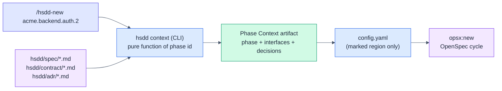
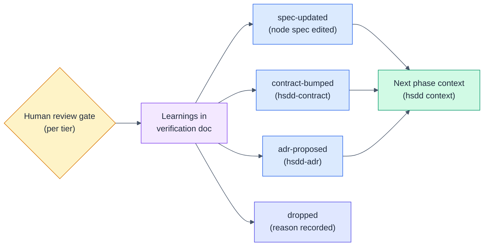

# HSDD: Hierarchical Spec-Driven Development (vNext delta: mechanization)

> Delta specification, rebased from the `v0_5` exploration branch onto v0.6.1.
> It moves every mechanical guarantee of the methodology from skill prose into
> a small deterministic CLI, makes the phase context pull-based, wires contract
> fixtures into gates, adds the execution-stage feedback loop, derives project
> state and contract consumers instead of authoring them, and opens brownfield
> and multi-team paths. Read it against v0.3 through v0.6.1; only the changes
> are stated here. Everything not touched below still stands.

**Version:** vNext (undecided; 0.7.0 candidate)
**Status:** Draft — exploration rebase, for review
**Date:** 2026-07-15
**Owner:** Purbo Mohamad
**Drafted by:** Claude (Fable 5), rebasing the `v0_5` exploration branch
(`review/hsdd-v0_4-review-fable.md` + that branch's `spec/hsdd-spec-v0_5.md`)
onto the released v0.6.1. Companion analysis:
`review/hsdd-v0_5-exploration-rebase-review-fable-max.md`.
**Naming note:** the exploration branch's `spec/hsdd-spec-v0_5.md` is a
*different document* from the released `spec/hsdd-spec-v0_5.md` (the 0.5.0
layout change). This document supersedes the exploration spec entirely; the
released v0.5 is unrelated and stands.
**Supersedes (in part):** the registry-distribution rules of v0.3 §5.3 as
amended by the 0.4.1 verbatim-copy provisions and v0.5 §3, and the
verification-template copy rule of v0.6 §5.2; the push-based phase switch of
v0.3 §9 step 7 and v0.4 §5 (the v0.4 §4.2 missing-ADR fallback survives as the
tool's error path); the contract frontmatter fields `produced_by` and
`consumers` of v0.3 §5.1, the `phase_ids` field of v0.4.2 §4.1, and the
`confirm` entry kind of v0.4.2 §3.2; the PE/review-window definition of v0.3
§12.3; the gate-only default for contract-producing first phases in v0.3 §12.1
and the users guide; the FP-progression mandate of v0.3 §7 (`hsdd-phase-plan`);
the isolation and token claims as worded in the README.

---

## 1. What vNext Changes and Why

Two lines of work diverged at v0.4.1 and both proved out:

- **The released line (0.4.2 → 0.6.1)** hardened the *planning* stage in the
  field: the governance freeze and `hsdd-reconcile` made parallel planning
  conflict-free by construction (0.4.2); one `hsdd/` root (0.5); readable
  templates, proportional ceremony, the execution branch protocol, and the
  ownership-first axis came out of the GMP-911 field test (0.6); source
  provenance and structural anchors out of the pressure-test campaign (0.6.1).
- **The exploration line (branch `v0_5`)** answered the v0.4 review's central
  finding — *prose-enforced invariants fail probabilistically* — with a
  working, tested `hsdd` CLI (registry, context, lint, status, rename,
  check-scope), plus the review gate, the feedback loop, derived state,
  brownfield adoption, and the multi-team profile.

The two lines barely overlap: one fixed planning choreography and artifact
legibility, the other mechanized execution and closed the loop. They compose.

v0.6.1 itself supplies the frame for the merge. Its diagnosis — *"rules that
live only in prose fire inconsistently"* — is the exploration's thesis one
step short of code, and its remedy ("each behavior gets a structural anchor —
a required field, a checklist item, or an explicit stop") is the middle rung
of a ladder this delta completes:

> **Prose → structure → tool.** 0.6.1 anchored judgment-adjacent behaviors in
> structure. vNext moves the *mechanical* subset — context assembly, registry
> projection, referential integrity, state derivation, scope checking, tree
> renames — into a deterministic CLI. Skills decide; tools do.

Honesty note the original exploration could not have: the 0.6.0 pressure
campaign showed the prose-and-structure defenses *holding* under combined
authority, deadline, and social pressure (freeze, sibling isolation, reconcile
ordering all GREEN). Mechanization is therefore not a rescue; it is economics
and determinism — a rule enforced by code costs zero tokens per session,
cannot be negotiated with, and never fires inconsistently. The anti-
rationalization tables stay for the judgment half.

Traceability, exploration → vNext:

| Exploration proposal | Fate in the released line | vNext |
|----------------------|---------------------------|-------|
| Machine-readable artifact model (node frontmatter, normative phase block) | 0.6 made templates bullet lists; 0.6.1 rejected node frontmatter | **Rebased:** the 0.6.1 bullet templates *are* the normative grammar; no node frontmatter (§2) |
| `hsdd` CLI | not absorbed | Rebased to the 0.6.1 artifact shapes and `hsdd/` layout (§3) |
| Pull-based context, `/hsdd-new` | 0.6 declared `config.yaml` ephemeral (mitigation, not mechanism) | Kept; the CLI makes 0.6's "take either side and re-run" trivially safe (§4) |
| Worktree-per-phase required | 0.6 §4 shipped the finer-grained execution protocol (`Collides with`, integration branches) | **Superseded by 0.6 §4;** the CLI serves it (§4.2) |
| Contract validation wired into gates; integration nodes | not absorbed (0.4.2 added the canonical-artifact gate, adjacent) | Kept; integration-node ownership resolved under the 0.6 axis rule (§5) |
| Learnings + dispositions; mid-phase renegotiation | 0.6 added Outstanding dispositions (verification half); 0.4.2 added request/amend (planning half) | Rebased to coexist with both (§6) |
| Derived state; `consumers`/`produced_by` derived | 0.4.2 added `phase_ids` + `confirm` to manage the same duplication | **Conflict resolved:** derive; retire `confirm` and `phase_ids` (§7) |
| Claims rewrite; `Touches` + check-scope | not absorbed | Kept, updated with pressure-test evidence (§8) |
| `hsdd-review` skill; PR-wired sign-off; leverage tier rule | 0.6 added the verification template + Sign-off (artifact half) | Rebased; leverage rule narrowed per field evidence (§9) |
| PE in human terms | 0.6 added the sizing floor (the other half of proportionality) | Kept; unified with floor and ceiling (§10) |
| Ordering policy | not absorbed | Kept (§11) |
| `hsdd-adopt` (brownfield) | not absorbed | Rebased (bullet fields, `hsdd/` paths, sources) (§12) |
| Multi-team profile | 0.6/0.6.1 made "who builds what?" a mandatory stop — with nowhere durable to record the answer | Rebased: the `Team` field is that landing spot (§13) |
| Evidence program | two field campaigns ran and were published in `review/` | Kept; formalized (§14) |
| "Last delta; consolidate next" | 0.6 §9.8 listed consolidation, unshipped; the stack is now six deltas deep | **This is the last delta** (§18) |

**What does not change:** the recursive node model, contracts as the only
cross-node knowledge, typed dependency edges, the untouched OpenSpec cycle,
review tiers, the governance freeze and sibling isolation (0.4.2), the
`hsdd/` layout (0.5), the bullet templates, summary table, sizing floor,
tier-scaled artifacts, execution branch protocol, and ownership-first axis
(0.6), and source provenance with its stops (0.6.1).

---

## 2. The Normative Grammar

The CLI can only be deterministic if the artifacts it projects from are
machine-readable. The exploration reached for YAML frontmatter on node specs;
0.6.1 explicitly declined node frontmatter, and 0.6's field-block discipline
makes it unnecessary:

> **The 0.6.1 bullet templates are the normative grammar.** The node header
> block and the phase section, exactly as `hsdd-spec` and `hsdd-phase-plan`
> emit them since 0.6.1 (`- **Field:** value` bullets, "none" for empty
> lists), are parsed by the CLI. The human format and the machine format are
> the same text. A field lives in exactly one place; anything derivable from
> other artifacts is never authored at all.

This retires the exploration's node-spec frontmatter entirely. No template
changes, no migration for 0.6.1-shaped projects: the grammar is what the
skills already write. Blocks that do not parse are `hsdd lint` errors naming
the file, the field, and the template.

### 2.1 Node header grammar

`hsdd/spec/{node-id}.md`, the 0.6.1 shape plus two optional fields:

```markdown
- **Kind:** internal | leaf-parent
- **Purpose:** ...
- **Owns:** ...
- **Does not own:** ...
- **Consumes:** [contract-id@version, ...], or "none"
- **Produces:** [contract-id@version, ...], or "none"
- **Governed by:** [ADR-NNN, ...]            (omit when empty)
- **Sources:** [path-or-url (§section), ...], or "none"
- **Team:** {team-name}                      (multi-team profile only, §13)
- **Adopted:** as-built                      (brownfield only, §12)
- **Decomposes into:** child node ids, OR "phases (see hsdd-phase-plan)"
- **Isolation strategy:** ...
```

The node id comes from the filename and the `#` title (0.6.1 §5's
one-file-per-child rule guarantees both exist); it is not a field.

### 2.2 Phase section grammar

The 0.6.1 phase template, verbatim, plus one optional field:

```markdown
### {phase-id}: {Phase Name}

- **Consumes:** [contract-id@version, ...], or "none"
- **Produces:** [contract-id@version, ...], or "none"
- **Governed by:** [ADR-NNN, ...]            (omit when empty)
- **Scope:** concrete, verifiable deliverable
- **Size estimate:** ~N files (~N lines), <= 8 OpenSpec tasks
- **Gate:** exact command, or "node default"
- **Verification:** 1-3 lines of intent
- **Review tier:** gate-only | spot-check | full-review
- **Collides with:** [phase-ids] — optional reason   (omit when none)
- **Touches:** [src/auth/**, tests/auth/**]          (optional; §8.2)
- **Dependencies:** which prior phases, and what specifically
```

`hsdd context` resolves `Gate: node default` against the plan's
`**Default gate:**` line (0.6 §3.4). The summary table (0.6 §2.2) is
cross-checked by lint (§3.4), never parsed as a source of truth: the phase
sections are authoritative, the table is their index.

### 2.3 Contract frontmatter: authored intent only

`produced_by`, `consumers`, and `phase_ids` are **removed** (rationale and
migration in §7). Two fields are added to make validation executable (§5):

```markdown
---
id: auth-token
version: v1
status: stable          # stable | draft | deprecated
kind: api               # api | event | schema | shared-model | file | cli
owner: acme.backend.auth
schema: hsdd/contract/schema/auth-token.schema.json   # stable needs schema
fixtures: hsdd/contract/fixture/auth-token/           #   and/or fixtures
external_consumers: [ops-dashboard]   # optional: consumers outside the tree
---
```

`owner` stays authored — it is intent (who owns the interface), and lint
checks it against the node that lists the contract under `Produces`. Producers
and consumers are derived facts (§7). `external_consumers` covers the 0.4.2
edge case of consumers with no planned phases (external or human consumers);
it exists so derivation loses no information the old hand-maintained list
could carry.

ADR frontmatter is unchanged. `affects` remains authored (it carries forward
references); lint enforces the bidirectional match with `Governed by` once
both artifacts exist.

### 2.4 Conventions frontmatter

`hsdd/conventions.md` gains frontmatter so the CLI reads layout overrides and
policies without parsing prose. Defaults are the 0.5/0.6 layout:

```markdown
---
spec_dir: hsdd/spec
verify_dir: hsdd/verify
contract_dir: hsdd/contract
adr_dir: hsdd/adr
template_dir: hsdd/templates
openspec_dir: openspec
ordering_policy: interfaces-first     # §11
profile: single-team                  # single-team | multi-team (§13)
---
```

The body keeps the human-facing conventions exactly as today. Absent
frontmatter or fields fall back to these defaults, so existing 0.5+ projects
work unchanged; a pre-0.5 project (conventions at `docs/conventions.md`) keeps
the 0.5 compatibility rule — honor its stated layout, offer to migrate.

---

## 3. The `hsdd` CLI

### 3.1 Principle and distribution

One tool, `hsdd`, owns every deterministic operation. Zero-dependency Node
(>= 20), published to npm, run as `npx hsdd <command>` or installed as a
devDependency. It absorbs `gen-registry.mjs`.

This **retires the verbatim-copy machinery entirely** — both instances:

- the `gen-registry.mjs` copy chain (0.4.1's rule, `hsdd-contract` bundling,
  the `hsdd-adr` bootstrap workaround, the 0.5 re-copy-on-migrate step)
  becomes `hsdd registry`;
- the `templates/verification.md` copy rule of v0.6 §5.2 becomes
  `hsdd template verification` (§3.8).

The corrupted-registry failure mode (an agent retyping the generator) becomes
structurally impossible, and every command is available the moment the package
is — no bundling order, no bootstrap gap.

The CLI never calls a model and never guesses. Every command is a pure
function of the repository state; unresolvable input is a hard error naming
the skill that owns the fix.

**Starting point:** the `v0_5` branch contains a complete implementation with
unit and end-to-end tests (`cli/`). It predates 0.4.2, so rebasing it is a
bounded migration, not a rewrite; the concrete deltas are listed in §18.

### 3.2 Command: `hsdd registry`

Replaces `gen-registry.mjs`. Projects `hsdd/contract/INDEX.md` and
`hsdd/adr/INDEX.md` from frontmatter, as today, with one change: the contract
table's producer and consumer columns are **derived** from node and phase
`Produces`/`Consumes` declarations plus `external_consumers` (§7), and the
`owner` column is cross-checked against the deriving node. Deterministic
output, no timestamps.

### 3.3 Command: `hsdd context <phase-id> [--write]`

Deterministic phase-context assembly, replacing the mechanical half of the
`hsdd-config` phase switch:

1. Resolve the leaf-parent file from the phase id and parse its phase section
   (grammar §2.2), resolving `node default` gates.
2. For each consumed contract id: load `hsdd/contract/{slug}.md`, extract only
   `## Interface` and `## Guarantees / invariants`.
3. Resolve governing ADRs from the phase section and each consumed contract's
   `Governed by`; extract only `## Decision` and `## Consequences`, and only
   from ADRs with `status: accepted`.
4. Emit the **Phase Context artifact**: a self-contained markdown document
   with the `## Current Phase`, `## Contracts from Prior Phases / Nodes`, and
   `## Governing Decisions` sections. Sources are **never** injected — the
   0.6.1 §2.3 rule, now enforced by construction.

`--write` splices it into `openspec/config.yaml` between literal markers
inside the `context:` block scalar; without the flag it prints to stdout:

```text
<!-- hsdd:phase-context:begin -->
...generated sections...
<!-- hsdd:phase-context:end -->
```

Only the marked region is replaced; project-wide context and `rules:` are
untouched by construction, not by instruction. `hsdd-config` (init) places
the markers.

Guards — the 0.4.2 and 0.6 phase-switch checks, now deterministic:

| Condition | Behavior |
|-----------|----------|
| Unknown phase id or unparseable phase section | Error naming the file and the grammar (§2.2) |
| Consumed contract file missing | Error: "author it with hsdd-contract" |
| Referenced ADR file missing | Error: "author it with hsdd-adr". The CLI never invents a decision (subsumes v0.4 §4.2) |
| Referenced ADR is `proposed` | Excluded from output, warning; a proposed decision is never injected as binding |
| Consumed contract is `draft` | Warning (consumers may build against a draft at their own risk) |
| Phase listed under an unresolved `request`'s contingent phases | **Error** (the 0.4.2 stop); `--allow-contingent` overrides after explicit human confirmation |
| This node's plan has an undrained pending-governance section | Warning: run `hsdd-reconcile` first |
| Phase is not next-runnable (already archived, or a `Dependencies` phase's change neither archived nor merged) | Warning (the 0.6 §4.1 self-heal check) |
| A phase in this phase's `Collides with` has an in-flight (unarchived) change | Warning: colliding phases execute serially (0.6 §4.3) |

The last four are new relative to the exploration: they are the reconcile
guard, the self-heal check, and the contention rule that 0.4.2/0.6 specified
as skill prose, derivable mechanically from the tree, the archive, and the
pending sections.

### 3.4 Command: `hsdd lint [--strict] [--profile <name>]`

Referential integrity plus structural-anchor verification across the whole
tree. Errors unless noted; `--strict` promotes migration/format warnings.

Carried from the exploration (rebased to 0.6.1 shapes):

1. Every id in `Consumes`/`Produces` (node headers and phase sections)
   resolves to `hsdd/contract/{slug}.md` with a matching version.
2. Every contract's `owner` node exists and lists the contract under
   `Produces`; no two nodes produce the same contract.
3. Every `Governed by` ADR id resolves to a file in `hsdd/adr/`.
4. ADR `affects` and artifact `Governed by` match bidirectionally where both
   exist; `affects` entries naming nonexistent ids are warnings (forward
   references).
5. ADR ids are unique, zero-padded, and match their filenames.
6. A `stable` contract has at least one of `schema`/`fixtures`, and the paths
   exist (§5).
7. A phase consuming a `draft` contract: warning.
8. Every phase section parses against the grammar; phase numbers are
   sequential per leaf-parent.
9. Every OpenSpec change carrying a `Phase:` line references an existing
   phase id.
10. Derived-state consistency (§7): e.g. a verification doc for a phase whose
    change was never created is an error; created-but-not-archived is a
    warning (in-progress notes are legitimate).
11. Generated `INDEX.md` files match a fresh projection
    (regenerate-and-diff).
12. Undispositioned `Outstanding` or `Learnings` entries in a signed-off
    verification doc (§6, §9): warning; `--strict` error.

New in vNext — the 0.6/0.6.1 structural anchors, verified:

13. The phase summary table opens the `## Phase Plan` section and matches the
    phase sections (ids, tier, dependencies, collisions) — the 0.6 §2.2
    quality gate, mechanized.
14. `Collides with` is symmetric (if A lists B, B lists A) and every listed
    id exists.
15. One spec file per child: every id under a parent's `Decomposes into` has
    its own `hsdd/spec/{child-id}.md` (0.6.1 §5).
16. Sources mapping: every entry in the root `## Sources` appears in at least
    one node's `Sources` or is marked "informative only — not decomposed";
    a node's `Sources` entries name documents the root section lists — the
    mechanically checkable half of 0.6.1 §2.2's gates (whether a listed
    source actually *governs* the node stays judgment).
17. Format: field blocks are bullet lists; empty lists render "none", not
    `[]` (0.6 §2.1). Warning; `--strict` error.
18. Two phases whose `Touches` globs intersect but do not list each other
    under `Collides with`: warning (only when both declare `Touches`) —
    contention the plan missed, derived from the scopes it declared.
19. Multi-team profile (`--profile multi-team`, §13): `Team` required on
    every node; cross-team contract bumps blocked from `stable` until every
    derived cross-team consumer has acked; multi-team ADRs need
    `## Approvals` before `accepted`.

Designed for pre-commit or CI. Exit 0 clean, 1 errors, 2 warnings-only.
Semantic judgment (is this decomposition good? is this phase well-sized?)
stays with skills and humans — lint checks shape and reference, never meaning.

### 3.5 Command: `hsdd status [node-id] [--write]`

Projects the derived lifecycle state (§7) of every phase under the given node
(default: root) and rolls it up per node. Prints a table; `--write` emits
`hsdd/STATUS.md` with the generated-file header. Also surfaces per node:
an undrained pending-governance section ("planned, awaiting reconcile") and
contracts blocked from `stable` by open requests. Answers "where are we?"
mechanically instead of by archaeology.

### 3.6 Command: `hsdd rename <old-node-id> <new-node-id>`

Tree surgery. Dotted-path identity stays; this command makes it refactorable:

- Rewrites the id and all dotted descendants across: node spec filenames and
  titles, phase headings, `Consumes`/`Produces` references, contract `owner`,
  ADR `affects`, `Governed by` entries, and verification-doc filenames.
  Id-boundary-aware (never rewrites `authx` when renaming `auth`).
- **Never rewrites `openspec/changes/`**: the archive is immutable history.
- Appends the mapping to `hsdd/renames.md`, the ledger that keeps archived
  changes and old discussions resolvable.
- Runs `hsdd registry` and `hsdd lint` afterward and reports.

Moving a node and renaming a slug are the same operation. Splitting or
merging nodes remains judgment for `hsdd-spec`, followed by renames for the
mechanical part (§6.3).

### 3.7 Command: `hsdd check-scope <phase-id> [--base <ref>]`

Compares the changed files (working tree, staged, and commits since `--base`,
default the branch fork point) against the phase's `Touches` globs. Lists any
out-of-scope files and exits nonzero. A phase with no `Touches` prints a note
and exits 0 — the check is opt-in per phase (§8.2).

### 3.8 Command: `hsdd template <name>`

Prints a bundled template (`verification`, `conventions`) to stdout:

```bash
npx hsdd template verification > hsdd/templates/verification.md
```

This replaces "copy the file verbatim from the skill's directory" with a
deterministic, versioned source. The templates ship in the npm package; the
skills instruct the command instead of the copy. The retype-drift failure
mode (a paraphrased Outstanding section silently losing the gate condition)
becomes impossible for the same reason the registry did.

---

## 4. Pull-Based Phase Context and the Execution Protocol

### 4.1 Context as a pure function

v0.3 §9 flagged its own step 7 (the manual context switch) as the easiest
step to forget; 0.6 §4.1 declared the result ephemeral and prescribed
"take either side and re-run the switch" at merge. vNext supplies the
mechanism that makes both moot:

> The phase context is a pure function of the phase id: `hsdd context`
> derives it from the tree at the moment the cycle starts. Nothing needs to
> be remembered, stale context cannot be inherited, and a lost merge side
> loses nothing — regeneration is deterministic.

The 0.6.0 pressure test observed exactly this property from the prose side
("the block regenerated from spec + contract sources — which is why losing a
conflict side loses nothing"); the CLI turns that observation into the
mechanism. The `.gitattributes` `merge=ours` suggestion of 0.6 §4.1 stands.

The paved road is a new slash command:

- `/hsdd-new {phase-id}`: runs `npx hsdd context {phase-id} --write`,
  verifies exit 0, reports warnings for the human to rule on, then starts
  `opsx:new` for a change named `{phase-id}` with dots as hyphens, whose
  proposal carries the `Phase: {phase-id}` line (§7.2).
- `/hsdd-phase {phase-id}` is retained as the context-only step (it now runs
  the same command without starting the cycle), for users who want to inspect
  before starting.



### 4.2 Parallel execution: 0.6 §4 governs

The exploration's blanket rule ("one worktree per active phase, required") is
**superseded by the finer-grained 0.6 execution protocol**, which the field
test earned: one integration branch per node; phase branches merge into it;
a node's plan lives on exactly one lineage; reconcile runs once, at the root;
`Collides with` serializes — parallel worktrees only for phases with no
collision between them. The CLI serves that protocol rather than replacing
it: each worktree carries its own `config.yaml`, `/hsdd-new` re-derives
context per phase, and the context guard warns when a colliding phase is
in flight (§3.3).

### 4.3 The engine adapter boundary

The Phase Context artifact is engine-neutral markdown. Writing it into
OpenSpec's `config.yaml` is one adapter — the only one implemented. If
OpenSpec changes its config semantics or a different execution engine is
preferred later, only the adapter changes; the tree, contracts, ADRs, and
the context function survive. HSDD remains OpenSpec-first; it stops being
OpenSpec-shaped.

---

## 5. Contract Validation and Integration Nodes

### 5.1 Stable means machine-checkable

The v0.3 contract template already named `## Validation` (fixture + schema)
and wired it to nothing; 0.4.2 §5 added the canonical-path gate (any shared
code-level artifact names its path and owning phase) but still nothing runs.
vNext makes it normative:

> A contract may not be `stable` unless it carries at least one executable
> validation artifact: a `schema` (JSON Schema or equivalent for the kind) or
> a `fixtures` directory of concrete examples, at the canonical paths its
> frontmatter names. `hsdd lint` enforces existence; `hsdd-reconcile` checks
> it before flipping `draft` to `stable` (§7.3).

Default locations `hsdd/contract/schema/` and `hsdd/contract/fixture/`
(overridable; the contract's frontmatter is authoritative either way — when
fixtures live in the product tree, e.g. next to the tests that use them, the
frontmatter simply says so). Guidance per kind: `api` and `event` want schema
plus example payloads; `schema` and `shared-model` want the schema plus
edge-case fixtures; `file` wants a sample tree; `cli` wants recorded
invocations (args, stdout, exit code).

### 5.2 Both gates run the contract

Consumer-driven contract testing, wired into the existing gate mechanism:

- **Producer side:** the gate of any phase that produces a contract MUST
  include a check that its real output validates against the schema and
  reproduces the fixtures (e.g. `npm run contract:verify auth-token`).
  `hsdd-phase-plan` writes it into the phase's `Gate:` by default.
- **Consumer side:** phases that consume a contract build and test against
  the fixtures, not hand-rolled mocks. **The mocks are the fixtures.** When
  the contract bumps, the fixtures change, and consumer tests fail loudly
  instead of drifting silently.

This closes the known failure mode of contract-first development (mocks pass,
live integration fails) with machinery the artifacts already sketch — and it
answers, structurally, the reconcile collision the 0.6.0 end-to-end test
surfaced ("fixtures/ vs MSW mocks", correctly sent to the human): the
contract names one canonical fixture set and both sides consume it.

### 5.3 Integration nodes

Node-local wiring ("final phase: composition") exercises nothing across
sibling nodes. vNext adds a decomposition rule that preserves "only leaves
drive code":

> When an internal node's children exchange contracts, `hsdd-spec` SHOULD add
> an **integration node**: a child leaf-parent named `{node}.integration`
> with `hard` edges to each producing sibling. Its phases exercise the real
> composed behavior — replay contract fixtures against live components, run
> end-to-end slices of the primary flows. Its phases default to
> `full-review`.

Because its edges are `hard`, the DAG schedules it after the producers ship,
exactly where integration belongs. Small trees that are one leaf-parent need
no integration node; their final composition phase already covers it.

**Ownership under the 0.6 axis rule** (new consideration the exploration
predates): an integration node spanning two teams' outputs still gets
**exactly one owning team** — whoever owns the composed, user-facing behavior
(often the consumer side, or a designated QA/e2e owner). Stated in the node's
`Team` field under the multi-team profile. "No node is owned by two teams"
(0.6 §6.2) holds; consuming two teams' contracts is not co-ownership, it is
what contracts are for.

---

## 6. The Feedback Loop at the Gate

0.4.2 built the upward channel for the *planning* stage (`request`/`amend`
entries, drained by reconcile). 0.6 built the honesty channel for
*verification* (`Outstanding` + dispositions). What is still missing is the
channel for what a phase *learns while being built* — the contract gap found
mid-apply, the measured number that invalidates a guess, the boundary that
turns out wrong. The GMP-911 verification docs grew ad-hoc "Deviations"
sections for exactly this; vNext gives that emergent behavior its structure,
the 0.6.1 way.

### 6.1 Learnings, dispositioned at the gate

The verification template (v0.6 §5.2) gains one section, between
`## Outstanding` and `## Sign-off`:

```markdown
## Learnings
- L1: auth-token needs a `scopes` claim the contract omits.
  -> disposition: contract-bumped (auth-token@v2)
- L2: session-store latency budget was guessed; measured 3x higher.
  -> disposition: spec-updated (acme.backend.auth: Isolation strategy)
- L3: considered switching JWT lib mid-phase.
  -> disposition: dropped (out of scope; current lib adequate)
```

Every learning carries exactly one disposition: `spec-updated`,
`contract-bumped (id@v)`, `adr-proposed (ADR-nnn)`, or `dropped (reason)`.
"- none" is a valid entry; silence is not. The two sections divide cleanly:
**Outstanding is about this phase's claims** (what could not be verified
here); **Learnings is about the tree** (what flows upward). Both gate the
sign-off: the review gate is not passed while either holds an undispositioned
item. `hsdd lint` flags violations (§3.4 check 12); `hsdd-review` (§9)
drives the dispositioning.

Dispositions execute through the owning skills, at the root, by the human
running the gate — `hsdd-contract` for bumps, `hsdd-adr` for proposals, a
node-spec edit (or `hsdd-spec` re-decomposition) for spec updates. The gate
is a root-side human session, so the phase-session prohibition ("never update
governance from a phase" — the 0.6 tasks rule) is untouched.



### 6.2 Mid-phase contract renegotiation

When a phase discovers mid-`apply` that a consumed contract is wrong or
incomplete, the procedure — threaded through the 0.6 branch discipline:

1. **Pause** the apply at a task boundary; do not improvise around the
   contract (the phase session never edits governance).
2. **Record** the gap as a learning in the in-progress verification notes,
   in `request`/`amend` vocabulary (the 0.4.2 grammar, reused: a gap is a
   `request`, a producer-side discovery is an `amend`).
3. **Renegotiate at the root lineage** via `hsdd-contract`, with the human: a
   backward-compatible addition amends the current version; a breaking change
   drafts `v{n+1}` with a migration note. Under the multi-team profile,
   cross-team consumers ack first (§13.2).
4. **Propagate**: merge or rebase the root's contract change into the phase's
   branch or worktree.
5. **Re-derive** the context: `npx hsdd context {phase-id} --write`.
6. **Resume** the change; OpenSpec's artifact flow absorbs the updated
   context. Producer-side code changes ship through the producing node's own
   phases; the consumer never edits another node's internals (unchanged
   rule).

### 6.3 Boundary corrections

When shipped phases reveal a wrong decomposition, the correction path is:
`hsdd-spec` re-decomposes the affected subtree (judgment), then `hsdd rename`
executes the mechanical rewrites (§3.6), then `hsdd lint` proves the tree
consistent. Archived changes stay put; `hsdd/renames.md` keeps old ids
resolvable. This does not make re-decomposition cheap (it cannot be), but it
makes it a bounded, tool-assisted operation instead of an untracked hand edit
across a dozen files.

---

## 7. Derived State and the Retirement of `confirm`

### 7.1 State is derived, never declared

No hand-maintained status field is added anywhere. A phase's lifecycle state
is a pure projection of artifacts that already exist, read against the 0.6
verification template:

| State | Derived from |
|-------|--------------|
| `planned` | none of the below exist |
| `in-progress` | a linked change exists under `openspec/changes/` |
| `built` | the linked change is archived |
| `verified` | `hsdd/verify/{phase-id}.verification.md` exists with a non-empty `## Observed` section |
| `approved` | Sign-off complete: reviewer and date recorded (or a merged PR linked), every Outstanding item and every Learning dispositioned |

Node state is the rollup of its descendants (`planned` until any child
starts, `done` when all are `approved`, otherwise `in-progress`).
`hsdd status` prints it; `hsdd lint` flags inconsistent combinations.


### 7.2 Linking changes to phases

Derivation needs a deterministic link between an OpenSpec change and its
phase. Two mechanisms, both written by `/hsdd-new`:

- The change directory is named `{phase-id}` with dots as hyphens
  (`acme-backend-auth-2`).
- The proposal's first line is `Phase: {phase-id}` (added to the `proposal`
  rules by `hsdd-config`). The line is authoritative; the directory name is
  the human-friendly convention.

### 7.3 `consumers`, `produced_by`, `phase_ids`, and `confirm`: retired

The exploration and 0.4.2 solved the same rot problem from opposite ends.
The exploration's diagnosis: `produced_by`/`consumers` are write-only
metadata, hand-maintained duplication that no tool checks. 0.4.2's answer
kept the fields and built process around the duplication — `phase_ids:
provisional|final`, `confirm` entries, a reconcile step to drain them. The
process works (field-tested, pressure-tested), but it exists *only because
the data is authored twice*. Once phase sections are machine-readable, the
duplication itself can go:

> Producers and consumers are **derived**: the registry scans node headers
> and phase sections for `Produces`/`Consumes`, plus the contract's
> `external_consumers`. `produced_by`, `consumers`, and `phase_ids` are
> removed from contract frontmatter. The `confirm` entry kind is retired —
> there is nothing left to confirm; the plan's own phase sections are the
> record. A field lives in exactly one place.

What remains of the 0.4.2 protocol — unchanged, because it is genuinely about
judgment, not duplication:

- The governance freeze and sibling isolation stand as-is.
- `request`, `amend`, and `note` entries stand as-is; they carry gaps,
  producer discoveries, and conventions facts that no derivation can invent.
- `hsdd-reconcile` still drains pending sections, still resolves requests
  with the human, still applies amends under contract rules — and still
  flips `status: draft` to `stable`, now under three conditions: **no
  unresolved `request` names the contract** (as today), **both sides are
  planned** (derived: the producing node and every consuming node in the
  tree have phase sections referencing it — a side with only
  `external_consumers` counts as planned), and **the validation artifacts
  of §5.1 exist**.

`hsdd-config`'s "provisional contract" warning becomes unnecessary;
`status: draft` alone carries "not yet safe to build against", which is what
provisional was standing in for. The contingent-phase stop survives in
`hsdd context` (§3.3).

**Migration** (the one breaking artifact change in this delta): delete
`produced_by`, `consumers`, and `phase_ids` from contract frontmatter; add
`external_consumers` where a real external consumer exists; run
`npx hsdd registry`. `hsdd lint` reports contracts still in the old shape as
migration warnings (`--strict`: errors). Plans with historical `confirm`
entries in already-reconciled sections need nothing — drained sections are
already stamped prose.

**Considered and rejected:** keeping the fields and having lint verify them
against the derivation ("derive-and-check"). Rejected because it preserves
the double bookkeeping and the whole confirm choreography to protect data
the tool can simply produce; rot-detection is strictly worse than
rot-impossibility at equal implementation cost.

---

## 8. Scope: Honest Claims and Enforcement

### 8.1 Claims rewrite

Context injection bounds what is pushed into a session; it does not stop an
agent from grepping sibling internals in the working tree. The prose defenses
added since (0.4.2's sibling-isolation rules and anti-rationalization rows)
*did hold* under the 0.6.0 pressure campaign — both sibling-peek baits were
refused — so the claims rewrite is now about precision, not concession:

| Current claim (README) | Replacement |
|------------------------|-------------|
| "A session cannot wander into a sibling's concern or fabricate an interface it was never given, because neither is in context." | "Context injection shapes attention: a session is handed only its phase and its consumed interfaces, and the skills' isolation rules held under adversarial pressure testing. Those rules are still probabilistic; where information hiding must be certain, declare a `Touches` scope and let `hsdd check-scope` enforce the file footprint at the gate." |
| "Token cost does not scale with total system size." | "Per-session context is bounded by the phase, not the system. Total project tokens still scale with the number of phases, and decomposition itself costs tokens: below a handful of PEs, plain OpenSpec is cheaper. HSDD pays a planning overhead to buy bounded sessions, parallelism, and reviewability." |

### 8.2 Opt-in enforcement

For phases where information hiding matters (parallel teams,
security-sensitive seams), the phase section declares `Touches:` globs (§2.2)
and the gate includes `npx hsdd check-scope {phase-id}`. `hsdd-phase-plan`
adds both by default for phases in trees with parallel lanes. The diff either
stays inside the declared footprint or the gate fails; the reviewer sees the
violation instead of discovering the coupling months later.

`Touches` also feeds back into planning: overlapping `Touches` between two
phases with no mutual `Collides with` is a lint warning (§3.4 check 18) —
the plan declared the scopes; the tool derives the contention the plan
forgot to mark. Worktrees with sparse checkouts remain an optional harder
wall for teams that want one.

---

## 9. The Review Gate: `hsdd-review`, Sign-Off, Tier Leverage

### 9.1 New skill: `hsdd-review`

The gate is the methodology's centerpiece and the only workflow step with no
skill support. 0.6 gave it the artifact (the verification template with
Outstanding and Sign-off); `hsdd-review` drives the sitting:

- **Inputs:** the phase id, its tier, the verification doc, the diff.
- **Behavior:** run the gate command, `hsdd check-scope`, and `hsdd lint`,
  pasting real output into the doc; walk the per-tier checklist; require a
  disposition for every Outstanding item (0.6 rule) and every Learning
  (§6.1); record the sign-off; show `hsdd status` for the node.
- **Per-tier checklists**, aligned with the 0.6 §3.2 artifact profile:
  - `gate-only` (minutes): gate green, scope check green, diff within the
    Size estimate. (There is no `design.md` to read; the tier skipped it.)
  - `spot-check`: the above, plus read the diff summary and the produced
    contract/type surface; confirm naming and shape match the phase Scope;
    confirm no coupling to another node's internals.
  - `full-review`: the above, plus read the full diff, run the manual
    verification steps, probe the edge cases in the phase's Verification,
    check error paths against the consumed contracts' guarantees.
- **Output:** the completed Sign-off block, and each Learning executed
  through its owning skill (§6.1).

### 9.2 Sign-off uses real review infrastructure

A "reviewed by" line the agent can type is an honor-system record. The
recommended flow wires the gate to infrastructure that already enforces human
identity:

- Each phase branch merges into the node's integration branch (0.6 §4.2) by
  pull request; the PR approval and merge are the approval event. The
  verification doc links the PR; `hsdd status` treats a merged linked PR as
  the sign-off signal.
- Repos without PR flow fall back to the signed line in the Sign-off section,
  committed by the human. The doc records which mechanism was used.

Review tiers map onto PR ceremony (gate-only: auto-merge on green checks with
notification; spot-check: one approval; full-review: approval after running
the verification steps), so HSDD composes with branch protection instead of
parallel-inventing review records. Either way, `approved` additionally
requires the dispositions of §7.1 — a merged PR with an undispositioned
Outstanding item is not approved, and lint says so.

### 9.3 Tier assignment considers leverage — narrowed by field evidence

The exploration proposed "any phase whose outputs feed 2+ later phases gets
spot-check minimum," which would have re-tiered every first phase. The
GMP-911 field review then explicitly endorsed a gate-only skeleton phase as
"exactly the right risk allocation." Both are right about different things:
the skeleton's *scaffolding* deserved gate-only; a *contract or shared type
surface* is a different object — highest fan-out in the plan, all signal to
read, expensive to get wrong. The rebased rule targets the object, not the
phase:

> A phase that **produces a contract, or a type surface consumed by two or
> more later phases**, gets `spot-check` at minimum — and the spot-check
> reads *that surface* (the contract body, the exported types), not the whole
> diff. Pure scaffolding with no consumed outputs (build config, test rigs,
> codegen output, vendored boilerplate) stays `gate-only`.

Cost check: under 0.6 §3.2, moving such a phase from gate-only to spot-check
changes the verification doc from slim to short and adds a glance at the
surface — minutes, spent exactly where a wrong shape would propagate through
every later phase.

---

## 10. Sizing: the PE, Floor and Ceiling in the Same Terms

The Phase Equivalent is redefined in terms of the durable constraint (human
review capacity), not a vendor's session window:

> **One PE is the largest unit of change one reviewer can genuinely review
> and manually verify in a single sitting**, plus the agent run that produces
> it. Working guidelines: a reviewable diff of roughly <= 400 changed lines
> of non-generated code, <= 8 OpenSpec tasks, about half a working day end to
> end.

Calibration note, explicitly non-normative: as of mid-2026 one PE happens to
fit one Claude Code rolling window (~5h). When windows change, the PE does
not; the review sitting is the invariant. All "~5h window" phrasing in the
README, spec, skills, and conventions template is replaced by "one review
sitting" with this calibration note.

The 0.6 sizing floor and this ceiling are now two ends of one rule stated in
the same unit: **a phase must fit one review sitting (ceiling, split if not)
and must earn one (floor, merge candidates per 0.6 §3.1 if not).** The floor's
checklist anchor and kept-split reason (0.6.1 §3) are unchanged.

---

## 11. Phase Ordering as Policy

The FP progression (types → pure functions → effects → composition) moves
from a mandate in `hsdd-phase-plan` to a **named policy** selected in
`hsdd/conventions.md` frontmatter (`ordering_policy`, §2.4):

- `interfaces-first` (default): stable interfaces and shared types first,
  effects behind interfaces, composition and wiring last. The durable
  principle, stack-agnostic.
- `fp-progression`: the full FP ordering; the reference policy for FP stacks.
  This is `interfaces-first` sharpened — and it remains what the GMP-911
  field review praised ("textbook") where it applied.
- Projects may define their own (e.g. `walking-skeleton`: one thin end-to-end
  slice first, then widen), documented in the conventions body.

`hsdd-phase-plan` reads the policy and orders phases accordingly. Sizing,
tiers, gates, the summary table, and the floor are policy-independent.

---

## 12. Brownfield Adoption: `hsdd-adopt`

The systems that actually suffer the too-big-spec problem mostly already
exist. A new skill, `hsdd-adopt`, gives them a path in; its output feeds the
standard loop unchanged.

### 12.1 Process

1. **Archaeology.** Map the real seams: deployables, packages, API surfaces,
   event topics, schema/DB boundaries. Propose a shallow tree (depth 1–2)
   that follows the seams that exist, not the ones anyone wishes existed.
   The ownership-first axis rule (0.6 §6) applies here too — and "who builds
   what?" is usually *answerable* from the repo history and CODEOWNERS
   before it needs asking.
2. **As-built node specs.** One file per node (0.6.1 §5), the standard bullet
   header plus `- **Adopted:** as-built`: purpose, owns/does-not-own,
   observed contracts. `Sources` points at what documents the node — READMEs,
   API docs, dashboards, the code paths themselves (0.6.1 §2 applies to
   adoption verbatim: the pointer scales, the summary thins). No invented
   decomposition below the level needed now.
3. **Contracts from seams.** Extract real interfaces as contracts:
   `version: v1` defined as **current behavior**. Schemas come from the code
   or traffic; fixtures are generated from existing tests or captured
   payloads — which satisfies §5.1, so these contracts start `stable` and
   immediately give a validation harness to code that never had one.
4. **Lazy tree.** Only the subtree about to change gets decomposed further
   and phased. Everything else remains an as-built stub. Depth on demand; the
   ceremony budget goes where the work is.
5. **First change.** From here the standard loop applies: `hsdd-phase-plan`
   on the target node, reconcile, `/hsdd-new`, cycle, `/hsdd-review` gate.
6. **Prove the tree:** `npx hsdd registry && npx hsdd lint`.

### 12.2 Rules

- `hsdd-adopt` never proposes refactoring the system to fit a nicer tree; the
  tree fits the system. Boundary improvements arrive later as learnings and
  ADRs, through the §6 loop.
- As-built specs are honest about ignorance: unknown internals stay unknown
  and are said to be unknown. The `Isolation strategy` records how the node
  is exercised today (existing tests, staging), not an aspiration.
- Contracts describe observed behavior, warts included. A wart worth fixing
  becomes a learning at a later gate, then a versioned bump with a migration
  note; it is never silently "corrected" during extraction.

---

## 13. The Multi-Team Profile (opt-in)

The default profile is `single-team` (§2.4): one team, parallel sessions via
worktrees under the 0.6 protocol. The README's "multi-team" tagline is
rescoped to that honest default plus an explicit opt-in profile for genuine
multi-team trees.

### 13.1 Ownership — the landing spot for "who builds what?"

0.6 made ownership the decomposition axis; 0.6.1 made the question a
mandatory stop. But the answer currently lands nowhere durable — it shapes
the tree and evaporates. Under the multi-team profile, node headers carry
`- **Team:** {name}` (§2.1): the recorded answer to the question the skill
was required to ask. `hsdd lint --profile multi-team` requires it on every
node, and the 0.6 axis quality gate ("no node is owned by two teams") gets a
machine anchor. `hsdd status` groups by team. Teams own subtrees; a phase
touching another team's `Touches` scope is a lint error, not a courtesy.

### 13.2 Contract change negotiation

Bumping a contract with cross-team consumers is a negotiation, not an edit:

- The new version starts `draft`. The migration note lists every consuming
  team (derived, §7.3).
- Each consuming team records an ack line in the contract's `## Versioning`
  section: `Acked-by: web-team (2026-07-15)`.
- `hsdd lint --profile multi-team` blocks the version from `stable` until
  all derived cross-team consumers have acked; `hsdd-reconcile` respects the
  same condition at flip time.

### 13.3 ADR approval

An ADR whose `affects` spans more than one team's nodes lists the approving
teams in its body (`## Approvals`); it may not be flipped to `accepted` until
each is present. Same lint enforcement.

Anything heavier (roadmap sync, capacity planning, escalation) is out of
scope: HSDD coordinates artifacts, not organizations (§17).

---

## 14. The Evidence Program

The methodology's load-bearing claims are empirical. Since the exploration,
real evidence exists and lives in `review/`: a full field test on a
production monorepo (GMP-911, 14 planned phases, 2 nodes, measured
process-to-product ratios) and an adversarial pressure campaign with an
end-to-end regression (0.6.0/0.6.1, GREEN). vNext formalizes the pipeline
those produced ad hoc:

### 14.1 Per-phase metrics

The verification template gains an optional `## Metrics` block, filled at
the gate while the numbers are fresh:

```markdown
## Metrics
- agent wall-clock: 2h 40m
- review wall-clock: 35m (tier: full-review)
- gate failures before green: 2
- tokens (if reported by the harness): ~1.4M
- product diff vs process artifacts: 410 / 320 lines
- escaped defects (filled retroactively when found): 0
```

`hsdd status --write` aggregates whatever metrics exist into `hsdd/STATUS.md`.
No dashboards; the point is a consistent record. (The product/process line
ratio is there because the GMP-911 review had to compute it by hand to find
the ceremony problem; make the next such finding free.)

### 14.2 The case study

One real system, built end to end with HSDD, published with its tree,
contracts, verification docs, and metrics, including a comparison baseline
(the same or a comparable feature driven as one monolithic spec): tokens per
phase, review minutes per tier, defects caught at gates, contract churn. This
artifact, not the spec, is what makes the methodology defensible. It is
release criteria for v1.0, stated here so the requirement is versioned like
everything else. GMP-911 is the natural seed; it lacks only the baseline and
the write-up.

---

## 15. Updated Skill Set, Commands, and Layout

### 15.1 Eight skills plus one tool

| Skill | Change in vNext |
|-------|-----------------|
| `hsdd-spec` | Proposes integration nodes (§5.3); hands boundary corrections to `hsdd rename` (§6.3); node template gains the optional `Team` (§13.1) and `Adopted` (§12) fields; conventions template gains frontmatter (§2.4). Everything else unchanged — the 0.6.1 shapes are the grammar. |
| `hsdd-contract` | Drops `produced_by`/`consumers`/`phase_ids` (§7.3); requires schema/fixtures for `stable` (§5.1); registry via `npx hsdd registry`; verbatim-copy rule retired (§3.1). Root-only writer rule unchanged. |
| `hsdd-adr` | Authoring unchanged; consistency checks move to `hsdd lint`; the bootstrap-gap workaround is deleted (§3.1); multi-team `## Approvals` (§13.3). |
| `hsdd-phase-plan` | Reads the ordering policy (§11); writes contract-verification gates (§5.2) and `Touches` where scoping matters (§8.2); applies the narrowed leverage rule (§9.3). Freeze, pending sections (minus `confirm`), floor, summary table, Mermaid graph unchanged. |
| `hsdd-config` | Shrinks to judgment: project init (context, rules, skill mapping, splice markers, `Phase:` proposal rule) and the engine adapter. The mechanical phase switch is `npx hsdd context` (§3.3); tier-conditional artifact rules (0.6 §3.2) unchanged; template copying becomes `npx hsdd template` (§3.8). |
| `hsdd-reconcile` | Drains `request`/`amend`/`note` (no more `confirm`); flips `draft`→`stable` under the three conditions of §7.3; uses `hsdd registry`/`hsdd lint` instead of the copied generator. Collision arbitration unchanged. |
| **`hsdd-review`** | **New (§9): drives the human gate per tier; dispositions Outstanding and Learnings; records sign-off.** |
| **`hsdd-adopt`** | **New (§12): brownfield adoption; as-built tree; contracts from seams; lazy decomposition.** |
| `hsdd` CLI | New (§3): registry, context, lint, status, rename, check-scope, template. Owns everything deterministic. |

### 15.2 Slash commands

| Command | Does |
|---------|------|
| `/hsdd-new {phase-id}` | **New, the paved road:** `hsdd context --write`, report warnings, then `opsx:new` with the phase link (§4.1, §7.2). |
| `/hsdd-review {phase-id}` | New: run the gate via `hsdd-review` (§9). |
| `/hsdd-phase {phase-id}` | Retained: context switch only, now via the CLI. |
| `/hsdd-spec`, `/hsdd-contract`, `/hsdd-adr`, `/hsdd-phase-plan`, `/hsdd-reconcile` | Unchanged thin delegators. |

### 15.3 Layout additions

```text
hsdd/
  STATUS.md              # generated by hsdd status --write (§3.5)
  renames.md             # tree-surgery ledger (§3.6)
  contract/
    schema/              # contract schemas (§5.1, default location)
    fixture/             # contract fixtures (§5.1, default location)
  scripts/               # RETIRED for new projects (gen-registry.mjs -> CLI);
                         # existing copies keep working until migration
```

Everything else in the 0.5/0.6 layout stands.

---

## 16. Settled Decisions (vNext)

| Question | Decision |
|----------|----------|
| Where do mechanical guarantees live? | In the `hsdd` CLI (npm, zero-dependency). Skills decide; tools do. Both verbatim-copy rules (generator, verification template) are retired. |
| Machine-readable node specs: frontmatter? | No — reaffirms 0.6.1. The 0.6.1 bullet templates are the normative grammar; the human format is the machine format. |
| Push or pull phase context? | Pull: `hsdd context` derives it at cycle start; `/hsdd-new` is the paved road. Marked-region splice keeps rules and project context untouched by construction. 0.6's config-ephemerality rule stands and becomes trivially safe. |
| Parallel execution mechanics | 0.6 §4 governs unchanged (integration branches, one-lineage plans, `Collides with` serialization). The exploration's blanket worktree mandate is superseded. The CLI adds a context-time warning when a colliding phase is in flight. |
| `produced_by`/`consumers`/`phase_ids` on contracts? | Deleted; derived from node/phase `Produces`/`Consumes` plus `external_consumers`. `confirm` entries retired. `request`/`amend`/`note`, the freeze, and reconcile's judgment role survive unchanged. |
| When may a contract be `stable`? | Only with executable validation (schema and/or fixtures, lint-checked), both sides planned (derived), and no unresolved request naming it. Flipped by `hsdd-reconcile`, as today. |
| Cross-node integration? | An integration child node with `hard` edges to producing siblings; fixtures replayed against the live composition; `full-review`; exactly one owning team. |
| Execution-stage feedback | A `## Learnings` section in the verification template, every entry dispositioned (`spec-updated` / `contract-bumped` / `adr-proposed` / `dropped`) before sign-off, executed at the root by the owning skills. Outstanding covers this phase's claims; Learnings covers the tree. |
| Phase/node status fields? | Never authored. Derived from changes, archive, verification docs, and sign-offs; projected by `hsdd status` into `hsdd/STATUS.md`. |
| Node identity under refactoring? | Dotted paths stay; `hsdd rename` rewrites authored artifacts, never the archive; `hsdd/renames.md` is the ledger. |
| PE definition | One human review sitting (~<= 400 changed lines, <= 8 tasks, ~half a day end to end). The ~5h window is calibration. Floor (0.6) and ceiling now share the unit. |
| First-phase review tier | Narrowed leverage rule: producing a contract or a type surface consumed by 2+ phases ⇒ `spot-check` of that surface, minimum. Pure scaffolding stays `gate-only` (field evidence honored). |
| FP progression | A named ordering policy (`fp-progression`), default `interfaces-first`, selected in conventions frontmatter. |
| Isolation claim | Rewritten as attention-shaping with tested-but-probabilistic prose defenses; deterministic enforcement is opt-in via `Touches` + `hsdd check-scope`. |
| Token claim | Rewritten: bounded per-session context; total tokens scale with phase count; planning overhead acknowledged. |
| Brownfield | `hsdd-adopt`: as-built specs (bullet field `Adopted`), contracts from seams with real fixtures (v1 = current behavior, `stable` from day one), lazy tree, sources point at the code and docs. |
| Multi-team | Opt-in profile: `Team` field (the durable answer to "who builds what?"), acked cross-team bumps, ADR approvals, lint-enforced. Default claim rescoped to one team with parallel sessions. |
| Evidence | Metrics block per phase (including product/process ratio); GMP-911 seeds the case study; a published case study with a baseline is release criteria for v1.0. |
| Delta stack | **This is the last delta.** The next release consolidates v0.3 through vNext into one current spec; deltas are retired as the format for major revisions (§18). |

---

## 17. Non-Goals (vNext)

| Excluded | Why |
|----------|-----|
| A project-management tool | `hsdd status` projects state from artifacts; it does not plan capacity, assign work, or replace a tracker. |
| Forking or wrapping OpenSpec | The engine stays untouched; only the adapter writes to it, between markers. |
| Semantic lint | `hsdd lint` checks referential integrity and shape, never meaning. Whether a decomposition is good remains human plus skill work. |
| Replacing the anti-rationalization tables | They passed adversarial testing; they guard the judgment half. The CLI covers only the mechanical half. |
| Mandatory multi-team ceremony | The profile is opt-in. A solo project never sees acks, approvals, or Team fields. |
| Agent-maintained derived data | Reaffirmed and extended: registries, status, and consumer lists are all projections now. |
| A daemon, server, or heavy toolchain | The CLI is a zero-dependency Node package; nothing runs in the background. |
| Enforced file isolation by default | `Touches` is opt-in per phase. Sparse worktrees remain optional. Honest defaults over theatrical ones. |

---

## 18. Implementation Plan

The `v0_5` branch already implements the CLI and both new skills against the
pre-0.4.2 artifact model; the work is a rebase, not a rewrite.

**P0: rebase the CLI (`cli/` from the `v0_5` branch)**

1. Layout defaults: `hsdd/` roots (§2.4 keys), conventions at
   `hsdd/conventions.md` with `docs/conventions.md` fallback,
   `hsdd/STATUS.md`, `hsdd/renames.md`.
2. Grammar: parse the 0.6.1 bullet node header (no frontmatter; `Sources`,
   `Team`, `Adopted` fields) and bullet phase sections (`Collides with`,
   `Touches`, `node default` gate resolution, "none" semantics). Drop the
   node-frontmatter and `**Field:**`-line parsers.
3. Contract model: drop `phase_ids` handling; derive producers/consumers;
   read `external_consumers`; keep old-shape detection as migration warnings.
4. Verification parsing: the 0.6 template (`Observed`, `Outstanding` +
   dispositions, `Sign-off`, new `Learnings`/`Metrics` sections).
5. Context guards: contingent-phase stop, pending-section warning,
   next-runnable warning, collides-in-flight warning (§3.3).
6. Lint: renumber and implement checks 13–19 (§3.4); rebase 1–12.
7. New command: `hsdd template` (§3.8); bundle both templates.
8. Green `node --test`; e2e against a 0.6.1-shaped fixture project; publish
   to npm.

**P1: skill and command edits**

9. `hsdd-contract`, `hsdd-adr`: retire copy rules; CLI invocations;
   frontmatter change + migration note.
10. `hsdd-reconcile`: drop `confirm` handling; three-condition stable flip.
11. `hsdd-config`: markers at init; `Phase:` proposal rule; switch delegates
    to the CLI; `hsdd template` for the verification template.
12. `hsdd-phase-plan`: ordering policy, contract-verification gates,
    `Touches`, narrowed leverage rule.
13. `/hsdd-new`; `/hsdd-phase` delegating to the CLI; conventions template
    frontmatter + updates.
14. Pressure-test the edited skills per the writing-skills loop (the 0.6.0
    campaign is the model; reuse its fixtures where shapes allow), then
    re-sync installed copies.

**P2: the gate, the loop, adoption, scale**

15. Verification template: `Learnings` + `Metrics` sections.
16. `hsdd-review` + `/hsdd-review`; PR-wired sign-off.
17. `hsdd-adopt`.
18. Multi-team profile (lint `--profile`, acks, approvals, `Team`).
19. Claims rewrite in README and users guide (§8.1, §10); users-guide
    walkthroughs gain `/hsdd-new`, the review step, and status.

**P3: consolidation (release criteria for the version this delta becomes)**

20. Consolidate v0.3 + v0.4 + v0.4.2 + v0.5 + v0.6 + v0.6.1 + vNext into a
    single current spec; retire the delta reading path (the users guide
    currently requires six documents read in order). Deltas remain in
    `spec/` as history.
21. v1.0 additionally requires the §14.2 case study.

---

## 19. Glossary Additions

- **`hsdd` CLI:** the deterministic tool owning registry, context, lint,
  status, rename, scope checks, and templates. Skills decide; tools do.
- **Normative grammar:** the 0.6.1 bullet templates for node headers and
  phase sections, as parsed by the CLI. The human format is the machine
  format.
- **Phase Context artifact:** the engine-neutral markdown document produced
  by `hsdd context`; adapters write it into the execution engine's config
  between literal markers.
- **PE (revised):** the largest change one reviewer can genuinely review and
  manually verify in one sitting, plus the agent run producing it.
- **Integration node:** a leaf-parent child with `hard` edges to producing
  siblings, whose phases exercise the real composed behavior; owned by
  exactly one team.
- **Learning:** a gate-time finding that must be dispositioned
  (spec-updated, contract-bumped, adr-proposed, or dropped) before sign-off.
- **Derived state:** a phase's lifecycle (`planned` → `approved`) projected
  from existing artifacts; never authored.
- **`Touches`:** a phase's optional file-scope globs, enforced by
  `hsdd check-scope` and mined by lint for undeclared collisions.
- **`external_consumers`:** contract frontmatter naming consumers outside
  the tree, so derivation loses nothing the old hand-maintained list carried.
- **As-built node:** a brownfield node spec describing the system as it
  exists, marked `- **Adopted:** as-built`.
- **Ordering policy:** the named phase-ordering discipline selected in
  conventions frontmatter (`interfaces-first` default, `fp-progression`
  reference).
- **Profile:** the coordination level of a tree: `single-team` (default) or
  `multi-team` (Team fields, acks, approvals).
